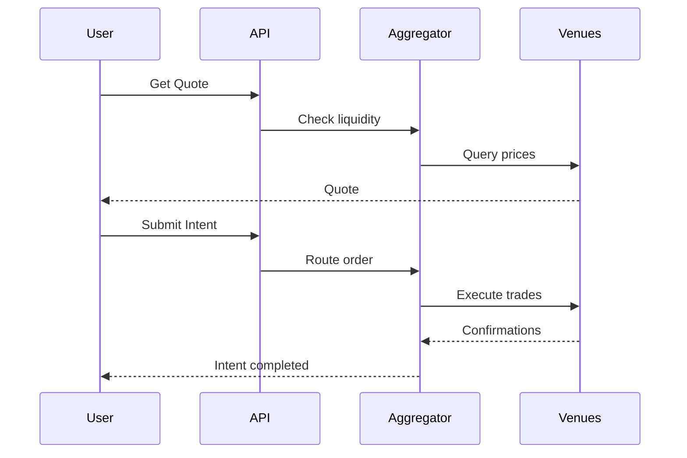

## Overview

Intent-based trading system that:
- **Aggregates liquidity** across Polymarket, Predifi CLOB, Limitless
- **Optimizes execution** for best price
- **Handles complexity** of multi-venue routing

<Info>
  Submit an intent → Predifi finds best execution → Tracks status → Settlement
</Info>

---

## Get Trading Quote

Get estimated price and fees before placing trade.

<ParamField path="GET" type="method">
  /v1/trading/quote
</ParamField>

### Parameters

<ParamField query="marketId" type="string" required>
  Market identifier (e.g., `BTC-15M-20250111-1430`)
</ParamField>

<ParamField query="action" type="string" required>
  Trade action: `buy` or `sell`
</ParamField>

<ParamField query="outcomeId" type="number" required>
  Outcome: `0` = YES, `1` = NO
</ParamField>

<ParamField query="size" type="number" required>
  Amount in USDC to spend (buy) or shares to sell
</ParamField>

<ParamField query="maxSlippage" type="number">
  Maximum acceptable slippage (default: 0.02 = 2%)
</ParamField>

### Response

```json
{
  "ok": true,
  "data": {
    "estimatedShares": 150.0,
    "avgPrice": 0.6667,
    "minPrice": 0.6534,
    "maxPrice": 0.6745,
    "fee": 0.10,
    "total": 100.10,
    "slippage": 0.0123,
    "validUntil": 1638360120000,
    "venues": [
      {
        "venue": "polymarket",
        "shares": 90.0,
        "price": 0.6543,
        "liquidity": 45000
      },
      {
        "venue": "predifi_clob",
        "shares": 60.0,
        "price": 0.6789,
        "liquidity": 23000
      }
    ]
  }
}
```

<Warning>
  Quotes valid for **2 minutes**. Re-fetch if expired.
</Warning>

### Example

<CodeGroup>

```bash cURL
curl "https://api.predifi.com/v1/trading/quote?marketId=BTC-15M-20250111-1430&action=buy&outcomeId=0&size=100&maxSlippage=0.02" \
  -H "Authorization: Bearer YOUR_API_KEY"
```

```typescript TypeScript
const quote = await api.get('/v1/trading/quote', {
  params: {
    marketId: 'BTC-15M-20250111-1430',
    action: 'buy',
    outcomeId: 0,
    size: 100,
    maxSlippage: 0.02
  }
});

console.log(`Est. shares: ${quote.data.estimatedShares}`);
console.log(`Avg price: $${quote.data.avgPrice}`);
console.log(`Total cost: $${quote.data.total}`);
```

```python Python
response = requests.get(
    'https://api.predifi.com/v1/trading/quote',
    headers={'Authorization': f'Bearer {api_key}'},
    params={
        'marketId': 'BTC-15M-20250111-1430',
        'action': 'buy',
        'outcomeId': 0,
        'size': 100,
        'maxSlippage': 0.02
    }
)

quote = response.json()['data']
print(f"Est. shares: {quote['estimatedShares']}")
print(f"Avg price: ${quote['avgPrice']}")
```

</CodeGroup>

---

## Submit Trading Intent

Submit intent to buy or sell.

<ParamField path="POST" type="method">
  /v1/trading/intent
</ParamField>

### Request Body

<ParamField body="marketId" type="string" required>
  Market identifier
</ParamField>

<ParamField body="action" type="string" required>
  `buy` or `sell`
</ParamField>

<ParamField body="outcomeId" type="number" required>
  `0` = YES, `1` = NO
</ParamField>

<ParamField body="size" type="number" required>
  USDC amount (buy) or shares (sell)
</ParamField>

<ParamField body="maxSlippage" type="number">
  Max slippage (default: 0.02)
</ParamField>

<ParamField body="limitPrice" type="number">
  Limit price (0-1). Won't execute if worse than limit.
</ParamField>

<ParamField body="userAddress" type="string" required>
  Your wallet address
</ParamField>

### Response

```json
{
  "ok": true,
  "data": {
    "intentId": "0x123abc...",
    "status": "pending",
    "marketId": "BTC-15M-20250111-1430",
    "outcomeId": 0,
    "targetSize": 100,
    "estimatedShares": 150.0,
    "expiresAt": 1638360600000,
    "executionPlan": [
      {"venue": "polymarket", "shares": 90.0, "price": 0.6543},
      {"venue": "predifi_clob", "shares": 60.0, "price": 0.6789}
    ]
  }
}
```

**Intent expires in 10 minutes.** Track status with intent ID.

### Example

<CodeGroup>

```bash cURL
curl -X POST "https://api.predifi.com/v1/trading/intent" \
  -H "Authorization: Bearer YOUR_API_KEY" \
  -H "Content-Type: application/json" \
  -d '{
    "marketId": "BTC-15M-20250111-1430",
    "action": "buy",
    "outcomeId": 0,
    "size": 100,
    "maxSlippage": 0.02,
    "userAddress": "0x your_address"
  }'
```

```typescript TypeScript
const intent = await api.post('/v1/trading/intent', {
  marketId: 'BTC-15M-20250111-1430',
  action: 'buy',
  outcomeId: 0,
  size: 100,
  maxSlippage: 0.02,
  userAddress: '0x your_address'
});

console.log(`Intent ID: ${intent.data.intentId}`);
console.log(`Status: ${intent.data.status}`);

// Poll for status updates
const checkStatus = async (intentId: string) => {
  const status = await api.get(`/v1/trading/intent/${intentId}`);
  console.log(status.data.status);
  
  if (['completed', 'failed', 'cancelled'].includes(status.data.status)) {
    return status.data;
  }
  
  await new Promise(r => setTimeout(r, 2000));
  return checkStatus(intentId);
};

const result = await checkStatus(intent.data.intentId);
```

```python Python
response = requests.post(
    'https://api.predifi.com/v1/trading/intent',
    headers={'Authorization': f'Bearer {api_key}'},
    json={
        'marketId': 'BTC-15M-20250111-1430',
        'action': 'buy',
        'outcomeId': 0,
        'size': 100,
        'maxSlippage': 0.02,
        'userAddress': '0x your_address'
    }
)

intent = response.json()['data']
print(f"Intent ID: {intent['intentId']}")
```

</CodeGroup>

---

## Get Intent Status

Check execution status of trading intent.

<ParamField path="GET" type="method">
  /v1/trading/intent/:id
</ParamField>

### Response

```json
{
  "ok": true,
  "data": {
    "intentId": "0x123abc...",
    "status": "executing",
    "marketId": "BTC-15M-20250111-1430",
    "outcomeId": 0,
    "targetSize": 100,
    "filledSize": 65,
    "avgFillPrice": 0.6598,
    "fills": [
      {
        "venue": "polymarket",
        "size": 45,
        "avgPrice": 0.6543,
        "txHash": "0xabc...",
        "timestamp": 1638360030000
      },
      {
        "venue": "predifi_clob",
        "size": 20,
        "avgPrice": 0.6701,
        "txHash": "0xdef...",
        "timestamp": 1638360045000
      }
    ],
    "createdAt": 1638360000000,
    "updatedAt": 1638360045000
  }
}
```

**Status values:**
- `pending` - Waiting to execute
- `executing` - In progress
- `completed` - Fully filled
- `partial` - Partially filled, won't fill more
- `failed` - Execution failed
- `cancelled` - User cancelled
- `expired` - Intent expired

### Example

<CodeGroup>

```bash cURL
curl "https://api.predifi.com/v1/trading/intent/0x123abc..." \
  -H "Authorization: Bearer YOUR_API_KEY"
```

```typescript TypeScript
const status = await api.get('/v1/trading/intent/0x123abc...');
console.log(`Status: ${status.data.status}`);
console.log(`Filled: ${status.data.filledSize}/${status.data.targetSize}`);
```

```python Python
response = requests.get(
    'https://api.predifi.com/v1/trading/intent/0x123abc...',
    headers={'Authorization': f'Bearer {api_key}'}
)
status = response.json()['data']
print(f"Status: {status['status']}")
```

</CodeGroup>

---

## Cancel Intent

Cancel pending intent (not yet executed).

<ParamField path="DELETE" type="method">
  /v1/trading/intent/:id
</ParamField>

### Response

```json
{
  "ok": true,
  "data": {
    "intentId": "0x123abc...",
    "status": "cancelled",
    "message": "Intent cancelled successfully"
  }
}
```

<Warning>
  Can only cancel `pending` intents. Cannot cancel `executing` or `completed`.
</Warning>

---

## Trading Workflow



---

## Error Handling

| Error Code | Description |
|------------|-------------|
| `INVALID_MARKET` | Market doesn't exist |
| `MARKET_CLOSED` | Market no longer accepting trades |
| `INSUFFICIENT_BALANCE` | Not enough USDC |
| `SLIPPAGE_EXCEEDED` | Price moved beyond maxSlippage |
| `LIQUIDITY_UNAVAILABLE` | Not enough liquidity |
| `INVALID_OUTCOME` | Invalid outcomeId |
| `INTENT_NOT_FOUND` | Intent doesn't exist |
| `INTENT_EXPIRED` | Intent expired (>10 min) |
| `CANNOT_CANCEL` | Intent already executing/completed |

---

## Best Practices

<AccordionGroup>
  <Accordion title="Always Get Quote First" icon="calculator">
    Check price and slippage before submitting intent.
  </Accordion>

  <Accordion title="Use WebSocket for Status" icon="bolt">
    Subscribe to `user_intent` channel instead of polling.
  </Accordion>

  <Accordion title="Set Appropriate Slippage" icon="gauge">
    Low liquidity markets need higher slippage tolerance (3-5%).
  </Accordion>

  <Accordion title="Handle Partial Fills" icon="chart-pie">
    Intent may partially fill if liquidity runs out.
  </Accordion>

  <Accordion title="Use Limit Orders for Patience" icon="clock">
    Set `limitPrice` if you can wait for better price.
  </Accordion>
</AccordionGroup>

---

## Rate Limits

| Endpoint | Rate Limit |
|----------|------------|
| `GET /v1/trading/quote` | 60 req/min |
| `POST /v1/trading/intent` | 10 req/min |
| `GET /v1/trading/intent/:id` | 30 req/min |
| `DELETE /v1/trading/intent/:id` | 20 req/min |

---

## Next Steps

<CardGroup cols={2}>
  <Card title="Markets API" icon="chart-line" href="/api-reference/markets">
    Browse available markets
  </Card>
  <Card title="Portfolio API" icon="wallet" href="/api-reference/portfolio">
    Track your positions
  </Card>
  <Card title="WebSocket API" icon="bolt" href="/api-reference/websockets">
    Real-time intent updates
  </Card>
  <Card title="Orderbook API" icon="book" href="/api-reference/orderbook">
    View available liquidity
  </Card>
</CardGroup>

