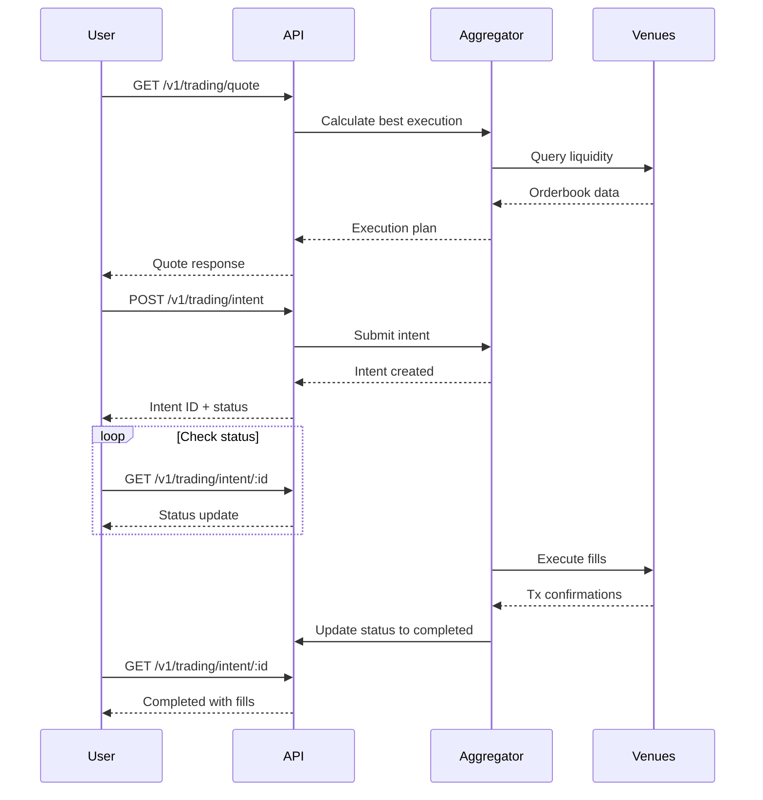

## Overview

The Trading API enables you to:
- **Get quotes** before placing trades (price, slippage, fees)
- **Submit trading intents** to buy or sell YES/NO tokens
- **Track intent status** from submission to execution
- **Cancel pending intents** before they execute

<Info>
  Predifi uses **intent-based trading**. You submit a trading intent with desired parameters, and our aggregator finds the best execution across all venues.
</Info>

---

## Get Trading Quote

Get a price quote before submitting a trade.

<ParamField path="GET" type="method">
  /v1/trading/quote
</ParamField>

### Request

<ParamField query="marketId" type="string" required>
  Market identifier (e.g., `BTC-15M-20250111-1430`)
</ParamField>

<ParamField query="action" type="string" required>
  Trade direction: `buy` or `sell`
</ParamField>

<ParamField query="outcomeId" type="number" required>
  Outcome to trade:
  - `0` = YES
  - `1` = NO
</ParamField>

<ParamField query="size" type="number" required>
  Trade size in USDC (minimum: $1.00)
</ParamField>

<ParamField query="maxSlippage" type="number">
  Maximum acceptable slippage (0-1, default: 0.02)
  
  Example: `0.02` = 2% max slippage
</ParamField>

### Response

```json
{
  "ok": true,
  "data": {
    "marketId": "BTC-15M-20250111-1430",
    "action": "buy",
    "outcomeId": 0,
    "size": 100.0,
    "estimatedShares": 150.75,
    "avgPrice": 0.6633,
    "minPrice": 0.6500,
    "maxPrice": 0.6766,
    "fee": 0.10,
    "total": 100.10,
    "slippage": 0.015,
    "validUntil": 1638360120000,
    "venues": [
      {
        "venue": "polymarket",
        "shares": 90.45,
        "price": 0.6600,
        "liquidity": 5420.30
      },
      {
        "venue": "predifi_clob",
        "shares": 60.30,
        "price": 0.6680,
        "liquidity": 3210.50
      }
    ]
  },
  "timestamp": 1638360000000
}
```

<ResponseField name="estimatedShares" type="number">
  Expected number of tokens you'll receive
</ResponseField>

<ResponseField name="avgPrice" type="number">
  Weighted average execution price (0-1)
</ResponseField>

<ResponseField name="minPrice" type="number">
  Best price available in market
</ResponseField>

<ResponseField name="maxPrice" type="number">
  Worst price in your execution path
</ResponseField>

<ResponseField name="fee" type="number">
  Protocol fee in USDC
</ResponseField>

<ResponseField name="total" type="number">
  Total cost including fees (USDC)
</ResponseField>

<ResponseField name="slippage" type="number">
  Estimated slippage percentage (0-1)
</ResponseField>

<ResponseField name="validUntil" type="number">
  Quote expiration timestamp (Unix ms)
  
  Quotes are valid for **2 minutes**
</ResponseField>

<ResponseField name="venues" type="array">
  Breakdown of execution across venues
  
  Shows how the order will be split for best price
</ResponseField>

### Example Request

<CodeGroup>

```bash cURL
curl "https://api.predifi.com/v1/trading/quote?marketId=BTC-15M-20250111-1430&action=buy&outcomeId=0&size=100" \
  -H "Authorization: Bearer YOUR_API_KEY"
```

```typescript TypeScript
const quote = await api.get('/v1/trading/quote', {
  params: {
    marketId: 'BTC-15M-20250111-1430',
    action: 'buy',
    outcomeId: 0,    // YES
    size: 100        // $100 USDC
  }
});

console.log(`Quote: ${quote.data.estimatedShares} shares at avg price $${quote.data.avgPrice}`);
console.log(`Total cost: $${quote.data.total} (including $${quote.data.fee} fee)`);
console.log(`Slippage: ${(quote.data.slippage * 100).toFixed(2)}%`);
```

```python Python
response = requests.get(
    'https://api.predifi.com/v1/trading/quote',
    headers={'Authorization': f'Bearer {api_key}'},
    params={
        'marketId': 'BTC-15M-20250111-1430',
        'action': 'buy',
        'outcomeId': 0,  # YES
        'size': 100      # $100 USDC
    }
)

quote = response.json()['data']
print(f"Quote: {quote['estimatedShares']} shares at ${quote['avgPrice']}")
print(f"Total: ${quote['total']} (fee: ${quote['fee']})")
```

</CodeGroup>

---

## Submit Trading Intent

Submit a trading intent to buy or sell outcome tokens.

<ParamField path="POST" type="method">
  /v1/trading/intent
</ParamField>

### Request Body

```json
{
  "marketId": "BTC-15M-20250111-1430",
  "action": "buy",
  "outcomeId": 0,
  "size": 100.0,
  "maxSlippage": 0.02,
  "limitPrice": null,
  "userAddress": "0x742d35Cc6634C0532925a3b844Bc9e7595f0bEb"
}
```

<ParamField body="marketId" type="string" required>
  Market identifier
</ParamField>

<ParamField body="action" type="string" required>
  Trade direction: `buy` or `sell`
</ParamField>

<ParamField body="outcomeId" type="number" required>
  Outcome to trade:
  - `0` = YES
  - `1` = NO
</ParamField>

<ParamField body="size" type="number" required>
  Trade size in USDC
  
  **Limits:**
  - Minimum: $1.00
  - Maximum: $100,000.00 per trade
</ParamField>

<ParamField body="maxSlippage" type="number">
  Maximum acceptable slippage (0-1)
  
  Default: `0.02` (2%)
  
  Intent will fail if slippage exceeds this threshold
</ParamField>

<ParamField body="limitPrice" type="number">
  Optional limit price (0-1)
  
  Intent only executes if price is better than limit:
  - **Buy**: Execute only if price ≤ limitPrice
  - **Sell**: Execute only if price ≥ limitPrice
  
  Leave `null` for market order
</ParamField>

<ParamField body="userAddress" type="string" required>
  Your wallet address (0x...)
  
  This address must have sufficient USDC balance
</ParamField>

### Response

```json
{
  "ok": true,
  "data": {
    "intentId": "0x123abc...",
    "status": "pending",
    "marketId": "BTC-15M-20250111-1430",
    "action": "buy",
    "outcomeId": 0,
    "size": 100.0,
    "estimatedShares": 150.75,
    "estimatedPrice": 0.6633,
    "maxSlippage": 0.02,
    "limitPrice": null,
    "createdAt": 1638360000000,
    "expiresAt": 1638360600000,
    "estimatedFillTime": 120,
    "executionPlan": {
      "venues": [
        {
          "venue": "polymarket",
          "shares": 90.45,
          "price": 0.6600
        },
        {
          "venue": "predifi_clob",
          "shares": 60.30,
          "price": 0.6680
        }
      ],
      "avgPrice": 0.6633,
      "totalCost": 100.10
    }
  },
  "timestamp": 1638360000000
}
```

<ResponseField name="intentId" type="string">
  Unique intent identifier
  
  Use this to track execution status
</ResponseField>

<ResponseField name="status" type="string">
  Intent status:
  - `pending` - Submitted, awaiting execution
  - `executing` - Currently being filled
  - `completed` - Successfully executed
  - `failed` - Execution failed
  - `cancelled` - Cancelled by user
  - `expired` - Expired without execution
</ResponseField>

<ResponseField name="estimatedFillTime" type="number">
  Expected execution time in seconds
  
  Typically 30-120 seconds depending on liquidity
</ResponseField>

<ResponseField name="expiresAt" type="number">
  Intent expiration timestamp (Unix ms)
  
  Intents expire after **10 minutes** if not filled
</ResponseField>

<ResponseField name="executionPlan" type="object">
  Planned execution across venues
  
  Actual execution may differ slightly based on real-time liquidity
</ResponseField>

### Example Request

<CodeGroup>

```bash cURL
curl -X POST https://api.predifi.com/v1/trading/intent \
  -H "Authorization: Bearer YOUR_API_KEY" \
  -H "Content-Type: application/json" \
  -d '{
    "marketId": "BTC-15M-20250111-1430",
    "action": "buy",
    "outcomeId": 0,
    "size": 100,
    "maxSlippage": 0.02,
    "userAddress": "0x742d35Cc6634C0532925a3b844Bc9e7595f0bEb"
  }'
```

```typescript TypeScript
const intent = await api.post('/v1/trading/intent', {
  marketId: 'BTC-15M-20250111-1430',
  action: 'buy',
  outcomeId: 0,
  size: 100,
  maxSlippage: 0.02,
  userAddress: userWalletAddress
});

console.log(`Intent submitted: ${intent.data.intentId}`);
console.log(`Status: ${intent.data.status}`);
console.log(`Estimated fill time: ${intent.data.estimatedFillTime}s`);

// Poll for status updates
const checkStatus = async (intentId: string) => {
  const status = await api.get(`/v1/trading/intent/${intentId}`);
  return status.data.status;
};

// Wait for completion
while (true) {
  await sleep(2000);
  const status = await checkStatus(intent.data.intentId);
  console.log(`Status: ${status}`);
  
  if (['completed', 'failed', 'cancelled', 'expired'].includes(status)) {
    break;
  }
}
```

```python Python
intent = requests.post(
    'https://api.predifi.com/v1/trading/intent',
    headers={'Authorization': f'Bearer {api_key}'},
    json={
        'marketId': 'BTC-15M-20250111-1430',
        'action': 'buy',
        'outcomeId': 0,
        'size': 100,
        'maxSlippage': 0.02,
        'userAddress': user_address
    }
)

data = intent.json()['data']
print(f"Intent ID: {data['intentId']}")
print(f"Status: {data['status']}")
print(f"Estimated fill: {data['estimatedFillTime']}s")
```

</CodeGroup>

---

## Get Intent Status

Check the execution status of a trading intent.

<ParamField path="GET" type="method">
  /v1/trading/intent/:intentId
</ParamField>

### Request

<ParamField path="intentId" type="string" required>
  Intent identifier returned from submit intent
</ParamField>

### Response

```json
{
  "ok": true,
  "data": {
    "intentId": "0x123abc...",
    "status": "completed",
    "marketId": "BTC-15M-20250111-1430",
    "action": "buy",
    "outcomeId": 0,
    "requestedSize": 100.0,
    "filledSize": 100.0,
    "filledShares": 150.75,
    "avgFillPrice": 0.6633,
    "totalCost": 100.10,
    "fee": 0.10,
    "slippage": 0.015,
    "createdAt": 1638360000000,
    "executedAt": 1638360085000,
    "expiresAt": 1638360600000,
    "fills": [
      {
        "venue": "polymarket",
        "shares": 90.45,
        "price": 0.6600,
        "cost": 59.70,
        "txHash": "0xabc123...",
        "timestamp": 1638360080000
      },
      {
        "venue": "predifi_clob",
        "shares": 60.30,
        "price": 0.6680,
        "cost": 40.28,
        "txHash": "0xdef456...",
        "timestamp": 1638360085000
      }
    ],
    "failureReason": null
  },
  "timestamp": 1638360100000
}
```

<ResponseField name="status" type="string">
  Current intent status:
  - `pending` - Awaiting execution
  - `executing` - Being filled now
  - `completed` - Successfully executed
  - `partially_filled` - Some fills complete, still executing
  - `failed` - Execution failed
  - `cancelled` - Cancelled by user
  - `expired` - Expired without full execution
</ResponseField>

<ResponseField name="filledSize" type="number">
  Amount of USDC actually filled
  
  May be less than `requestedSize` for partial fills
</ResponseField>

<ResponseField name="filledShares" type="number">
  Actual number of tokens received
</ResponseField>

<ResponseField name="avgFillPrice" type="number">
  Actual average execution price (0-1)
</ResponseField>

<ResponseField name="slippage" type="number">
  Actual slippage experienced (0-1)
</ResponseField>

<ResponseField name="fills" type="array">
  Individual fills across venues
  
  Each fill includes venue, amount, price, and tx hash
</ResponseField>

<ResponseField name="failureReason" type="string">
  Error message if status is `failed`
  
  Common reasons:
  - Insufficient liquidity
  - Slippage exceeded limit
  - Market closed
  - Insufficient balance
</ResponseField>

### Example Request

<CodeGroup>

```bash cURL
curl "https://api.predifi.com/v1/trading/intent/0x123abc..." \
  -H "Authorization: Bearer YOUR_API_KEY"
```

```typescript TypeScript
const status = await api.get(`/v1/trading/intent/${intentId}`);

console.log(`Status: ${status.data.status}`);

if (status.data.status === 'completed') {
  console.log(`Filled: ${status.data.filledShares} shares`);
  console.log(`Avg price: $${status.data.avgFillPrice}`);
  console.log(`Slippage: ${(status.data.slippage * 100).toFixed(2)}%`);
  console.log(`Venues used: ${status.data.fills.length}`);
}

if (status.data.status === 'failed') {
  console.error(`Failed: ${status.data.failureReason}`);
}
```

```python Python
response = requests.get(
    f'https://api.predifi.com/v1/trading/intent/{intent_id}',
    headers={'Authorization': f'Bearer {api_key}'}
)

data = response.json()['data']

if data['status'] == 'completed':
    print(f"Filled: {data['filledShares']} shares")
    print(f"Avg price: ${data['avgFillPrice']}")
    print(f"Slippage: {data['slippage']*100:.2f}%")
elif data['status'] == 'failed':
    print(f"Failed: {data['failureReason']}")
```

</CodeGroup>

---

## Cancel Intent

Cancel a pending trading intent before it executes.

<ParamField path="DELETE" type="method">
  /v1/trading/intent/:intentId
</ParamField>

<Warning>
  You can only cancel intents with status `pending`. Intents that are `executing` or `completed` cannot be cancelled.
</Warning>

### Request

<ParamField path="intentId" type="string" required>
  Intent identifier to cancel
</ParamField>

### Response

```json
{
  "ok": true,
  "data": {
    "intentId": "0x123abc...",
    "status": "cancelled",
    "cancelledAt": 1638360050000
  },
  "timestamp": 1638360050000
}
```

### Example Request

<CodeGroup>

```bash cURL
curl -X DELETE "https://api.predifi.com/v1/trading/intent/0x123abc..." \
  -H "Authorization: Bearer YOUR_API_KEY"
```

```typescript TypeScript
try {
  const result = await api.delete(`/v1/trading/intent/${intentId}`);
  console.log(`Intent cancelled: ${result.data.intentId}`);
} catch (error) {
  if (error.response?.data?.error === 'CANNOT_CANCEL') {
    console.error('Intent already executing or completed');
  }
}
```

```python Python
response = requests.delete(
    f'https://api.predifi.com/v1/trading/intent/{intent_id}',
    headers={'Authorization': f'Bearer {api_key}'}
)

if response.ok:
    print(f"Intent cancelled: {intent_id}")
else:
    print(f"Cannot cancel: {response.json()['message']}")
```

</CodeGroup>

---

## Trading Workflow

### Complete Trading Flow



### Recommended Flow

<Steps>
  <Step title="Get Quote">
    Call `/v1/trading/quote` to see expected execution
    
    Review: price, shares, slippage, fees
  </Step>
  
  <Step title="Submit Intent">
    Call `/v1/trading/intent` with same parameters
    
    Save `intentId` from response
  </Step>
  
  <Step title="Poll Status">
    Poll `/v1/trading/intent/:id` every 2-5 seconds
    
    Or use WebSocket for real-time updates
  </Step>
  
  <Step title="Handle Result">
    When status is `completed`:
    - Update user balance
    - Show fill details
    - Record transaction
    
    When status is `failed`:
    - Show error message
    - Allow retry
  </Step>
</Steps>

---

## Error Handling

### Common Errors

| Error Code | HTTP Status | Description | Resolution |
|------------|-------------|-------------|------------|
| `INVALID_MARKET` | 400 | Market doesn't exist | Check market ID |
| `MARKET_CLOSED` | 400 | Market not accepting trades | Trade different market |
| `INSUFFICIENT_BALANCE` | 400 | Not enough USDC | Deposit more funds |
| `INVALID_SIZE` | 400 | Size below minimum or above max | Adjust trade size |
| `EXCESSIVE_SLIPPAGE` | 400 | Slippage exceeds maxSlippage | Increase limit or reduce size |
| `INSUFFICIENT_LIQUIDITY` | 400 | Not enough liquidity | Reduce trade size |
| `QUOTE_EXPIRED` | 400 | Quote older than 2 minutes | Get fresh quote |
| `INTENT_NOT_FOUND` | 404 | Intent ID doesn't exist | Check intent ID |
| `CANNOT_CANCEL` | 400 | Intent already executing | Too late to cancel |

### Error Response Example

```json
{
  "ok": false,
  "error": "INSUFFICIENT_BALANCE",
  "message": "Insufficient USDC balance. Required: $100.10, Available: $50.00",
  "details": {
    "required": 100.10,
    "available": 50.00,
    "shortfall": 50.10
  },
  "timestamp": 1638360000000
}
```

### Handling in Code

```typescript
try {
  const intent = await api.post('/v1/trading/intent', {...});
  return intent.data;
} catch (error) {
  const { error: code, message, details } = error.response.data;
  
  switch (code) {
    case 'INSUFFICIENT_BALANCE':
      // Prompt user to deposit
      showDepositPrompt(details.shortfall);
      break;
    
    case 'MARKET_CLOSED':
      // Market no longer active
      showError('This market has closed');
      break;
    
    case 'EXCESSIVE_SLIPPAGE':
      // Slippage too high
      if (confirm('High slippage. Increase limit?')) {
        // Retry with higher maxSlippage
        retry({ ...params, maxSlippage: 0.05 });
      }
      break;
    
    default:
      // Generic error
      showError(message);
  }
}
```

---

## Best Practices

<AccordionGroup>
  <Accordion title="Always Get Quote First" icon="magnifying-glass-dollar">
    Get a quote before submitting intent to show user expected execution:
    
    ```typescript
    // 1. Get quote
    const quote = await api.get('/v1/trading/quote', { params });
    
    // 2. Show to user
    showQuoteModal({
      shares: quote.data.estimatedShares,
      price: quote.data.avgPrice,
      fee: quote.data.fee,
      total: quote.data.total
    });
    
    // 3. If user confirms, submit intent
    if (userConfirms) {
      const intent = await api.post('/v1/trading/intent', params);
    }
    ```
  </Accordion>

  <Accordion title="Use WebSocket for Status Updates" icon="bolt">
    Instead of polling, subscribe to intent updates via WebSocket:
    
    ```typescript
    // ❌ Polling (inefficient)
    const interval = setInterval(async () => {
      const status = await api.get(`/v1/trading/intent/${intentId}`);
      if (status.data.status === 'completed') {
        clearInterval(interval);
      }
    }, 2000);
    
    // ✅ WebSocket (efficient)
    ws.subscribe('user_intent', intentId, (update) => {
      console.log('Status:', update.status);
      if (update.status === 'completed') {
        handleComplete(update);
      }
    });
    ```
  </Accordion>

  <Accordion title="Set Reasonable Slippage Limits" icon="triangle-exclamation">
    Balance between execution certainty and price protection:
    
    ```typescript
    // Small trades: tighter slippage
    if (size < 100) {
      maxSlippage = 0.01;  // 1%
    }
    
    // Medium trades: moderate slippage
    else if (size < 1000) {
      maxSlippage = 0.02;  // 2%
    }
    
    // Large trades: wider slippage
    else {
      maxSlippage = 0.05;  // 5%
    }
    ```
  </Accordion>

  <Accordion title="Handle Partial Fills" icon="chart-bar">
    Intents may be partially filled if liquidity is exhausted:
    
    ```typescript
    const status = await api.get(`/v1/trading/intent/${intentId}`);
    
    if (status.data.status === 'partially_filled') {
      const fillRate = status.data.filledSize / status.data.requestedSize;
      
      if (fillRate < 0.5) {
        // Less than 50% filled - may want to cancel and retry
        console.log(`Only ${(fillRate * 100).toFixed(0)}% filled`);
        
        // Option 1: Cancel remainder
        await api.delete(`/v1/trading/intent/${intentId}`);
        
        // Option 2: Wait for more fills
        // (intent will keep trying until expiration)
      }
    }
    ```
  </Accordion>

  <Accordion title="Use Limit Orders for Better Prices" icon="chart-line">
    Add `limitPrice` to wait for better execution:
    
    ```typescript
    // Get current market price
    const quote = await api.get('/v1/trading/quote', { params });
    const currentPrice = quote.data.avgPrice;  // e.g., 0.6633
    
    // Set limit price 2% better
    const limitPrice = currentPrice * 0.98;  // 0.6500
    
    // Submit intent with limit
    const intent = await api.post('/v1/trading/intent', {
      ...params,
      limitPrice: limitPrice
    });
    
    // Intent will only execute if price ≤ 0.6500
    ```
  </Accordion>
</AccordionGroup>

---

## Rate Limits

| Endpoint | Rate Limit | Notes |
|----------|------------|-------|
| `GET /v1/trading/quote` | 30 req/min | Can cache for 30s |
| `POST /v1/trading/intent` | 10 req/min | Trading intents |
| `GET /v1/trading/intent/:id` | 60 req/min | Status checks |
| `DELETE /v1/trading/intent/:id` | 10 req/min | Cancellations |

<Tip>
  Use WebSocket API for real-time updates instead of polling REST endpoints.
</Tip>

---

## Next Steps

<CardGroup cols={2}>
  <Card
    title="Portfolio API"
    icon="wallet"
    href="/api-reference/portfolio"
  >
    Track positions and P&L
  </Card>
  <Card
    title="WebSocket API"
    icon="bolt"
    href="/api-reference/websockets"
  >
    Real-time intent updates
  </Card>
  <Card
    title="Markets API"
    icon="chart-line"
    href="/api-reference/markets"
  >
    Find markets to trade
  </Card>
  <Card
    title="Orderbook API"
    icon="list"
    href="/api-reference/orderbook"
  >
    Check market liquidity
  </Card>
</CardGroup>
