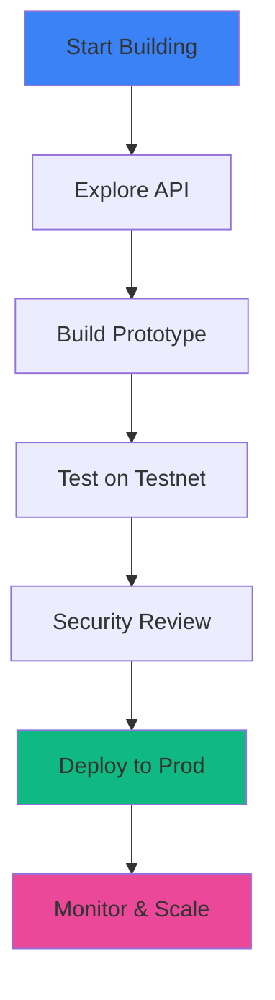
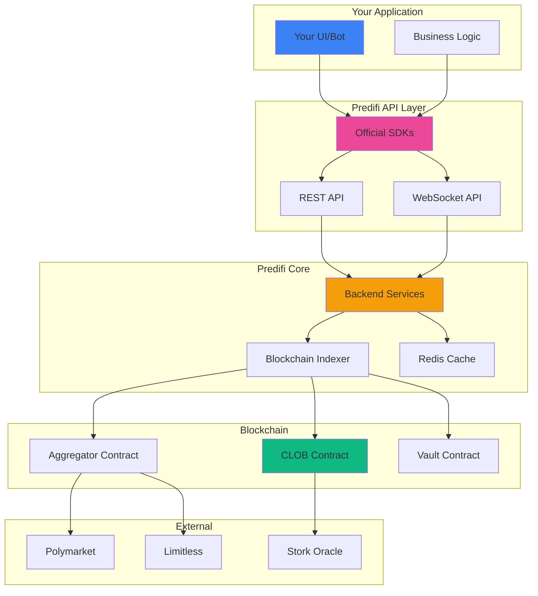

## Build the Future of Prediction Markets

Predifi provides a **complete infrastructure stack** for building prediction market applications. Whether you want to integrate Predifi into your app, create custom markets, or build entirely new trading experiences—we've got you covered.

<Frame>
  <div style={{padding: '20px', background: '#f8fafc', borderRadius: '8px'}}>
    **Predifi API + SDK → Your Application → Users Trade Predictions → You Earn Fees**
  </div>
</Frame>

---

## What You Can Build

<CardGroup cols={2}>
  <Card title="Trading Bots" icon="robot">
    Automated trading strategies leveraging Predifi's orderbook and aggregator
  </Card>
  
  <Card title="Custom UIs" icon="palette">
    White-label prediction market interfaces with your branding
  </Card>
  
  <Card title="Market Making" icon="chart-line">
    Provide liquidity and earn from spreads
  </Card>
  
  <Card title="Analytics Dashboards" icon="chart-mixed">
    Real-time market data, portfolio tracking, advanced analytics
  </Card>
  
  <Card title="Mobile Apps" icon="mobile">
    iOS/Android prediction market trading apps
  </Card>
  
  <Card title="Social Platforms" icon="users">
    Integrate prediction markets into social networks
  </Card>
  
  <Card title="News Integration" icon="newspaper">
    Create markets automatically from news events
  </Card>
  
  <Card title="DAO Governance" icon="gavel">
    Let communities predict and vote on outcomes
  </Card>
</CardGroup>

---

## Why Build on Predifi?

### 🚀 Complete Infrastructure

No need to build everything from scratch:

<Tabs>
  <Tab title="Smart Contracts">
    **17 audited contracts** covering:
    - CLOB orderbook matching
    - Cross-venue aggregation
    - ERC-4626 liquidity vaults
    - Cross-chain bridging
    - Oracle integration
    
    90%+ test coverage, battle-tested.
  </Tab>
  
  <Tab title="Backend API">
    **RESTful + WebSocket APIs** for:
    - Market data (prices, orderbooks, history)
    - Trading (place orders, manage positions)
    - Portfolio tracking (multi-chain positions)
    - User management (authentication, preferences)
    
    100% uptime SLA, &lt;50ms latency.
  </Tab>
  
  <Tab title="SDKs">
    **Official SDKs** in multiple languages:
    - TypeScript/JavaScript
    - Python
    - Rust (coming soon)
    - Go (coming soon)
    
    Type-safe, well-documented, actively maintained.
  </Tab>
  
  <Tab title="Liquidity">
    **Shared liquidity** across:
    - Native CLOB orderbook
    - Polymarket aggregation
    - Limitless aggregation
    - LP vault capital
    
    Millions in available liquidity.
  </Tab>
</Tabs>

### 💰 Revenue Sharing

**Earn fees from your integrations:**

| Integration Type | Your Share | Predifi Share |
|-----------------|------------|---------------|
| **Custom UI** (users trade via your app) | 50% of fees | 50% |
| **Trading Bot** (volume-based) | 30% of fees | 70% |
| **Market Creation** (you create markets) | 40% of creator fees | 60% |
| **Liquidity Provision** (you provide LP capital) | 60% of LP returns | 40% |

<Info>
  Example: Your app generates $100K in trading fees → You earn **$50K**
</Info>

### 🌐 Multi-Chain by Default

Deploy on any EVM chain we support:

- **Arbitrum** - Low fees, high speed
- **Base** - Coinbase ecosystem
- **Optimism** - Ethereum-aligned
- **BSC** - Binance ecosystem

One codebase, multiple chains. [Learn more →](/technology/chain-agnostic)

### 🔒 Security First

Built with security in mind:

- ✅ **Audited contracts** - Multiple security audits
- ✅ **Open source** - Transparent, community-reviewed
- ✅ **Battle-tested** - Millions in volume processed
- ✅ **Non-custodial** - Users control their funds
- ✅ **Upgradeable** - Fix issues without redeployment

### 📊 Rich Data

Access comprehensive market data:

```javascript
// Real-time orderbook
const orderbook = await predifi.getOrderbook('BTC-100K');

// Historical prices
const prices = await predifi.getPriceHistory('BTC-100K', { 
  interval: '1h', 
  from: '2024-01-01' 
});

// Market statistics
const stats = await predifi.getMarketStats('BTC-100K');
// { volume24h: 1234567, trades: 5432, liquidity: 987654, ... }

// User positions
const positions = await predifi.getPositions('0x123...');
```

---

## Quick Start

### 1. Get API Key

<Steps>
  <Step title="Sign Up">
    Create account at [app.predifi.com](https://app.predifi.com)
  </Step>
  
  <Step title="Developer Dashboard">
    Navigate to Settings → Developer → API Keys
  </Step>
  
  <Step title="Create Key">
    Click "Create API Key", name it, and save securely
  </Step>
  
  <Step title="Set Permissions">
    Configure key permissions (read-only, trading, etc.)
  </Step>
</Steps>

### 2. Install SDK

<CodeGroup>

```bash npm
npm install @predifi/sdk
```

```bash yarn
yarn add @predifi/sdk
```

```bash pnpm
pnpm add @predifi/sdk
```

```bash pip
pip install predifi
```

</CodeGroup>

### 3. Initialize Client

<CodeGroup>

```typescript TypeScript
import { Predifi } from '@predifi/sdk';

const predifi = new Predifi({
  apiKey: 'your-api-key',
  chain: 'arbitrum', // or 'base', 'optimism'
  environment: 'production' // or 'testnet'
});

// Fetch markets
const markets = await predifi.getMarkets();
console.log(`Found ${markets.length} markets`);
```

```python Python
from predifi import Predifi

predifi = Predifi(
    api_key='your-api-key',
    chain='arbitrum',
    environment='production'
)

# Fetch markets
markets = predifi.get_markets()
print(f'Found {len(markets)} markets')
```

```javascript JavaScript
const { Predifi } = require('@predifi/sdk');

const predifi = new Predifi({
  apiKey: 'your-api-key',
  chain: 'arbitrum',
  environment: 'production'
});

// Fetch markets
predifi.getMarkets().then(markets => {
  console.log(`Found ${markets.length} markets`);
});
```

</CodeGroup>

### 4. Place Your First Trade

```typescript
// Get current price
const market = await predifi.getMarket('BTC-100K');
console.log(`BTC-100K YES price: $${market.yesPrice}`);

// Place order
const order = await predifi.placeOrder({
  market: 'BTC-100K',
  side: 'BUY',
  outcome: 'YES',
  amount: 100, // $100 USDC
  price: 0.65, // $0.65 per share
  type: 'LIMIT'
});

console.log(`Order placed: ${order.id}`);
console.log(`Status: ${order.status}`);
```

**That's it!** You're now trading programmatically on Predifi.

---

## Development Flow

### Typical Integration Journey



<Steps>
  <Step title="Explore (Week 1)">
    - Read documentation
    - Experiment with API in Postman/Insomnia
    - Browse example applications
    - Join developer Discord
  </Step>
  
  <Step title="Prototype (Week 2-3)">
    - Build core functionality
    - Integrate SDK into your app
    - Test on testnet (Arbitrum Sepolia)
    - Get feedback from community
  </Step>
  
  <Step title="Test (Week 4)">
    - Comprehensive testing
    - Edge case handling
    - Performance optimization
    - User testing with small group
  </Step>
  
  <Step title="Audit (Week 5)">
    - Security review (if handling funds)
    - Code review with Predifi team
    - Load testing
    - Bug fixes
  </Step>
  
  <Step title="Deploy (Week 6)">
    - Mainnet deployment
    - Marketing launch
    - User onboarding
    - Monitor closely
  </Step>
  
  <Step title="Scale (Ongoing)">
    - Gather user feedback
    - Add features
    - Optimize performance
    - Grow user base
  </Step>
</Steps>

---

## Architecture Overview

### How It All Fits Together



### Integration Points

<AccordionGroup>
  <Accordion title="API Integration (Easiest)" icon="plug">
    **Best for**: Web apps, mobile apps, dashboards
    
    - RESTful API for standard operations
    - WebSocket API for real-time updates
    - No blockchain knowledge required
    - Hosted infrastructure
    
    ```typescript
    // All blockchain complexity abstracted
    const order = await predifi.api.placeOrder({...});
    ```
  </Accordion>

  <Accordion title="SDK Integration (Recommended)" icon="code">
    **Best for**: Most applications
    
    - Type-safe interfaces
    - Automatic retries and error handling
    - Built-in rate limiting
    - Comprehensive documentation
    
    ```typescript
    import { Predifi } from '@predifi/sdk';
    const predifi = new Predifi({...});
    ```
  </Accordion>

  <Accordion title="Direct Contract Integration (Advanced)" icon="file-contract">
    **Best for**: Maximum control, custom logic
    
    - Interact with contracts directly
    - No API rate limits
    - Requires blockchain knowledge
    - Handle gas management
    
    ```solidity
    // Call contracts directly
    ICLOB(clob).placeOrder(...);
    ```
  </Accordion>

  <Accordion title="Hybrid Approach (Flexible)" icon="shuffle">
    **Best for**: Advanced use cases
    
    - Use API for reads (fast)
    - Use contracts for writes (trustless)
    - Best of both worlds
    
    ```typescript
    // Read from API
    const market = await predifi.api.getMarket('BTC-100K');
    
    // Write to contract
    await predifi.contracts.clob.placeOrder(...);
    ```
  </Accordion>
</AccordionGroup>

---

## API Overview

### RESTful Endpoints

**Core endpoints:**

| Endpoint | Purpose |
|----------|---------|
| `GET /markets` | List all markets |
| `GET /markets/:id` | Get market details |
| `GET /markets/:id/orderbook` | Get orderbook depth |
| `POST /orders` | Place new order |
| `GET /orders/:id` | Get order status |
| `DELETE /orders/:id` | Cancel order |
| `GET /portfolio` | Get user positions |
| `GET /portfolio/history` | Get trade history |

[Full API reference →](/api/getting-started)

### WebSocket Streams

**Real-time data:**

```typescript
// Subscribe to orderbook updates
predifi.ws.subscribe('orderbook', 'BTC-100K', (data) => {
  console.log('Orderbook updated:', data);
});

// Subscribe to trades
predifi.ws.subscribe('trades', 'BTC-100K', (trade) => {
  console.log('New trade:', trade);
});

// Subscribe to user orders
predifi.ws.subscribe('user_orders', (order) => {
  console.log('Order update:', order);
});
```

[WebSocket documentation →](/api/websockets)

---

## Code Examples

### Common Use Cases

<AccordionGroup>
  <Accordion title="Get Market Data" icon="chart-line">
    ```typescript
    // Get all active markets
    const markets = await predifi.getMarkets({
      status: 'active',
      category: 'crypto'
    });
    
    // Get specific market
    const market = await predifi.getMarket('BTC-100K');
    console.log({
      question: market.question,
      yesPrice: market.yesPrice,
      noPrice: market.noPrice,
      volume24h: market.volume24h,
      resolutionDate: market.resolutionDate
    });
    
    // Get orderbook
    const orderbook = await predifi.getOrderbook('BTC-100K');
    console.log('Best bid:', orderbook.bids[0]);
    console.log('Best ask:', orderbook.asks[0]);
    ```
  </Accordion>

  <Accordion title="Place Market Order" icon="cart-shopping">
    ```typescript
    // Buy YES shares at current market price
    const order = await predifi.placeOrder({
      market: 'BTC-100K',
      side: 'BUY',
      outcome: 'YES',
      amount: 100, // $100 USDC
      type: 'MARKET' // Execute immediately at best price
    });
    
    console.log(`Bought ${order.filledShares} shares`);
    console.log(`Avg price: $${order.avgFillPrice}`);
    ```
  </Accordion>

  <Accordion title="Place Limit Order" icon="list-check">
    ```typescript
    // Buy YES shares at specific price
    const order = await predifi.placeOrder({
      market: 'BTC-100K',
      side: 'BUY',
      outcome: 'YES',
      amount: 100,
      price: 0.60, // Only buy at $0.60 or better
      type: 'LIMIT'
    });
    
    // Check order status
    const status = await predifi.getOrder(order.id);
    console.log(`Status: ${status.status}`); // PENDING, FILLED, PARTIAL, CANCELLED
    ```
  </Accordion>

  <Accordion title="Cancel Order" icon="xmark">
    ```typescript
    // Cancel pending order
    await predifi.cancelOrder(order.id);
    
    // Cancel all orders for a market
    await predifi.cancelAllOrders('BTC-100K');
    
    // Cancel all orders
    await predifi.cancelAllOrders();
    ```
  </Accordion>

  <Accordion title="Get Portfolio" icon="wallet">
    ```typescript
    // Get all positions
    const positions = await predifi.getPositions();
    
    for (const position of positions) {
      console.log(`Market: ${position.market}`);
      console.log(`Outcome: ${position.outcome}`);
      console.log(`Shares: ${position.shares}`);
      console.log(`Entry Price: $${position.entryPrice}`);
      console.log(`Current Value: $${position.currentValue}`);
      console.log(`P&L: $${position.unrealizedPnl}`);
    }
    ```
  </Accordion>

  <Accordion title="Real-Time Updates" icon="bolt">
    ```typescript
    // Connect to WebSocket
    await predifi.ws.connect();
    
    // Subscribe to market updates
    predifi.ws.on('market', 'BTC-100K', (update) => {
      console.log('Price update:', update.yesPrice);
    });
    
    // Subscribe to your orders
    predifi.ws.on('userOrder', (order) => {
      if (order.status === 'FILLED') {
        console.log('Order filled!', order);
      }
    });
    
    // Subscribe to trades
    predifi.ws.on('trade', 'BTC-100K', (trade) => {
      console.log('New trade:', trade);
    });
    ```
  </Accordion>
</AccordionGroup>

[More code examples →](/developers/code-examples)

---

## Resources

### Documentation

<CardGroup cols={2}>
  <Card
    title="API Reference"
    icon="book"
    href="/api/getting-started"
  >
    Complete API documentation
  </Card>
  <Card
    title="SDK Documentation"
    icon="code"
    href="/developers/sdks"
  >
    TypeScript, Python, Rust SDKs
  </Card>
  <Card
    title="Code Examples"
    icon="file-code"
    href="/developers/code-examples"
  >
    Copy-paste ready examples
  </Card>
  <Card
    title="Smart Contracts"
    icon="file-contract"
    href="https://github.com/predifi/contracts"
  >
    Contract source code
  </Card>
</CardGroup>

### Tools

<CardGroup cols={2}>
  <Card
    title="API Playground"
    icon="play"
    href="https://api.predifi.com/playground"
  >
    Test API calls in browser
  </Card>
  <Card
    title="Testnet Faucet"
    icon="faucet"
    href="https://faucet.predifi.com"
  >
    Get testnet USDC
  </Card>
  <Card
    title="Contract Explorer"
    icon="magnifying-glass"
    href="https://explorer.predifi.com"
  >
    View on-chain data
  </Card>
  <Card
    title="Status Page"
    icon="signal"
    href="https://status.predifi.com"
  >
    API uptime and latency
  </Card>
</CardGroup>

### Community

<CardGroup cols={3}>
  <Card
    title="Discord"
    icon="discord"
    href="https://discord.gg/predifi"
  >
    Join #developers channel
  </Card>
  <Card
    title="GitHub"
    icon="github"
    href="https://github.com/predifi"
  >
    Open source repos
  </Card>
  <Card
    title="Twitter/X"
    icon="x-twitter"
    href="https://twitter.com/predifi"
  >
    Updates and announcements
  </Card>
</CardGroup>

---

## Support

### Getting Help

<Steps>
  <Step title="Documentation">
    Search these docs first—most questions answered here
  </Step>
  
  <Step title="Discord">
    Ask in #developers channel—community + core team respond
  </Step>
  
  <Step title="GitHub Issues">
    Report bugs or request features on GitHub
  </Step>
  
  <Step title="Email">
    For private inquiries: developers@predifi.com
  </Step>
</Steps>

### Response Times

| Channel | Response Time | Best For |
|---------|---------------|----------|
| **Discord** | < 2 hours | General questions, troubleshooting |
| **GitHub Issues** | < 24 hours | Bug reports, feature requests |
| **Email** | < 48 hours | Partnerships, private issues |

---

## Next Steps

<CardGroup cols={2}>
  <Card
    title="Why Build on Predifi"
    icon="lightbulb"
    href="/developers/why-build-on-predifi"
  >
    Learn about our advantages
  </Card>
  <Card
    title="Quickstart Guide"
    icon="rocket"
    href="/developers/quickstart"
  >
    Build your first integration
  </Card>
  <Card
    title="API Documentation"
    icon="book"
    href="/api/getting-started"
  >
    Explore the full API
  </Card>
  <Card
    title="Use Cases"
    icon="lightbulb"
    href="/developers/use-cases"
  >
    See what others are building
  </Card>
</CardGroup>

---

## Ready to Build?

Join hundreds of developers building on Predifi:

<Card
  title="Get Started Now"
  icon="rocket"
  href="https://app.predifi.com/developer"
>
  Create your API key and start building →
</Card>
