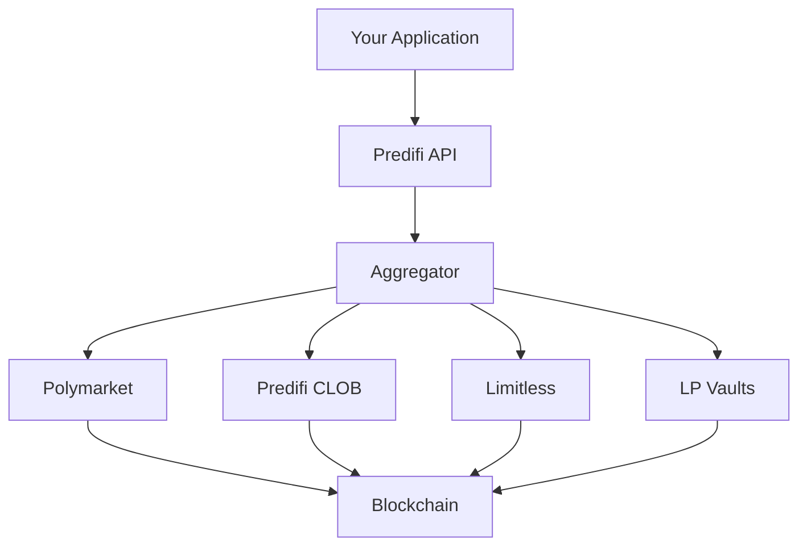

## Build the Future of Prediction Markets

Predifi provides production-ready infrastructure for building prediction market applications—trading bots, custom UIs, analytics platforms, and more.

---

## What You Can Build

<CardGroup cols={2}>
  <Card title="Trading Bots" icon="robot">
    Automated strategies, arbitrage, market making
  </Card>
  <Card title="Custom UIs" icon="desktop">
    Branded prediction market platforms
  </Card>
  <Card title="Analytics Dashboards" icon="chart-mixed">
    Market intelligence and tracking tools
  </Card>
  <Card title="Mobile Apps" icon="mobile">
    Native iOS/Android prediction markets
  </Card>
</CardGroup>

---

## Why Build on Predifi

<Tabs>
  <Tab title="Smart Contracts">
    - 17 audited contracts (90%+ coverage)
    - CLOB orderbook + AMM
    - Cross-venue aggregation
    - ERC-4626 liquidity vaults
    - UUPS upgradeable
  </Tab>
  
  <Tab title="Backend API">
    - &lt;50ms latency globally
    - Real-time WebSocket streams
    - 99.99% uptime
    - Auto-scaling infrastructure
    - Complete historical data
  </Tab>
  
  <Tab title="SDKs">
    - TypeScript/JavaScript
    - Python
    - Type-safe with full autocomplete
    - Comprehensive examples
  </Tab>
  
  <Tab title="Liquidity">
    - $XXM TVL
    - Professional market makers
    - Shared liquidity pool
    - Multi-venue aggregation
  </Tab>
</Tabs>

### Revenue Sharing

| Integration Type | Fee Share | Example Monthly Revenue |
|-----------------|-----------|------------------------|
| Custom UI | 50% | $5K on $10M volume |
| Trading Bot | 30% | $900 on $1M volume |
| Market Creation | 40% | Variable |
| LP Capital | 60% | 18% APY on $100K |

---

## Quick Start

<Steps>
  <Step title="Get API Key">
    Sign up at [app.predifi.com](https://app.predifi.com) → Developer → Create API Key
  </Step>
  
  <Step title="Install SDK">
    <CodeGroup>
    ```bash npm
    npm install @predifi/sdk
    ```
    
    ```bash pip
    pip install predifi
    ```
    </CodeGroup>
  </Step>
  
  <Step title="Initialize Client">
    ```typescript
    import { Predifi } from '@predifi/sdk';
    
    const predifi = new Predifi({
      apiKey: process.env.PREDIFI_API_KEY,
      chain: 'arbitrum'
    });
    ```
  </Step>
  
  <Step title="Place First Trade">
    ```typescript
    // Get quote
    const quote = await predifi.trading.getQuote({
      marketId: 'BTC-15M-20250111-1430',
      action: 'buy',
      outcomeId: 0,
      size: 100
    });
    
    // Submit intent
    const intent = await predifi.trading.submitIntent({
      ...quote,
      userAddress: '0x your_address'
    });
    
    console.log(`Intent ${intent.intentId}: ${intent.status}`);
    ```
  </Step>
</Steps>

---

## Multi-Chain Support

Deploy on any EVM chain:

```typescript
// Arbitrum (lowest fees)
const arb = new Predifi({ chain: 'arbitrum' });

// Base (Coinbase ecosystem)
const base = new Predifi({ chain: 'base' });

// Optimism (OP Stack)
const op = new Predifi({ chain: 'optimism' });

// BSC (Binance ecosystem)
const bsc = new Predifi({ chain: 'bsc' });
```

---

## Architecture



Your app calls Predifi → We aggregate liquidity → Execute on best venue → Settle on-chain

---

## Integration Points

<AccordionGroup>
  <Accordion title="REST API" icon="code">
    Full HTTP API for all operations. Best for server-side apps.
    
    [View API documentation →](/api-reference/getting-started)
  </Accordion>

  <Accordion title="SDK" icon="cube">
    Type-safe SDKs with built-in error handling and retries.
    
    [View SDK documentation →](/developers/sdks)
  </Accordion>

  <Accordion title="Direct Contracts" icon="file-contract">
    Integrate directly with smart contracts for maximum control.
    
    [View contract documentation →](/developers/contracts)
  </Accordion>

  <Accordion title="Hybrid" icon="layer-group">
    Combine API for reads + contracts for writes.
  </Accordion>
</AccordionGroup>

---

## API Overview

| Category | Endpoints | Use Cases |
|----------|-----------|-----------|
| **Markets** | List, search, details, prices, trades | Browse markets, price history |
| **Orderbook** | Depth, top of book | Check liquidity, estimate slippage |
| **Trading** | Quote, submit intent, status, cancel | Execute trades |
| **Portfolio** | Balances, positions, P&L, history | Track performance |
| **WebSocket** | Market data, orderbook, trades, intents | Real-time updates |

[Full API reference →](/api-reference/getting-started)

---

## Common Use Cases

<AccordionGroup>
  <Accordion title="Simple Market Data Display">
    ```typescript
    // Fetch and display active markets
    const markets = await predifi.markets.list({
      status: 'active',
      category: 'crypto',
      sort: 'volume',
      limit: 10
    });
    
    markets.forEach(m => {
      console.log(`${m.question}: ${m.yesPrice}`);
    });
    ```
  </Accordion>

  <Accordion title="Automated Trading Bot">
    ```typescript
    // Monitor prices and trade on conditions
    predifi.ws.subscribe('market', 'BTC-100K', async (update) => {
      if (update.yesPrice < 0.50 && update.liquidity > 10000) {
        await predifi.trading.submitIntent({
          marketId: 'BTC-100K',
          action: 'buy',
          outcomeId: 0,
          size: 100,
          userAddress: WALLET
        });
      }
    });
    ```
  </Accordion>

  <Accordion title="Portfolio Tracker">
    ```typescript
    // Real-time P&L tracking
    const positions = await predifi.portfolio.getPositions(address, {
      status: 'open'
    });
    
    const pnl = await predifi.portfolio.getPnL(address, {
      period: '24h'
    });
    
    console.log(`Open positions: ${positions.length}`);
    console.log(`24h P&L: $${pnl.summary.totalPnL}`);
    ```
  </Accordion>

  <Accordion title="Market Making Bot">
    ```typescript
    // Provide liquidity on both sides
    const ob = await predifi.orderbook.get('aggregated', marketId);
    
    const spread = ob.outcomes.YES.spreadPercent;
    if (spread > 2) {
      // Place orders inside spread
      await predifi.trading.submitIntent({
        marketId,
        action: 'buy',
        outcomeId: 0,
        size: 500,
        limitPrice: ob.outcomes.YES.bestBid + 0.0025
      });
    }
    ```
  </Accordion>

  <Accordion title="Analytics Dashboard">
    ```typescript
    // Aggregate market statistics
    const markets = await predifi.markets.list({ status: 'active' });
    
    const stats = {
      totalVolume: markets.reduce((sum, m) => sum + m.volume24h, 0),
      avgLiquidity: markets.reduce((sum, m) => sum + m.liquidity, 0) / markets.length,
      totalTraders: new Set(markets.flatMap(m => m.traders)).size
    };
    
    console.log(`24h Volume: $${stats.totalVolume}`);
    ```
  </Accordion>

  <Accordion title="Price Alerts">
    ```typescript
    // WebSocket price monitoring
    predifi.ws.subscribe('market', '*', (update) => {
      if (update.priceChange1h > 0.10) {
        sendAlert(`${update.marketId}: +${update.priceChange1h * 100}%`);
      }
    });
    ```
  </Accordion>
</AccordionGroup>

---

## Resources

<CardGroup cols={3}>
  <Card title="API Reference" icon="book" href="/api-reference/getting-started">
    Complete API documentation
  </Card>
  <Card title="SDK Docs" icon="cube" href="/developers/sdks">
    TypeScript & Python SDKs
  </Card>
  <Card title="Contract Docs" icon="file-contract" href="/developers/contracts">
    Smart contract reference
  </Card>
  <Card title="Examples" icon="code" href="https://github.com/predifi/examples">
    Code examples & templates
  </Card>
  <Card title="Discord" icon="discord" href="https://discord.gg/predifi">
    Join #developers channel
  </Card>
  <Card title="GitHub" icon="github" href="https://github.com/predifi">
    Open source repos
  </Card>
</CardGroup>

---

## Support

| Channel | Response Time | Best For |
|---------|--------------|----------|
| **Discord #api-support** | < 1 hour | Quick questions |
| **GitHub Issues** | < 24 hours | Bug reports |
| **Email** (admin@predifi.com) | < 48 hours | Complex issues |

---

## Next Steps

<CardGroup cols={2}>
  <Card title="Quickstart Guide" icon="rocket" href="/developers/quickstart">
    Build your first integration
  </Card>
  <Card title="Why Build on Predifi" icon="lightbulb" href="/developers/why-build-on-predifi">
    Learn about advantages
  </Card>
  <Card title="API Getting Started" icon="key" href="/api-reference/getting-started">
    Get your API key
  </Card>
  <Card title="View Examples" icon="code" href="https://github.com/predifi/examples">
    Code samples & templates
  </Card>
</CardGroup>

