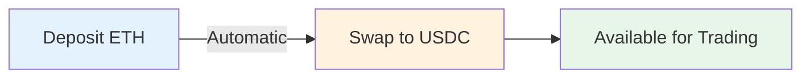

## Overview

Predifi supports multiple funding methods to make it easy to get started trading:

<CardGroup cols={2}>
  <Card title="Crypto Deposits" icon="bitcoin">
    Transfer USDC or other supported cryptocurrencies directly to your Smart AA wallet
  </Card>
  <Card title="Fiat On-Ramp" icon="credit-card">
    Purchase crypto instantly with credit or debit cards through our integrated payment partners
  </Card>
</CardGroup>

---

## Crypto Funding

### Supported Assets

You can deposit the following cryptocurrencies to fund your account:

| Asset | Supported Chains | Notes |
|-------|------------------|-------|
| **USDC** | Arbitrum, Optimism, Binance Smart Chain, Polygon | Primary trading asset |
| **USDT** | Arbitrum, Optimism, Binance Smart Chain | Auto-converts to USDC |
| **ETH** | Arbitrum, Optimism | Auto-converts to USDC |
| **Native tokens** | BNB (BSC), MATIC (Polygon) | Auto-converts to USDC |

<Info>
  All deposits are sent to your **Smart Account Abstraction (AA) wallet** address. This is a non-custodial wallet controlled by you.
</Info>

### How to Deposit Crypto

<Steps>
  <Step title="Get Your Wallet Address">
    Go to your [Wallet page](https://app.predifi.com/wallet) and copy your Smart AA wallet address
    
    ```
    Example: 0x742d35Cc6634C0532925a3b844Bc9e7595f0bEb
    ```
    
    <Warning>
      Always verify the full address. Each chain has a different deposit address.
    </Warning>
  </Step>
  
  <Step title="Select Chain">
    Choose which chain you want to deposit on:
    
    - **Arbitrum** - Low fees, fast
    - **Optimism** - Low fees, fast
    - **Binance Smart Chain** - Very low fees
    - **Polygon** - Very low fees
    
    Your funds stay on this chain in your LP Vault
  </Step>
  
  <Step title="Send Crypto">
    From your external wallet (MetaMask, Coinbase Wallet, etc.), send USDC to your Smart AA wallet address
    
    **Minimum deposit:** $10 USDC
    
    **Typical confirmation time:**
    - Arbitrum: 1-2 minutes
    - Optimism: 1-2 minutes
    - BSC: 3-5 minutes
    - Polygon: 2-3 minutes
  </Step>
  
  <Step title="Confirm Balance">
    Your balance will appear in your wallet once the transaction is confirmed
    
    Check your balance at [app.predifi.com/wallet](https://app.predifi.com/wallet)
  </Step>
</Steps>

### Deposit Example

<Tabs>
  <Tab title="From MetaMask">
    ```plaintext
    1. Open MetaMask
    2. Click "Send"
    3. Paste your Predifi Smart AA wallet address
    4. Enter amount (e.g., 100 USDC)
    5. Select the correct network (e.g., Arbitrum)
    6. Confirm transaction
    7. Wait for confirmation (1-2 minutes)
    8. Check your Predifi wallet balance
    ```
  </Tab>
  
  <Tab title="From Exchange">
    ```plaintext
    1. Open exchange (Binance, Coinbase, etc.)
    2. Go to "Withdraw"
    3. Select USDC
    4. Choose network (e.g., Arbitrum)
    5. Paste your Predifi Smart AA wallet address
    6. Enter amount
    7. Confirm withdrawal
    8. Wait for confirmation (5-10 minutes)
    9. Check your Predifi wallet balance
    ```
  </Tab>
  
  <Tab title="From Hardware Wallet">
    ```plaintext
    1. Connect hardware wallet (Ledger, Trezor)
    2. Open wallet interface
    3. Select USDC token
    4. Click "Send"
    5. Enter Predifi Smart AA wallet address
    6. Enter amount
    7. Approve on hardware device
    8. Confirm transaction
    9. Wait for confirmation
    10. Check your Predifi wallet balance
    ```
  </Tab>
</Tabs>

### Auto-Conversion

Non-USDC deposits are automatically converted to USDC:



**Conversion process:**
1. Your deposit is received (e.g., 0.05 ETH)
2. Automatic swap executed at market rate
3. USDC credited to your balance (e.g., ~$180 USDC)
4. Small conversion fee applied (~0.3%)

<Tip>
  **Pro tip:** Deposit USDC directly to avoid conversion fees
</Tip>

---

## Fiat On-Ramp

Purchase crypto instantly with your credit or debit card.

### Supported Payment Methods

<CardGroup cols={2}>
  <Card title="Credit Cards" icon="credit-card">
    Visa, Mastercard, American Express
  </Card>
  <Card title="Debit Cards" icon="credit-card">
    Visa Debit, Mastercard Debit
  </Card>
  <Card title="Apple Pay" icon="apple">
    Quick checkout with Face ID
  </Card>
  <Card title="Google Pay" icon="google">
    One-tap payment
  </Card>
</CardGroup>

### How to Buy Crypto with Fiat

<Steps>
  <Step title="Click 'Add Funds'">
    Go to [Wallet](https://app.predifi.com/wallet) and click "Add Funds" → "Buy with Card"
  </Step>
  
  <Step title="Enter Amount">
    Enter the amount you want to deposit in USD
    
    **Limits:**
    - Minimum: $20
    - Maximum: $10,000 per transaction
    - Daily limit: $25,000
  </Step>
  
  <Step title="Select Payment Method">
    Choose your payment method:
    - Credit/Debit Card (manual entry)
    - Apple Pay (instant)
    - Google Pay (instant)
    
    Your payment info is encrypted and never stored on Predifi servers
  </Step>
  
  <Step title="Complete KYC (First Time)">
    For regulatory compliance, first-time users must verify identity:
    
    **Required information:**
    - Full name
    - Date of birth
    - Country of residence
    - Government ID (passport, driver's license, or national ID)
    
    **Verification time:** Usually 1-5 minutes
    
    <Info>
      KYC is only required once. Subsequent purchases are instant.
    </Info>
  </Step>
  
  <Step title="Review and Confirm">
    Review the purchase details:
    
    ```
    You Pay:        $100.00 USD
    Processing Fee: $3.99 (3.99%)
    You Receive:    ~$96.01 USDC
    
    Rate: 1 USDC = $1.00
    Delivery: Instant (1-2 minutes)
    ```
    
    Click "Confirm Purchase"
  </Step>
  
  <Step title="Receive USDC">
    USDC is delivered to your Smart AA wallet within 1-2 minutes
    
    You'll receive an email and in-app notification when funds arrive
  </Step>
</Steps>

### On-Ramp Partners

We integrate with leading crypto payment providers:

<CardGroup cols={3}>
  <Card title="Moonpay" icon="moon">
    Global coverage, 150+ countries
  </Card>
  <Card title="Transak" icon="shuffle">
    Bank transfers, cards, Apple/Google Pay
  </Card>
  <Card title="Ramp" icon="rocket">
    Instant settlement, low fees
  </Card>
</CardGroup>

**Partner selection:**
- Best rate and availability determined automatically
- You always get the lowest fee option
- No need to choose manually

### Fees

Fiat on-ramp fees vary by payment method and partner:

| Payment Method | Fee | Speed |
|----------------|-----|-------|
| **Credit Card** | 3.5% - 4.5% | Instant |
| **Debit Card** | 3.5% - 4.5% | Instant |
| **Apple Pay** | 3.5% - 4.5% | Instant |
| **Google Pay** | 3.5% - 4.5% | Instant |
| **Bank Transfer (ACH)** | 1.0% - 1.5% | 1-3 days |
| **Wire Transfer** | 0.5% - 1.0% | Same day |

<Info>
  Fees are charged by payment partners, not Predifi. The exact fee is displayed before you confirm the transaction.
</Info>

### Geographic Availability

Fiat on-ramp is available in **100+ countries**, including:

**Supported regions:**
- 🇺🇸 United States
- 🇨🇦 Canada
- 🇬🇧 United Kingdom
- 🇪🇺 European Union (all countries)
- 🇦🇺 Australia
- 🇸🇬 Singapore
- 🇯🇵 Japan
- 🇰🇷 South Korea
- 🇮🇳 India
- 🇧🇷 Brazil
- And many more...

**Restricted regions:**
Some regions may have limited availability due to local regulations. Check availability during the purchase flow.

---

## Withdrawals

### Crypto Withdrawals

Withdraw USDC or other crypto to any external wallet:

<Steps>
  <Step title="Go to Wallet">
    Navigate to [Wallet](https://app.predifi.com/wallet) → "Withdraw"
  </Step>
  
  <Step title="Select Chain">
    Choose which chain to withdraw on (must match your deposit chain):
    - Arbitrum
    - Optimism
    - Binance Smart Chain
    - Polygon
  </Step>
  
  <Step title="Enter Details">
    - **Recipient Address:** External wallet address
    - **Amount:** USDC amount to withdraw
    - **Chain:** Verify correct network
    
    <Warning>
      Double-check the recipient address and chain. Sending to wrong chain = **permanent loss of funds**.
    </Warning>
  </Step>
  
  <Step title="Confirm Withdrawal">
    Review gas fee and total:
    
    ```
    Withdrawal Amount: $500.00 USDC
    Network Fee:       $0.50 (Arbitrum)
    Total Sent:        $500.00
    You Receive:       $499.50 (after gas)
    
    Estimated Time: 1-2 minutes
    ```
    
    Confirm with 2FA if enabled
  </Step>
</Steps>

**Withdrawal limits:**
- Minimum: $10 USDC
- Maximum: No limit (subject to available balance)
- Processing time: 1-5 minutes

### Fiat Off-Ramp

Sell USDC and receive fiat currency to your bank account:

<Steps>
  <Step title="Select 'Sell Crypto'">
    Go to Wallet → "Sell Crypto"
  </Step>
  
  <Step title="Enter Amount">
    Enter USDC amount to sell
    
    Limits:
    - Minimum: $20
    - Maximum: $50,000 per transaction
  </Step>
  
  <Step title="Add Bank Account">
    First-time users must add bank account:
    - Account holder name
    - Bank name
    - Account number / IBAN
    - Routing number / SWIFT code
    
    <Info>
      Bank details are encrypted and stored securely
    </Info>
  </Step>
  
  <Step title="Review and Confirm">
    ```
    You Sell:       $1,000.00 USDC
    Exchange Rate:  1 USDC = $0.999 USD
    Processing Fee: $9.99 (1%)
    You Receive:    $989.01 USD
    
    Delivery: 1-3 business days (bank transfer)
    ```
  </Step>
  
  <Step title="Receive Fiat">
    Funds are deposited to your bank account within 1-3 business days
  </Step>
</Steps>

**Off-ramp fees:**
- Bank transfer (ACH): 1.0% - 1.5%
- Wire transfer: 0.5% - 1.0%
- Debit card (instant): 3.5% - 4.5%

---

## Security

### Smart AA Wallet Security

Your Smart AA wallet has advanced security features:

<AccordionGroup>
  <Accordion title="Non-Custodial" icon="key">
    **You control your funds at all times**
    
    - Private keys managed by Account Abstraction
    - No one (including Predifi) can access your funds
    - You can withdraw anytime
  </Accordion>
  
  <Accordion title="Social Recovery" icon="users">
    **Recover access if you lose credentials**
    
    - Set trusted guardians (email, phone, hardware wallet)
    - Guardians can help recover account
    - No single point of failure
  </Accordion>
  
  <Accordion title="Multi-Sig Support" icon="shield">
    **Optional multi-signature protection**
    
    - Require multiple approvals for large withdrawals
    - Add hardware wallet as co-signer
    - Enhanced security for large accounts
  </Accordion>
  
  <Accordion title="Session Keys" icon="clock">
    **Limited-time trading permissions**
    
    - Grant temporary trading access
    - Auto-expire after set time
    - Limits maximum transaction size
  </Accordion>
</AccordionGroup>

### Payment Security

<CardGroup cols={2}>
  <Card title="PCI DSS Compliant" icon="lock">
    Payment card data handled by certified partners
  </Card>
  <Card title="3D Secure" icon="shield-check">
    Additional verification for card payments
  </Card>
  <Card title="Fraud Detection" icon="eye">
    Real-time monitoring and risk scoring
  </Card>
  <Card title="Encrypted" icon="fingerprint">
    End-to-end encryption for all transactions
  </Card>
</CardGroup>

---

## Fees Summary

### Deposit Fees

| Method | Fee | Speed |
|--------|-----|-------|
| **Crypto (USDC)** | $0 (only network gas) | 1-5 minutes |
| **Crypto (other assets)** | ~0.3% conversion fee | 1-5 minutes |
| **Fiat (card)** | 3.5% - 4.5% | Instant |
| **Fiat (bank transfer)** | 1.0% - 1.5% | 1-3 days |

### Withdrawal Fees

| Method | Fee | Speed |
|--------|-----|-------|
| **Crypto** | $0 (only network gas) | 1-5 minutes |
| **Fiat (bank transfer)** | 1.0% - 1.5% | 1-3 days |
| **Fiat (instant card)** | 3.5% - 4.5% | Instant |

<Tip>
  **Save on fees:** Use crypto deposits/withdrawals to avoid fiat on-ramp fees
</Tip>

---

## Troubleshooting

<AccordionGroup>
  <Accordion title="Deposit not showing up?" icon="clock">
    **Common causes:**
    - Transaction still pending on blockchain (check block explorer)
    - Wrong network selected (e.g., sent on Ethereum mainnet instead of Arbitrum)
    - Insufficient gas fee (transaction failed)
    
    **How to check:**
    1. Copy your transaction hash (from sending wallet)
    2. Check on block explorer (arbiscan.io for Arbitrum)
    3. Verify transaction status
    
    **If stuck for >30 minutes:**
    - Contact support with transaction hash
    - We'll investigate and credit manually if needed
  </Accordion>
  
  <Accordion title="Card payment declined?" icon="credit-card">
    **Common causes:**
    - Insufficient funds
    - Card not enabled for international/online transactions
    - Bank flagged as suspicious (crypto purchase)
    - Daily limit exceeded
    
    **Solutions:**
    - Contact your bank and approve the transaction
    - Try a different card
    - Use bank transfer instead (lower fees too)
  </Accordion>
  
  <Accordion title="KYC verification failed?" icon="id-card">
    **Common causes:**
    - Blurry or unclear ID photo
    - Name mismatch (ID vs account)
    - Unsupported ID type
    - Restricted country
    
    **Solutions:**
    - Retake ID photo with good lighting
    - Ensure name exactly matches ID
    - Try different ID document
    - Contact support if from supported country
  </Accordion>
  
  <Accordion title="Withdrawal taking too long?" icon="hourglass">
    **Crypto withdrawals:**
    - Usually 1-5 minutes
    - Check transaction on block explorer
    - Network congestion may cause delays
    
    **Fiat withdrawals:**
    - Bank transfers: 1-3 business days (normal)
    - Wire transfers: Same day (normal)
    - Weekends/holidays may delay
    
    **If delayed beyond normal time:**
    - Check spam folder for confirmation email
    - Verify bank account details correct
    - Contact support with withdrawal ID
  </Accordion>
</AccordionGroup>

---

## Best Practices

<CardGroup cols={2}>
  <Card title="Start Small" icon="seedling">
    Make a small test deposit first ($10-$20) to verify everything works
  </Card>
  <Card title="Verify Addresses" icon="magnifying-glass">
    Always double-check wallet addresses and network before sending
  </Card>
  <Card title="Save on Fees" icon="piggy-bank">
    Use crypto deposits to avoid 3-5% fiat on-ramp fees
  </Card>
  <Card title="Enable 2FA" icon="mobile">
    Add extra security with two-factor authentication
  </Card>
  <Card title="Bookmark Official Site" icon="bookmark">
    Only use app.predifi.com - beware of phishing sites
  </Card>
  <Card title="Keep Records" icon="file-text">
    Save transaction hashes and receipts for your records
  </Card>
</CardGroup>

---

## Need Help?

<CardGroup cols={3}>
  <Card
    title="Live Chat"
    icon="comments"
    href="https://app.predifi.com/support"
  >
    Get instant help from our support team
  </Card>
  <Card
    title="Discord"
    icon="discord"
    href="https://discord.gg/predifi"
  >
    Join our community for help and tips
  </Card>
  <Card
    title="Email Support"
    icon="envelope"
    href="mailto:support@predifi.com"
  >
    Send us your questions anytime
  </Card>
</CardGroup>

---

## Next Steps

<CardGroup cols={2}>
  <Card
    title="Start Trading"
    icon="chart-line"
    href="/getting-started/quickstart"
  >
    Place your first trade
  </Card>
  <Card
    title="Understanding Markets"
    icon="book"
    href="/markets"
  >
    Learn about available markets
  </Card>
  <Card
    title="Wallet Security"
    icon="shield"
    href="/support/security"
  >
    Secure your account
  </Card>
  <Card
    title="FAQ"
    icon="circle-question"
    href="/support/faq"
  >
    Common questions answered
  </Card>
</CardGroup>
