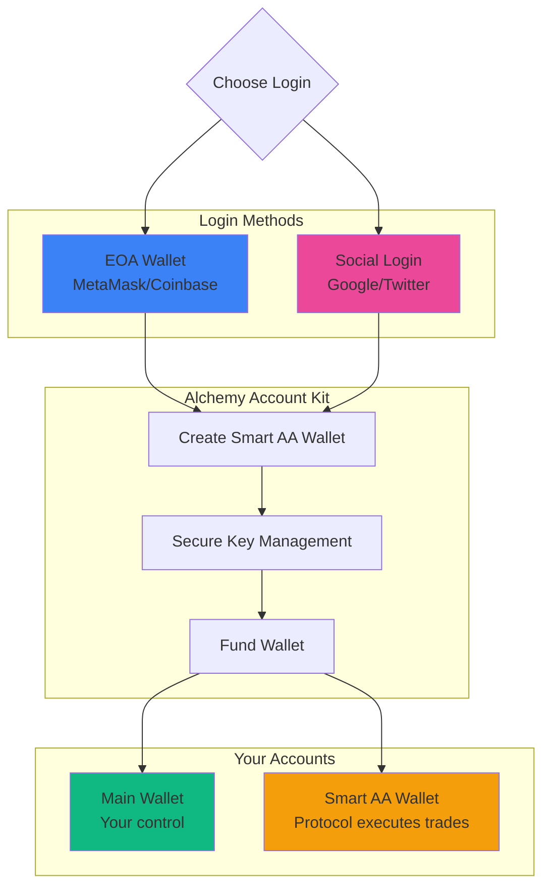

## Welcome to Predifi

Getting started is **simple and fast**. Choose your preferred login method and start trading prediction markets in under 2 minutes.

> ✨ **Connect Wallet or Social Login → Smart AA Wallet Created → Fund Account → Start Trading**

---

## Two Ways to Join

<CardGroup cols={2}>
  <Card title="EOA Wallet" icon="wallet">
    **For Crypto Users**
    
    Connect MetaMask, Coinbase Wallet, WalletConnect, or any EOA wallet
  </Card>
  
  <Card title="Social Login" icon="user">
    **For Everyone Else**
    
    Sign in with Google, Twitter, Discord, or Email—no crypto wallet needed
  </Card>
</CardGroup>

---

## Smart Account Abstraction

### What Happens When You Sign Up

Behind the scenes, Predifi creates a **Smart Account (AA Wallet)** for you powered by **Alchemy Account Kit**:



### Why Smart Accounts?

<Tabs>
  <Tab title="Gas Abstraction">
    **No gas tokens needed**
    
    Traditional crypto:
    ```
    ❌ Need ETH/MATIC/BNB for gas
    ❌ Different gas token per chain
    ❌ Run out of gas mid-transaction
    ❌ Complex for newcomers
    ```
    
    With Smart AA Wallet:
    ```
    ✅ Pay gas in USDC (or we sponsor it)
    ✅ Same experience on all chains
    ✅ Never worry about gas
    ✅ Simple for everyone
    ```
  </Tab>
  
  <Tab title="Social Recovery">
    **Never lose access**
    
    Traditional wallet:
    ```
    ❌ Lose seed phrase = lose funds forever
    ❌ No backup option
    ❌ High stress
    ```
    
    Smart AA Wallet:
    ```
    ✅ Multiple recovery methods
    ✅ Guardian system (email, phone)
    ✅ Account recovery without seed phrase
    ✅ Peace of mind
    ```
  </Tab>
  
  <Tab title="Batch Transactions">
    **One-click complex operations**
    
    Traditional:
    ```
    ❌ Approve USDC (tx 1)
    ❌ Wait for confirmation
    ❌ Deposit to vault (tx 2)
    ❌ Wait again
    ❌ Place trade (tx 3)
    → 3 transactions, 5 minutes
    ```
    
    Smart AA Wallet:
    ```
    ✅ All 3 actions in one transaction
    ✅ One confirmation
    ✅ 30 seconds total
    → Better UX
    ```
  </Tab>
  
  <Tab title="Session Keys">
    **Trade without constant approvals**
    
    Traditional:
    ```
    ❌ Every trade needs wallet approval
    ❌ Pop-up for every action
    ❌ Interrupts flow
    ```
    
    Smart AA Wallet:
    ```
    ✅ Approve session once
    ✅ Trade freely for X hours
    ✅ No interruptions
    ✅ Like Web2 UX
    ```
  </Tab>
</Tabs>

---

## Option 1: Connect EOA Wallet

### For Existing Crypto Users

If you already have a crypto wallet:

<Steps>
  <Step title="Visit Predifi">
    Go to [app.predifi.com](https://app.predifi.com)
  </Step>
  
  <Step title="Click 'Connect Wallet'">
    Choose from supported wallets:
    - **MetaMask** (most popular)
    - **Coinbase Wallet**
    - **WalletConnect** (mobile wallets)
    - **Rabby**
    - **Rainbow**
    - Others
  </Step>
  
  <Step title="Approve Connection">
    Your wallet will prompt you to connect
    - No transaction, no gas required
    - Just grants read access
  </Step>
  
  <Step title="Smart AA Wallet Created">
    Alchemy creates your Smart Account automatically
    - Linked to your EOA
    - You remain in control
    - Non-custodial
  </Step>
  
  <Step title="You're Ready">
    Fund your account and start trading
  </Step>
</Steps>

### Supported Wallets

<CardGroup cols={3}>
  <Card title="MetaMask" icon="fox">
    Most popular Ethereum wallet
  </Card>
  <Card title="Coinbase Wallet" icon="wallet">
    Easy onramp from Coinbase
  </Card>
  <Card title="WalletConnect" icon="mobile">
    Connect any mobile wallet
  </Card>
  <Card title="Rabby" icon="rabbit">
    Multi-chain DeFi wallet
  </Card>
  <Card title="Rainbow" icon="rainbow">
    Beautiful, simple wallet
  </Card>
  <Card title="Others" icon="ellipsis">
    Any WalletConnect-compatible wallet
  </Card>
</CardGroup>

---

## Option 2: Social Login

### For Everyone (No Wallet Needed)

Never used crypto before? No problem:

<Steps>
  <Step title="Visit Predifi">
    Go to [app.predifi.com](https://app.predifi.com)
  </Step>
  
  <Step title="Click 'Sign In'">
    Choose your preferred method:
    - **Google** (Gmail account)
    - **Twitter/X**
    - **Discord**
    - **Email** (passwordless)
  </Step>
  
  <Step title="Authorize">
    Allow Predifi to verify your identity
    - No password to remember
    - Secure OAuth flow
    - No personal data stored
  </Step>
  
  <Step title="Smart Wallet Created">
    Alchemy creates a Smart Account for you:
    - Backed by your social login
    - Recoverable if you lose access
    - Fully functional crypto wallet
  </Step>
  
  <Step title="Fund with Card or Crypto">
    Choose funding method:
    - **Credit/Debit Card** (fiat onramp)
    - **Transfer USDC** (from exchange or another wallet)
  </Step>
  
  <Step title="Start Trading">
    You're ready! Browse markets and place your first trade.
  </Step>
</Steps>

### Social Login Providers

<Tabs>
  <Tab title="Google">
    **Sign in with Google**
    
    - Use your Gmail account
    - Most convenient for most users
    - Instant verification
    - Can link multiple Google accounts
    
    **Security:** OAuth 2.0 + Alchemy key management
  </Tab>
  
  <Tab title="Twitter/X">
    **Sign in with Twitter**
    
    - Use your Twitter/X account
    - Popular in crypto community
    - Share trades easily
    - Built-in social features
    
    **Security:** OAuth 2.0 + Alchemy key management
  </Tab>
  
  <Tab title="Discord">
    **Sign in with Discord**
    
    - Use your Discord account
    - Join our trading community
    - Direct access to support
    - Gamer-friendly
    
    **Security:** OAuth 2.0 + Alchemy key management
  </Tab>
  
  <Tab title="Email">
    **Passwordless Email**
    
    - Use any email address
    - No password to remember
    - Magic link sent to inbox
    - Universal option
    
    **Security:** Email verification + Alchemy key management
  </Tab>
</Tabs>

---

## Alchemy Account Kit

### Our Wallet Infrastructure Partner

Predifi uses **Alchemy Account Kit** to power Smart Account creation and management:

<CardGroup cols={2}>
  <Card title="Battle-Tested" icon="shield-check">
    **Trusted by 1000+ apps**
    
    Alchemy powers top Web3 apps with billions in assets secured
  </Card>
  
  <Card title="ERC-4337 Compliant" icon="file-contract">
    **Standard Smart Accounts**
    
    Industry-standard account abstraction, not proprietary
  </Card>
  
  <Card title="Recovery Options" icon="life-ring">
    **Never Lose Access**
    
    Guardian recovery, social recovery, backup options
  </Card>
  
  <Card title="Seamless UX" icon="wand-magic-sparkles">
    **Web2-Like Experience**
    
    No seed phrases, no gas tokens, one-click actions
  </Card>
</CardGroup>

### How Alchemy Works

<AccordionGroup>
  <Accordion title="Key Management" icon="key">
    **Secure, distributed key storage:**
    
    - Private keys never leave Alchemy's secure enclave
    - Multi-party computation (MPC) for signatures
    - No single point of failure
    - You maintain ultimate control
    - Keys can be exported if needed
  </Accordion>

  <Accordion title="Gas Sponsorship" icon="gas-pump">
    **We pay gas fees for you:**
    
    - Predifi sponsors gas for core actions
    - Users pay in USDC (converted automatically)
    - No need to hold native tokens (ETH, MATIC, etc.)
    - Seamless cross-chain experience
  </Accordion>

  <Accordion title="Session Keys" icon="clock">
    **Trade without constant pop-ups:**
    
    - Approve a "session" (e.g., 24 hours)
    - Trade freely within session
    - Set spending limits
    - Revoke anytime
    - Better UX than traditional wallets
  </Accordion>

  <Accordion title="Account Recovery" icon="user-shield">
    **Multiple recovery methods:**
    
    **Option 1: Guardian Recovery**
    - Set up trusted guardians (email, phone, other wallet)
    - 2 of 3 guardians can recover account
    
    **Option 2: Social Recovery**
    - Re-authenticate with social login
    - Alchemy restores access
    
    **Option 3: Backup Key**
    - Optional backup key you control
    - Last resort recovery method
  </Accordion>
</AccordionGroup>

### Security Features

<Tabs>
  <Tab title="Non-Custodial">
    **You own your funds**
    
    - Keys managed by Alchemy, but YOU control
    - We can't access your funds
    - No centralized custodian
    - Withdraw anytime to any wallet
  </Tab>
  
  <Tab title="Multi-Factor Auth">
    **Extra security layers**
    
    - Biometric authentication (Face ID, Touch ID)
    - 2FA for sensitive actions
    - Device authorization
    - Suspicious activity detection
  </Tab>
  
  <Tab title="Spending Limits">
    **Control your risk**
    
    - Set daily/weekly spending limits
    - Require 2FA for large trades
    - Whitelist trusted addresses
    - Automatic fraud detection
  </Tab>
  
  <Tab title="Audited & Insured">
    **Institutional-grade security**
    
    - SOC 2 Type II certified
    - Regular security audits
    - Bug bounty program
    - Insurance for covered events
  </Tab>
</Tabs>

---

## Funding Your Account

### Option A: Buy USDC with Card

**Easiest for newcomers:**

<Steps>
  <Step title="Click 'Buy USDC'">
    In the Predifi app, click "Buy USDC with Card"
  </Step>
  
  <Step title="Enter Amount">
    Choose how much USD to convert to USDC
    - Minimum: $10
    - Maximum: $10,000 per transaction
  </Step>
  
  <Step title="Enter Card Details">
    Securely enter credit/debit card information
    - Processed by licensed onramp provider
    - Never stored by Predifi
  </Step>
  
  <Step title="Verify Identity">
    First-time users: KYC verification
    - Upload ID
    - Selfie verification
    - One-time process (5 minutes)
  </Step>
  
  <Step title="Receive USDC">
    USDC delivered to your wallet in ~5 minutes
  </Step>
</Steps>

**Fees:**
- Card processing: ~3-5%
- Network fees: Covered by Predifi

### Option B: Transfer USDC

**For existing crypto holders:**

<Steps>
  <Step title="Get Your Deposit Address">
    In Predifi app, click "Deposit" → "USDC"
  </Step>
  
  <Step title="Select Chain">
    Choose which chain to receive on:
    - Arbitrum (recommended - cheapest)
    - Base
    - Optimism
    - BSC
  </Step>
  
  <Step title="Send USDC">
    From your exchange or wallet:
    - Send USDC to displayed address
    - Make sure you select the correct chain!
    - **USDC only** (not USDT, DAI, or other stablecoins)
  </Step>
  
  <Step title="Wait for Confirmation">
    Typically 1-5 minutes depending on chain
  </Step>
  
  <Step title="Start Trading">
    USDC appears in your Predifi balance
  </Step>
</Steps>

**Supported Chains for Deposits:**
- ✅ Arbitrum (lowest fees)
- ✅ Base
- ✅ Optimism
- ✅ BSC
- ✅ Polygon

<Warning>
  **Always double-check the chain!** Sending USDC on the wrong chain will result in lost funds.
</Warning>

---

## Account Settings

### Managing Your Account

Once logged in, customize your account:

<AccordionGroup>
  <Accordion title="Profile Settings" icon="user">
    - Username (public)
    - Display name
    - Avatar
    - Bio
    - Privacy settings
  </Accordion>

  <Accordion title="Security Settings" icon="lock">
    - Enable 2FA
    - Biometric authentication
    - Session management
    - Connected devices
    - Activity log
  </Accordion>

  <Accordion title="Wallet Settings" icon="wallet">
    - View wallet address
    - Export private key (advanced)
    - Spending limits
    - Recovery guardians
    - Backup options
  </Accordion>

  <Accordion title="Notification Settings" icon="bell">
    - Email notifications
    - Push notifications
    - Discord/Telegram alerts
    - Price alerts
    - Position alerts
  </Accordion>

  <Accordion title="Trading Preferences" icon="sliders">
    - Default slippage tolerance
    - Auto-claim winnings
    - Reinvest profits
    - Chart preferences
    - Hotkeys
  </Accordion>
</AccordionGroup>

---

## Frequently Asked Questions

<AccordionGroup>
  <Accordion title="Is Predifi custodial or non-custodial?" icon="question">
    **Non-custodial.** Your funds are always in your control. Smart AA Wallets are your wallets, managed by Alchemy's secure infrastructure but owned by you.
  </Accordion>

  <Accordion title="Can I use my existing wallet?" icon="wallet">
    **Yes!** Connect any EOA wallet (MetaMask, Coinbase Wallet, etc.). A Smart AA Wallet will be created and linked to your EOA for enhanced functionality.
  </Accordion>

  <Accordion title="What if I lose access to my social login?" icon="key">
    **You can recover your account** through Alchemy's guardian system or backup methods. Contact support for assistance.
  </Accordion>

  <Accordion title="Do I need native gas tokens?" icon="gas-pump">
    **No.** Gas fees are abstracted away. You pay in USDC or Predifi sponsors the gas.
  </Accordion>

  <Accordion title="Can I withdraw my funds anytime?" icon="arrow-right-from-bracket">
    **Yes.** Withdraw USDC to any wallet address on supported chains anytime. No lock-ups or restrictions.
  </Accordion>

  <Accordion title="Is my data private?" icon="shield">
    **Yes.** We don't sell data. Social logins use OAuth (we never see your passwords). Wallet addresses are public (blockchain), but trading activity is private.
  </Accordion>

  <Accordion title="What countries are supported?" icon="globe">
    Most countries are supported except those under sanctions (OFAC list). KYC required for fiat onramp in some jurisdictions.
  </Accordion>
</AccordionGroup>

---

## Next Steps

<CardGroup cols={2}>
  <Card
    title="Browse Markets"
    icon="grid"
    href="/markets"
  >
    See available crypto and sports markets
  </Card>
  <Card
    title="Quickstart Guide"
    icon="rocket"
    href="/getting-started/quickstart"
  >
    Learn how to place your first trade
  </Card>
  <Card
    title="Portfolio Tracker"
    icon="chart-line"
    href="/products/portfolio-tracker"
  >
    Track your positions and P&L
  </Card>
  <Card
    title="Join Community"
    icon="discord"
    href="https://discord.gg/predifi"
  >
    Connect with other traders
  </Card>
</CardGroup>

---

## Get Started Now

<Card
  title="Create Your Account"
  icon="user-plus"
  href="https://app.predifi.com"
>
  Sign up with wallet or social login in under 2 minutes →
</Card>

**Powered by Alchemy Account Kit** - Trusted by 1000+ Web3 applications
