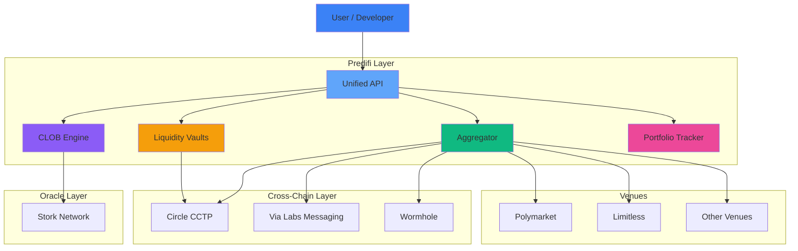

## What is Predifi?

Predifi is a **chain-agnostic prediction market infrastructure** that provides both user-facing trading products and powerful developer APIs. We enable seamless cross-chain prediction market trading and provide the building blocks for developers to create their own prediction market applications.

<CardGroup cols={2}>
  <Card
    title="Start Trading"
    icon="chart-line"
    href="/getting-started/quickstart"
  >
    Trade on prediction markets with unified liquidity
  </Card>
  <Card
    title="Build on Predifi"
    icon="code"
    href="/developers/introduction"
  >
    Use our APIs to build prediction market apps
  </Card>
  <Card
    title="Provide Liquidity"
    icon="hand-holding-dollar"
    href="/liquidity/overview"
  >
    Earn yield by providing liquidity to the protocol
  </Card>
  <Card
    title="Explore Technology"
    icon="microchip"
    href="/technology/chain-agnostic"
  >
    Learn about our cross-chain infrastructure
  </Card>
</CardGroup>

---

## Our Products

### For Traders

<CardGroup cols={2}>
  <Card
    title="CLOB Matching Engine"
    icon="chart-candlestick"
    href="/products/clob-matching"
  >
    Professional orderbook with off-chain matching and on-chain settlement
  </Card>
  <Card
    title="Prediction Market Aggregator"
    icon="layer-group"
    href="/products/aggregator"
  >
    Access Polymarket, Limitless, and more from one interface
  </Card>
  <Card
    title="Liquidity Vaults"
    icon="vault"
    href="/products/liquidity-vaults"
  >
    ERC-4626 compliant vaults for earning yield
  </Card>
  <Card
    title="Portfolio Tracker"
    icon="wallet"
    href="/products/portfolio-tracker"
  >
    Track all positions across chains and venues
  </Card>
</CardGroup>

### For Developers

<Card
  title="Unified Prediction Market API"
  icon="api"
  href="/developers/introduction"
>
  **Build on Predifi** - One API for all prediction market operations:
  - 📊 Fetch markets from multiple venues
  - 💼 Track portfolios across chains
  - 📈 Place and manipulate trades
  - 🔔 Real-time WebSocket feeds
  - 🌐 Chain-agnostic infrastructure
  
  Build prediction market apps, trading bots, analytics platforms, and more using our comprehensive API suite.
</Card>

---

## Why Choose Predifi?

<AccordionGroup>
  <Accordion title="🌐 Chain Agnostic" icon="globe">
    Trade on any EVM-compatible blockchain. Predifi abstracts away chain complexity, letting you focus on trading. Seamlessly move between chains without managing multiple wallets or bridges.
  </Accordion>
  
  <Accordion title="🔗 Cross-Chain Native" icon="link">
    Built-in CCTP and Wormhole integration for secure, fast cross-chain transfers. Bridge assets and data between chains seamlessly with our trusted partners Via Labs and Circle.
  </Accordion>
  
  <Accordion title="🎯 Unified Liquidity" icon="droplet">
    Access liquidity from Polymarket, Limitless, and Predifi's native pools. Get better prices through aggregated orderbooks and deeper liquidity.
  </Accordion>
  
  <Accordion title="⚡ Off-Chain Matching, On-Chain Settlement" icon="bolt">
    Professional CLOB experience with gas-efficient execution. Place and cancel orders for free, only pay gas when trades settle.
  </Accordion>
  
  <Accordion title="🔒 Enterprise-Grade Security" icon="shield-check">
    Non-custodial, audited smart contracts with 90%+ test coverage. Decentralized oracle resolution via Stork Network ensures fair outcomes.
  </Accordion>
  
  <Accordion title="�️ Developer-Friendly" icon="code">
    One unified API for all prediction market operations. Build complex applications without managing multiple venue integrations.
  </Accordion>
</AccordionGroup>

---

## Technology Stack

Predifi is built with cutting-edge partners and protocols:

<CardGroup cols={2}>
  <Card title="Circle CCTP" icon="circle" href="/technology/cross-chain-bridging">
    Cross-chain USDC transfers with native burn-and-mint
  </Card>
  <Card title="Via Labs" icon="share-nodes" href="/technology/partners">
    Reliable cross-chain messaging infrastructure
  </Card>
  <Card title="Stork Network" icon="tower-broadcast" href="/technology/partners">
    Decentralized oracle network for tamper-proof resolutions
  </Card>
  <Card title="EVM Compatible" icon="ethereum" href="/technology/chain-agnostic">
    Deploy on any EVM chain: Arbitrum, Base, Optimism, Polygon, BSC
  </Card>
</CardGroup>

---

## How It Works

<Steps>
  <Step title="Connect Your Wallet">
    Connect any EVM-compatible wallet. No sign-up, no KYC required.
  </Step>
  
  <Step title="Choose Your Product">
    Trade via CLOB or Aggregator, provide liquidity, or use our APIs to build.
  </Step>
  
  <Step title="Execute Seamlessly">
    Predifi handles all cross-chain complexity. Bridge, trade, settle—all automated.
  </Step>
  
  <Step title="Track Everything">
    Unified portfolio view across all chains and venues. One dashboard for all positions.
  </Step>
</Steps>

---

## Architecture Overview

---

## Use Cases

<Tabs>
  <Tab title="For Traders">
    - Trade on political, sports, crypto, and cultural events
    - Access best prices across multiple venues
    - Professional orderbook trading with limit orders
    - Track portfolio across all chains in one place
  </Tab>
  
  <Tab title="For Liquidity Providers">
    - Earn yield on idle USDC
    - Provide liquidity to prediction markets
    - Automated rebalancing
    - Transparent fee sharing (60% to LPs)
  </Tab>
  
  <Tab title="For Developers">
    - Build prediction market frontends
    - Create trading bots and algorithms
    - Build analytics and research tools
    - Integrate prediction markets into existing apps
    - Launch white-label prediction market platforms
  </Tab>
</Tabs>

---

## What Can You Trade?

Predifi aggregates markets across diverse categories:

<CardGroup cols={3}>
  <Card title="🗳️ Politics" icon="landmark">
    Elections, policy decisions, approval ratings, referendums
  </Card>
  <Card title="⚽ Sports" icon="futbol">
    Game outcomes, championships, player stats, tournament results
  </Card>
  <Card title="💰 Crypto" icon="bitcoin">
    Token prices, protocol launches, blockchain events, DeFi metrics
  </Card>
  <Card title="🎬 Entertainment" icon="film">
    Award shows, box office, streaming metrics, celebrity events
  </Card>
  <Card title="🌍 Current Events" icon="earth-americas">
    News outcomes, geopolitical events, disaster predictions
  </Card>
  <Card title="📊 Economics" icon="chart-line">
    Market indicators, Fed decisions, GDP forecasts, inflation
  </Card>
  <Card title="🔬 Science & Tech" icon="flask">
    Product launches, scientific discoveries, adoption metrics
  </Card>
  <Card title="🎮 Gaming" icon="gamepad">
    Esports tournaments, game releases, player achievements
  </Card>
  <Card title="🌤️ Weather" icon="cloud-sun">
    Temperature predictions, natural disasters, climate events
  </Card>
</CardGroup>

---

## Ready to Start?

<CardGroup cols={3}>
  <Card
    title="Start Trading"
    icon="rocket"
    href="/getting-started/quickstart"
  >
    Trade in 5 minutes
  </Card>
  <Card
    title="Build with APIs"
    icon="code"
    href="/developers/quickstart"
  >
    Developer quickstart
  </Card>
  <Card
    title="Provide Liquidity"
    icon="hand-holding-dollar"
    href="/liquidity/overview"
  >
    Earn yield
  </Card>
  <Card
    title="View Products"
    icon="grid-2"
    href="/products/overview"
  >
    Explore all products
  </Card>
  <Card
    title="Read Technology"
    icon="microchip"
    href="/technology/chain-agnostic"
  >
    Technical architecture
  </Card>
  <Card
    title="Join Community"
    icon="discord"
    href="https://discord.gg/predifi"
  >
    Discord community
  </Card>
</CardGroup>

<Note>
  **New to prediction markets?** Check out [How It Works](/how-it-works) to understand the basics, or jump straight to our [Quickstart Guide](/getting-started/quickstart).
</Note>

---

## Trusted By

Predifi is built in partnership with industry-leading protocols:

| Partner | Role | Why We Chose Them |
|---------|------|-------------------|
| **Circle (CCTP)** | Cross-chain bridging | Native USDC transfers with institutional trust |
| **Via Labs** | Cross-chain messaging | Reliable, battle-tested messaging infrastructure |
| **Stork Network** | Oracle provider | Decentralized, tamper-proof market resolution |
| **Polymarket** | Venue partner | Largest prediction market with deep liquidity |
| **Limitless** | Venue partner | Innovative Base-native markets |

[Learn more about our partners →](/technology/partners)

<!-- validation-check -->
