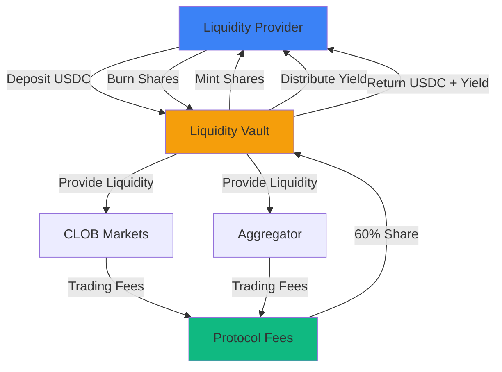
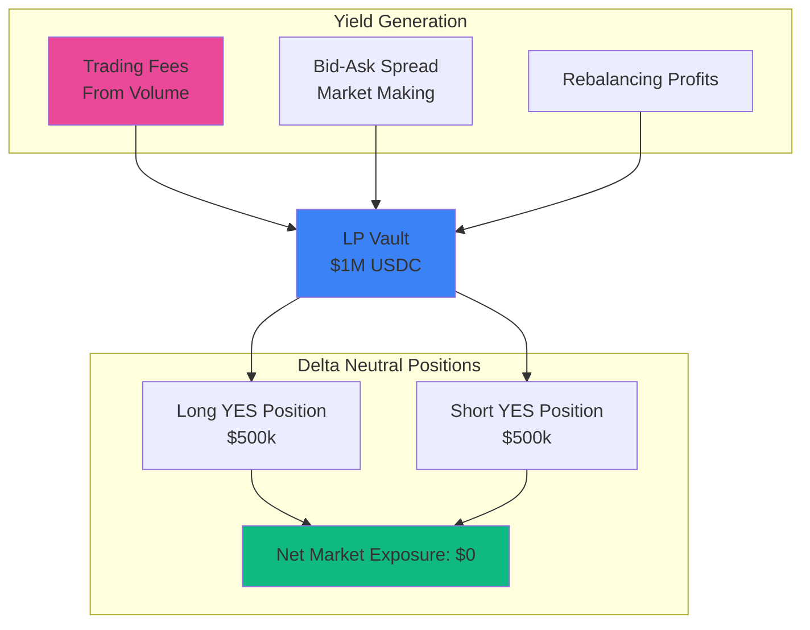

## What are Liquidity Vaults?

Predifi's **Liquidity Vaults** are ERC-4626 compliant smart contracts that let you earn yield by providing liquidity to prediction markets. Deposit USDC, receive vault shares, and automatically earn a portion of protocol fees.

> 💰 **Deposit USDC → Receive Vault Shares → Earn Fees Automatically → Withdraw Anytime**

---

## How It Works



<Steps>
  <Step title="Deposit USDC">
    Deposit USDC into the liquidity vault. You receive ERC-4626 vault shares representing your position.
  </Step>
  
  <Step title="Liquidity Deployed">
    Your capital is deployed to provide liquidity for both CLOB and Aggregator trades.
  </Step>
  
  <Step title="Earn Fees">
    As users trade, protocol fees are collected. 60% of fees go to liquidity providers.
  </Step>
  
  <Step title="Auto-Compounding">
    Fees are automatically reinvested, compounding your returns over time.
  </Step>
  
  <Step title="Withdraw Anytime">
    Burn your vault shares to withdraw USDC + earned yield (subject to utilization).
  </Step>
</Steps>

---

## Key Features

### 🏦 ERC-4626 Standard

Built on the industry-standard ERC-4626 vault interface:
- **Composability** - Works with existing DeFi protocols
- **Transparency** - Standard share accounting
- **Interoperability** - Compatible with vault aggregators
- **Proven Design** - Battle-tested standard used across DeFi

### 💰 Automatic Yield Distribution

- **No manual claiming** - Yield accrues to vault value
- **Auto-compounding** - Earn yield on your yield
- **Transparent** - Share price increases reflect earnings
- **Gas efficient** - No per-user distribution transactions

### 🔓 Non-Custodial

- **You control your shares** - Vault shares are in your wallet
- **No lock periods** - Withdraw anytime (subject to utilization)
- **Transparent operations** - All transactions on-chain
- **Audited contracts** - Security-first design

### 🌐 Multi-Venue Deployment

Your liquidity powers both:
- **CLOB Matching Engine** - Provide depth to orderbooks
- **Prediction Market Aggregator** - Enable cross-venue trades

One deposit, multiple revenue streams.

---

## Returns & APY

### Fee Distribution

| Source | LP Share | Other |
|--------|----------|-------|
| **CLOB Fees** | 60% | 30% treasury, 10% insurance |
| **Aggregator Fees** | 60% | 30% treasury, 10% insurance |
| **Settlement Fees** | 60% | 30% treasury, 10% insurance |

### Historical APY (Estimated)

<Note>
  **Note**: These are projected estimates based on expected trading volumes. Actual returns will vary based on market activity.
</Note>

| Scenario | Monthly Volume | Est. APY |
|----------|---------------|----------|
| Conservative | $1M | 5-8% |
| Moderate | $10M | 12-18% |
| Bullish | $50M | 25-35% |
| Very Bullish | $100M+ | 40-60% |

### Return Calculation Example

```
Vault TVL: $1,000,000
Monthly Volume: $10,000,000
Average Fee: 0.5%
Total Fees: $10M × 0.5% = $50,000
LP Share (60%): $50,000 × 60% = $30,000
Monthly Return: $30,000 / $1,000,000 = 3%
Annualized: 3% × 12 = 36% APY
```

<Warning>
  Past performance does not guarantee future results. Prediction market trading volumes can be volatile.
</Warning>

---

## Risks

## How Vaults Generate Yield

### Delta Neutral Strategy

Liquidity Vaults earn yield through a **delta neutral market making strategy** combined with **protocol fee capture**:



### Three Revenue Streams

<Tabs>
  <Tab title="1. Trading Fees">
    **Earn fees from protocol trading volume**
    
    LPs receive **60% of all trading fees** generated by the protocol:
    
    ```
    Example Daily Volume: $1,000,000
    Platform Trading Fees: 0.1% = $1,000
    LP Share (60%): $600/day
    
    With $1M in LP vault:
    Daily return: 0.06%
    Annualized: ~22% APY
    ```
    
    **Fee distribution is automatic**:
    - Fees collected from every trade
    - Distributed proportionally to vault shares
    - Increases share value in real-time
    - No manual claiming needed
  </Tab>
  
  <Tab title="2. Market Making Spread">
    **Capture bid-ask spread**
    
    Vault provides liquidity on both sides:
    
    ```
    Market: BTC to $100k?
    
    Vault provides:
    - BID: $0.64 (buy YES from users)
    - ASK: $0.66 (sell YES to users)
    - Spread: 2 cents per trade
    
    On $100k daily volume:
    Spread capture: $2,000/day
    With $1M vault: 0.2%/day = 73% APY
    ```
    
    **Delta neutral maintenance**:
    - Equal exposure to YES and NO
    - Net market exposure = $0
    - Profit from spread, not price movement
  </Tab>
  
  <Tab title="3. Rebalancing Profits">
    **Earn from position rebalancing**
    
    As markets move, vault rebalances:
    
    ```
    Scenario: YES price moves 0.60 → 0.70
    
    Vault rebalances:
    1. Sell some YES at $0.70 (high)
    2. Buy more NO at $0.30 (low)
    3. Maintain delta neutral
    4. Pocket the difference
    
    Profit per rebalance: 1-3% of position
    Multiple rebalances/day: 5-15% APY
    ```
  </Tab>
</Tabs>

### Delta Neutral Example

**Maintaining market neutrality:**

<Accordion title="Step-by-Step Delta Neutral Strategy" icon="scale-balanced">
  
**Initial State:**
```
Vault: $1,000,000 USDC
Market: BTC to $100k (YES @ $0.65, NO @ $0.35)

Vault Position:
- Buy 750,000 YES shares @ $0.65 = $487,500
- Buy 750,000 NO shares @ $0.35 = $262,500
- Total deployed: $750,000
- Reserve: $250,000
- Net exposure: $0 (perfectly hedged)
```

**Market Moves (BTC pumps, YES → $0.80):**
```
New prices: YES @ $0.80, NO @ $0.20

Vault value:
- YES shares: 750k × $0.80 = $600,000
- NO shares: 750k × $0.20 = $150,000
- Total: $750,000 (same as before!)
- Net exposure: Still $0
```

**Rebalancing for Profit:**
```
1. Sell 100k YES @ $0.80 = $80,000 profit locked
2. Buy 100k more NO @ $0.20 = $20,000 spent
3. Net profit: $60,000 from rebalancing
4. Return to balanced exposure
```

</Accordion>

### APY Breakdown

**Projected annual returns:**

| Component | Conservative | Expected | Optimistic |
|-----------|-------------|----------|------------|
| **Trading Fees (60% share)** | 15% | 25% | 40% |
| **Market Making Spread** | 5% | 10% | 20% |
| **Rebalancing Profits** | 3% | 5% | 10% |
| **Total APY** | **23%** | **40%** | **70%** |

<Info>
  Returns are variable and depend on trading volume, market volatility, and utilization rates. Past performance does not guarantee future results.
</Info>

### Risk Management

**How we minimize LP risk:**

<AccordionGroup>
  <Accordion title="Delta Neutral = No Market Risk" icon="shield-check">
    - Equal long and short exposure
    - Profit from volatility, not direction
    - Market can go up, down, sideways—vault profits
    - Only risk is if trading stops completely
  </Accordion>

  <Accordion title="Diversification Across Markets" icon="chart-network">
    - Liquidity spread across 100+ markets
    - Multiple asset classes (crypto, sports, politics)
    - Multiple time frames (15m, 30m, 1h, daily)
    - Reduces single-market risk
  </Accordion>

  <Accordion title="Utilization Limits" icon="gauge">
    - Max 80% of vault can be deployed
    - 20% reserve for withdrawals
    - Prevents overexposure
    - Maintains liquidity
  </Accordion>

  <Accordion title="Smart Contract Safeguards" icon="code">
    - Emergency pause function
    - Rate limiters on deposits/withdrawals
    - Admin keys secured in multi-sig
    - Audited by multiple firms
  </Accordion>
</AccordionGroup>

[View detailed risk analysis →](/liquidity/returns-and-risks)

---

## How to Provide Liquidity

<Steps>
  <Step title="Connect Wallet">
    Connect your wallet with USDC on supported chains
  </Step>
  
  <Step title="Navigate to Vaults">
    Go to the Liquidity Vaults page in the Predifi app
  </Step>
  
  <Step title="Choose Amount">
    Enter the amount of USDC you want to deposit (minimum $100)
  </Step>
  
  <Step title="Approve USDC">
    Approve the vault contract to access your USDC (one-time)
  </Step>
  
  <Step title="Deposit">
    Confirm the deposit transaction. You'll receive vault shares.
  </Step>
  
  <Step title="Track Performance">
    Monitor your vault share value and accrued yield in real-time
  </Step>
</Steps>

[Detailed LP guide →](/liquidity/how-to-provide)

---

## Vault Specifications

### Technical Details

| Parameter | Value |
|-----------|-------|
| **Standard** | ERC-4626 |
| **Asset** | USDC |
| **Min Deposit** | $100 |
| **Max Deposit** | Unlimited |
| **Fee Distribution** | Automatic |
| **Withdrawal** | Subject to utilization |
| **Upgrade Pattern** | UUPS Proxy |
| **Access Control** | Role-based (admin, funder) |

### Smart Contract Functions

```solidity
// Standard ERC-4626 Interface
function deposit(uint256 assets, address receiver) external returns (uint256 shares);
function withdraw(uint256 assets, address receiver, address owner) external returns (uint256 shares);
function redeem(uint256 shares, address receiver, address owner) external returns (uint256 assets);

// View Functions
function totalAssets() external view returns (uint256);
function convertToShares(uint256 assets) external view returns (uint256);
function convertToAssets(uint256 shares) external view returns (uint256);
function previewDeposit(uint256 assets) external view returns (uint256);
function previewWithdraw(uint256 assets) external view returns (uint256);
```

---

## Withdrawal Process

### How Withdrawals Work

1. **Request Withdrawal** - Burn vault shares to redeem USDC
2. **Check Utilization** - System checks if sufficient idle liquidity exists
3. **Instant vs Queued**:
   - If liquidity available: Instant withdrawal
   - If high utilization: Added to withdrawal queue
4. **Queue Processing** - As positions close, queued withdrawals are processed FIFO
5. **Receive USDC** - USDC + yield sent to your wallet

### Utilization Levels

| Utilization | Withdrawal Experience |
|-------------|----------------------|
| 0-50% | Instant withdrawals |
| 50-80% | Possible slight delay |
| 80-95% | Likely queued |
| 95-100% | Definitely queued |

<Info>
  You can view current utilization rate in the vault dashboard before depositing or withdrawing.
</Info>

---

## Vault Dashboard

Track your LP position in real-time:

### Key Metrics

- **Your Deposit** - Total USDC deposited
- **Vault Shares** - Number of shares you own
- **Current Value** - USDC value of your shares
- **Unrealized Profit** - Gains since deposit
- **APY (7-day)** - Rolling 7-day annualized return
- **Your Share of Vault** - Percentage ownership
- **Utilization Rate** - % of liquidity currently deployed

### Historical Performance

- **Daily returns chart** - Track day-by-day performance
- **Cumulative returns** - Total gains over time
- **Fee earnings** - Fees attributed to your position
- **Volume contribution** - Trading volume your liquidity supported

---

## Fee Structure

### For Liquidity Providers

| Action | Fee |
|--------|-----|
| **Deposit** | Free (gas only) |
| **Earning Yield** | Free (automatic) |
| **Withdraw** | Free (gas only) |
| **Performance Fee** | 40% of protocol fees go to treasury/insurance |

**Bottom line**: You receive 60% of all protocol fees generated by your liquidity.

---

## Multi-Chain Deployment

Liquidity Vaults deployed on multiple chains:

| Chain | Vault Address | Asset | Status |
|-------|--------------|-------|--------|
| Chain A | 0x... | USDC | ✅ Live |
| Chain B | 0x... | USDC | ✅ Live |
| Chain C | 0x... | USDC | 🔜 Coming Soon |

<Note>
  Specific chain deployments depend on grant decisions. Vaults will be available on Arbitrum, Binance Chain, or Optimism based on where we launch.
</Note>

---

## Comparison with Other Yield Options

| Option | APY | Risk | Liquidity | Complexity |
|--------|-----|------|-----------|------------|
| **Predifi Vaults** | 15-40% | Medium | Good | Low |
| Bank Savings | 0.5-2% | Very Low | Instant | Very Low |
| Stablecoins Lending (Aave) | 3-8% | Low | Instant | Low |
| LP on DEX (Uniswap) | 10-50% | Medium-High | Instant | Medium |
| Prediction Market Manual | 30-200% | High | Varies | High |

Predifi Vaults offer a middle ground: higher returns than traditional DeFi lending, lower complexity than manual trading.

---

## Best Practices

<AccordionGroup>
  <Accordion title="Deposit for the Long Term" icon="calendar">
    Vault strategies work best over months, not days. Plan to keep funds deposited for at least 3-6 months.
  </Accordion>

  <Accordion title="Monitor Utilization" icon="gauge">
    Check utilization before withdrawing. If it's high, you may want to wait for positions to close.
  </Accordion>

  <Accordion title="Diversify" icon="chart-scatter">
    Don't put all your capital in vaults. Maintain diversification across different yield sources.
  </Accordion>

  <Accordion title="Understand Risks" icon="shield-exclamation">
    Read the risks section carefully. Vaults can lose value in adverse market conditions.
  </Accordion>

  <Accordion title="Track Performance" icon="chart-line">
    Regularly review your vault performance. If returns don't meet expectations, consider reallocating.
  </Accordion>
</AccordionGroup>

---

## FAQs

<AccordionGroup>
  <Accordion title="What is ERC-4626?" icon="circle-question">
    ERC-4626 is a standard interface for tokenized vaults. It makes vaults interoperable and easy to integrate with other DeFi protocols.
  </Accordion>

  <Accordion title="Can I lose my deposit?" icon="exclamation">
    Yes. If markets move against LP positions significantly, vault value can decrease. However, over time, protocol fees should outweigh losses.
  </Accordion>

  <Accordion title="How often are yields distributed?" icon="clock">
    Continuously! Yield accrues to vault share value in real-time as fees are collected.
  </Accordion>

  <Accordion title="Can I withdraw anytime?" icon="door-open">
    Mostly yes, but subject to utilization. If liquidity is fully deployed, you may need to wait for positions to close.
  </Accordion>

  <Accordion title="Are vault shares transferable?" icon="arrow-right-arrow-left">
    Yes! Vault shares are ERC-20 tokens. You can transfer them to other addresses or trade them (if secondary markets exist).
  </Accordion>

  <Accordion title="What happens if the vault gets hacked?" icon="user-shield">
    Vaults include emergency pause mechanisms and insurance funds. However, smart contract risk always exists. Only deposit what you can afford to lose.
  </Accordion>
</AccordionGroup>

---

## Get Started

<CardGroup cols={2}>
  <Card title="Provide Liquidity" icon="hand-holding-dollar" href="/liquidity/how-to-provide">
    Step-by-step guide to depositing
  </Card>
  <Card title="Understand Risks" icon="triangle-exclamation" href="/liquidity/returns-and-risks">
    Full risk analysis
  </Card>
  <Card title="View Returns" icon="chart-line" href="/liquidity/returns-and-risks#historical-performance">
    Historical performance data
  </Card>
  <Card title="Launch App" icon="arrow-up-right-from-square" href="https://app.predifi.com/liquidity">
    Start earning now
  </Card>
</CardGroup>
