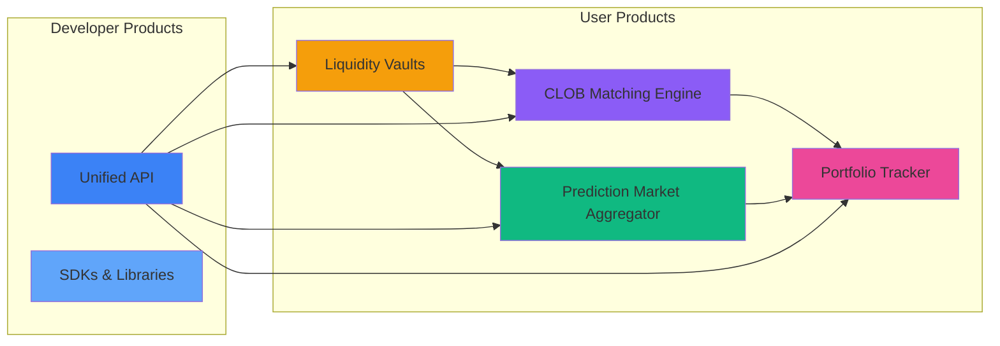

## Predifi Product Suite

Predifi offers a comprehensive ecosystem of prediction market products:

---

## For Traders

<CardGroup cols={2}>
  <Card
    title="CLOB Matching Engine"
    icon="chart-candlestick"
    href="/products/clob-matching"
  >
    Professional Central Limit Order Book with off-chain matching and on-chain settlement
  </Card>
  
  <Card
    title="Prediction Market Aggregator"
    icon="layer-group"
    href="/products/aggregator"
  >
    Access Polymarket, Limitless, and more from one interface
  </Card>
  
  <Card
    title="Liquidity Vaults"
    icon="vault"
    href="/products/liquidity-vaults"
  >
    ERC-4626 compliant vaults for earning yield
  </Card>
  
  <Card
    title="Portfolio Tracker"
    icon="wallet"
    href="/products/portfolio-tracker"
  >
    Unified dashboard for all positions across chains and venues
  </Card>
</CardGroup>

---

## For Developers

<Card
  title="Build on Predifi"
  icon="code"
  href="/developers/introduction"
>
  ### Unified Prediction Market API
  
  One API for all prediction market operations:
  
  - **📊 Market Data** - Fetch markets, orderbooks, price feeds
  - **💼 Portfolio** - Track positions across chains/venues
  - **📈 Trading** - Place, modify, cancel orders
  - **🔔 Real-Time** - WebSocket feeds for live updates
  
  [View API Documentation →](/api/getting-started)
</Card>

---

## Product Comparison

| Feature | CLOB | Aggregator | API Access |
|---------|------|------------|------------|
| **Order Types** | Market + Limit | Market only | Programmable |
| **Liquidity** | Predifi orderbook | Multiple venues | All sources |
| **Execution** | Instant | Cross-chain (5-10min) | Depends |
| **Fees** | 2% on winnings | 0.05-0.1% on trade | Same |
| **Best For** | Active traders | Market access | Developers |

[View detailed comparison →](#product-features-matrix)

---

## Getting Started

<CardGroup cols={2}>
  <Card title="Start Trading" icon="rocket" href="/getting-started/quickstart">
    Trade in 5 minutes
  </Card>
  <Card title="Provide Liquidity" icon="hand-holding-dollar" href="/liquidity/how-to-provide">
    Earn yield
  </Card>
  <Card title="Build with APIs" icon="code" href="/developers/quickstart">
    Developer guide
  </Card>
  <Card title="View Technology" icon="microchip" href="/technology/chain-agnostic">
    Technical docs
  </Card>
</CardGroup>
