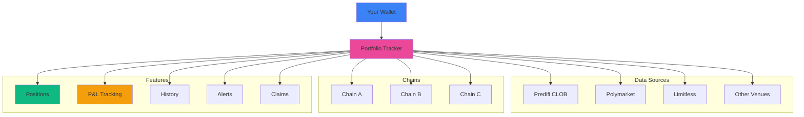

## What is Portfolio Tracker?

Predifi's **Portfolio Tracker** is your unified command center for monitoring all prediction market positions across multiple chains and venues. No more juggling different platforms or wallets—see everything in one place.

<Note>
**Multi-Chain + Multi-Venue → One Dashboard → Real-Time Updates → Complete Position Management**
</Note>

---

## Architecture



---

## Key Features

### 🌐 Multi-Chain Aggregation

Track positions across all EVM-compatible chains:

- **Automatic Detection** - Finds all your positions across connected chains
- **Real-Time Sync** - Updates as positions change
- **Unified Balance** - See total portfolio value in USD
- **Chain Breakdown** - View positions by chain
- **Cross-Chain Transfers** - Track assets moving between chains

### 🎯 Multi-Venue Support

One dashboard for all venues:

<CardGroup cols={3}>
  <Card title="Predifi CLOB" icon="chart-candlestick">
    Native orderbook positions
  </Card>
  <Card title="Polymarket" icon="p">
    Polygon-based markets
  </Card>
  <Card title="Limitless" icon="infinity">
    Base-native markets
  </Card>
</CardGroup>

### 📊 Comprehensive Position View

For each position, see:

- **Market Details** - Question, outcomes, resolution date
- **Your Position** - Outcome held (YES/NO), shares, entry price
- **Current Value** - Real-time market value
- **Unrealized P&L** - Profit/loss at current prices
- **Realized P&L** - Locked-in gains/losses from closed positions
- **Status** - Active, Pending, Resolved, Claimed
- **Actions** - Sell, Add, Claim buttons

### 📈 Real-Time P&L Tracking

Advanced profit & loss analytics:

```
Portfolio Summary:
├─ Total Invested: $10,000
├─ Current Value: $12,450
├─ Unrealized P&L: +$2,450 (+24.5%)
├─ Realized P&L: +$1,200 (from closed positions)
├─ Total P&L: +$3,650 (+36.5%)
└─ Win Rate: 67% (8 wins / 12 trades)
```

### 🔔 Smart Alerts

Stay informed with customizable notifications:

- **Price Alerts** - When position value crosses thresholds
- **Resolution Alerts** - When markets resolve
- **Claim Reminders** - When winnings are ready to claim
- **Portfolio Milestones** - Hit profit targets or drawdown limits
- **Market Updates** - News affecting your positions

### 📜 Complete History

Full transaction log:

- **Trade History** - All buys and sells with prices
- **Transfer History** - Cross-chain movements
- **Claim History** - Payout records
- **Fee History** - All fees paid
- **P&L History** - Daily/weekly/monthly performance

---

## Dashboard Views

### Overview Dashboard

**At-a-glance portfolio summary:**

<Tabs>
  <Tab title="Portfolio Value">
    ```
    Total Portfolio Value: $12,450
    ├─ Active Positions: $9,200 (73.9%)
    ├─ Pending Claims: $3,250 (26.1%)
    └─ Idle Cash: $0 (0%)
    
    24h Change: +$320 (+2.6%)
    7d Change: +$890 (+7.7%)
    30d Change: +$2,100 (+20.3%)
    ```
  </Tab>
  
  <Tab title="Positions Breakdown">
    ```
    Active Positions: 15
    ├─ Winning: 8 (53%)
    ├─ Losing: 5 (33%)
    └─ Break-even: 2 (14%)
    
    Resolved (Unclaimed): 3
    ├─ Winners: 3 ($3,250 to claim)
    └─ Losers: 0
    
    Closed Positions: 12
    ├─ Win Rate: 67%
    └─ Realized P&L: +$1,200
    ```
  </Tab>
  
  <Tab title="Performance">
    ```
    All-Time Performance:
    ├─ Best Trade: +$850 (BTCto100k-YES)
    ├─ Worst Trade: -$120 (Sports-Game-NO)
    ├─ Avg Win: +$245
    ├─ Avg Loss: -$65
    ├─ Profit Factor: 3.77
    └─ Sharpe Ratio: 1.82
    ```
  </Tab>
</Tabs>

### Positions Table

**Detailed position list:**

| Market | Outcome | Shares | Entry | Current | P&L | Status | Actions |
|--------|---------|--------|-------|---------|-----|--------|---------|
| BTC $100k 2025? | YES | 500 | $0.62 | $0.73 | +$55 | Active | Sell / Add |
| Election Winner | NO | 800 | $0.45 | $0.40 | -$40 | Active | Sell / Add |
| Sports Final | YES | 300 | $0.55 | $0.98 | +$129 | Resolved | **Claim** |

### Charts & Analytics

**Visual performance tracking:**

- **Portfolio Value Chart** - Historical value over time
- **P&L Chart** - Cumulative profit/loss
- **Position Size Distribution** - Pie chart of capital allocation
- **Win/Loss Streaks** - Visualization of trading patterns
- **ROI by Category** - Performance by market type (politics, sports, etc.)
- **Venue Performance** - Compare returns across Polymarket, Limitless, CLOB

---

## Position Management

### Active Positions

**What you can do:**

<AccordionGroup>
  <Accordion title="View Details" icon="eye">
    Click any position to see:
    - Full market description and resolution rules
    - Your trade history on this market
    - Current orderbook depth
    - Price chart
    - Related news/updates
  </Accordion>

  <Accordion title="Sell Position" icon="arrow-right-from-bracket">
    Exit at current market price:
    - See estimated proceeds
    - Set limit price (CLOB only)
    - Confirm and execute
    - Position closes and P&L is realized
  </Accordion>

  <Accordion title="Add to Position" icon="plus">
    Increase your stake:
    - Same process as opening new position
    - Averages your entry price
    - Updated in portfolio automatically
  </Accordion>

  <Accordion title="Set Alerts" icon="bell">
    Get notified when:
    - Price reaches target level
    - Market resolves
    - News mentions this market
  </Accordion>

  <Accordion title="Share Position" icon="share-nodes">
    Show off your trades:
    - Generate shareable link
    - Create social media card
    - Share on Twitter, Discord, etc.
  </Accordion>
</AccordionGroup>

### Resolved Positions

**Claim your winnings:**

1. **Identify Winners** - Positions marked with "Claim" button
2. **Review Payout** - See gross payout, fees, net amount
3. **Claim** - One click to claim all or individual positions
4. **Receive USDC** - Funds sent to your wallet immediately

<Tip>
  **Batch Claiming**: Claim multiple positions at once to save on gas fees!
</Tip>

### Historical Positions

**Learn from the past:**

- **Closed Trades** - Positions you exited before resolution
- **Performance Analysis** - What worked, what didn't
- **Trade Notes** - Add notes to remember your reasoning
- **Export Data** - CSV export for tax reporting or analysis

---

## Analytics & Insights

### Performance Metrics

**Key statistics tracked:**

| Metric | Description |
|--------|-------------|
| **Total Return** | Overall profit/loss across all positions |
| **Win Rate** | Percentage of profitable positions |
| **Avg Win** | Average profit per winning trade |
| **Avg Loss** | Average loss per losing trade |
| **Profit Factor** | Avg Win / Avg Loss ratio |
| **Sharpe Ratio** | Risk-adjusted return |
| **Max Drawdown** | Largest peak-to-trough decline |
| **ROI** | Return on invested capital |
| **Holding Period** | Average time in positions |

### Category Analysis

**Performance by market type:**

```
Category Performance:
├─ Politics: +45% ROI (12 trades)
├─ Crypto: +28% ROI (8 trades)
├─ Sports: -5% ROI (15 trades)
├─ Entertainment: +15% ROI (6 trades)
└─ Economics: +32% ROI (4 trades)
```

**Insight**: Focus on categories where you perform best!

### Venue Comparison

**Compare results across platforms:**

| Venue | Trades | Win Rate | Avg Return | Total P&L |
|-------|--------|----------|------------|-----------|
| Predifi CLOB | 15 | 73% | +18% | +$890 |
| Polymarket | 20 | 65% | +12% | +$650 |
| Limitless | 10 | 60% | +8% | +$210 |

### Time Analysis

**When do you trade best?**

- **Day of Week** - Are you better on weekdays or weekends?
- **Time of Day** - Morning vs evening performance
- **Hold Duration** - Quick exits vs long holds
- **Market Timing** - Early entry vs late entry performance

---

## Multi-Chain Features

### Cross-Chain Position View

See all positions regardless of chain:

```
Total Positions: 15

Chain A (5 positions):
├─ Value: $4,200
└─ P&L: +$320

Chain B (8 positions):
├─ Value: $6,800
└─ P&L: +$580

Chain C (2 positions):
├─ Value: $1,450
└─ P&L: -$50
```

### Chain Switching

**Easy navigation:**

- **Filter by Chain** - Show only positions on specific chain
- **Switch Wallet Network** - One-click network switching
- **Bridge Assets** - Initiate cross-chain transfers from dashboard
- **Gas Tracking** - See gas spent per chain

### Bridging History

**Track cross-chain movements:**

| Date | From | To | Amount | Status |
|------|------|----| -------|--------|
| Nov 10 | Chain A | Chain B | $1,000 | ✅ Complete |
| Nov 9 | Chain B | Chain A | $500 | ✅ Complete |
| Nov 8 | Chain A | Chain C | $2,000 | ✅ Complete |

---

## Alerts & Notifications

### Alert Types

<CardGroup cols={2}>
  <Card title="Price Alerts" icon="dollar-sign">
    Notify when position value crosses thresholds
  </Card>
  <Card title="Market Resolution" icon="flag-checkered">
    Know immediately when markets resolve
  </Card>
  <Card title="Claim Reminders" icon="hand-holding-dollar">
    Don't forget to claim your winnings
  </Card>
  <Card title="Portfolio Milestones" icon="trophy">
    Celebrate hitting profit targets
  </Card>
  <Card title="Risk Alerts" icon="triangle-exclamation">
    Warnings when positions lose significant value
  </Card>
  <Card title="Market Updates" icon="newspaper">
    News affecting your positions
  </Card>
</CardGroup>

### Notification Channels

**Choose how you're notified:**

- ✅ **In-App** - Dashboard notifications
- ✅ **Email** - Sent to your registered email
- ✅ **Push Notifications** - Browser/mobile push (coming soon)
- ✅ **Webhook** - Custom endpoint for developers
- 🔜 **Telegram Bot** - Message on Telegram
- 🔜 **Discord Bot** - DM on Discord

### Alert Configuration

**Customize your alerts:**

```javascript
{
  "priceAlert": {
    "enabled": true,
    "threshold": 10, // Notify on 10% price change
    "direction": "both" // up or down
  },
  "resolutionAlert": {
    "enabled": true,
    "advanceNotice": true // Notify 1 hour before resolution
  },
  "claimReminder": {
    "enabled": true,
    "frequency": "daily" // Remind daily until claimed
  }
}
```

---

## Export & Reporting

### Data Export

**Download your data:**

- **CSV Export** - Full position history for spreadsheets
- **JSON Export** - Machine-readable format for analysis
- **PDF Report** - Formatted report for records
- **Tax Report** - Formatted for tax reporting (US, EU, etc.)

### Tax Reporting

**Simplify tax season:**

| Field | Provided |
|-------|----------|
| **Acquisition Date** | ✅ |
| **Disposal Date** | ✅ |
| **Cost Basis** | ✅ |
| **Proceeds** | ✅ |
| **Gain/Loss** | ✅ Calculated |
| **Holding Period** | ✅ Short/Long-term |

<Note>
  Tax reporting is provided as a convenience. Consult a tax professional for your specific situation.
</Note>

### API Access

**Programmatic access:**

```bash
# Get portfolio summary
curl https://api.predifi.com/v1/portfolio/summary \
  -H "Authorization: Bearer YOUR_API_KEY"

# Get positions
curl https://api.predifi.com/v1/portfolio/positions \
  -H "Authorization: Bearer YOUR_API_KEY"

# Get P&L history
curl https://api.predifi.com/v1/portfolio/pnl?period=30d \
  -H "Authorization: Bearer YOUR_API_KEY"
```

[View full API documentation →](/api/portfolio)

---

## Mobile Experience

### Responsive Design

Portfolio Tracker works seamlessly on:

- 📱 **Mobile Phones** - Full functionality on small screens
- 📱 **Tablets** - Optimized tablet layout
- 💻 **Desktop** - Advanced multi-column view
- 🖥️ **Large Screens** - Dashboard mode with charts

### Mobile Features

**Optimized for on-the-go:**

- **Swipe Actions** - Swipe to sell or claim
- **Quick Filters** - Tap to filter by status, chain, venue
- **Push Notifications** - Native mobile alerts (coming soon)
- **Face/Touch ID** - Biometric authentication
- **Offline Mode** - View cached data without connection

---

## Privacy & Security

### Data Privacy

**Your data, your control:**

- **Non-Custodial** - We don't store private keys
- **On-Chain Data** - Positions derived from public blockchain
- **Optional Analytics** - Opt-in to share anonymized data
- **No Selling** - We never sell your data
- **GDPR Compliant** - European privacy standards

### Security Features

- **Read-Only Access** - Portfolio Tracker only reads, never writes
- **No Wallet Connection Required** - View by address without connecting
- **Encrypted Communications** - All API calls over HTTPS
- **Rate Limiting** - Protection against abuse
- **Audit Logs** - Track all actions

---

## Advanced Features

### Portfolio Sharing

**Show your success:**

1. **Generate Share Link** - Create public portfolio view
2. **Customize View** - Choose what to show/hide
3. **Share Link** - Post on social media
4. **Live Updates** - Shared view updates in real-time
5. **Revoke Access** - Disable shared link anytime

### Leaderboards

**Compare with others:**

- **Top Traders** - Highest returns in your category
- **Win Rate Leaders** - Most consistent winners
- **Volume Leaders** - Biggest traders
- **Streak Leaders** - Longest winning streaks

<Info>
  Leaderboard participation is opt-in. You can compete anonymously or with your username.
</Info>

### Portfolio Comparison

**Compare strategies:**

- **Your Portfolio vs Market** - Are you beating the average?
- **Your Portfolio vs Friends** - Friendly competition
- **Strategy A vs Strategy B** - Test different approaches

### Automated Insights

**AI-powered recommendations:**

- **Position Suggestions** - "Consider taking profit on X"
- **Risk Warnings** - "Portfolio concentration risk in category Y"
- **Market Opportunities** - "Similar traders are buying Z"
- **Performance Tips** - "You perform 20% better on weekday trades"

---

## Integration with Other Products

### Seamless Product Integration

Portfolio Tracker connects with:

<CardGroup cols={2}>
  <Card title="CLOB Trading" icon="chart-candlestick">
    Open CLOB positions show in real-time
  </Card>
  <Card title="Aggregator" icon="layer-group">
    Cross-venue positions unified
  </Card>
  <Card title="Liquidity Vaults" icon="vault">
    Track LP vault share value
  </Card>
  <Card title="API" icon="code">
    Programmatic portfolio access
  </Card>
</CardGroup>

### Unified Experience

**One-click actions:**

- From position → **Sell** → Opens trading interface
- From resolved position → **Claim** → Executes claim transaction
- From market → **Add Position** → Opens trade entry
- From portfolio → **Rebalance** → Suggests adjustments

---

## Getting Started

<Steps>
  <Step title="Connect Wallet">
    Connect your wallet to automatically load positions
  </Step>
  
  <Step title="Review Dashboard">
    Familiarize yourself with the overview and metrics
  </Step>
  
  <Step title="Configure Alerts">
    Set up notifications for important events
  </Step>
  
  <Step title="Explore Analytics">
    Dive into performance charts and insights
  </Step>
  
  <Step title="Manage Positions">
    Claim winnings, exit losers, add to winners
  </Step>
</Steps>

---

## FAQs

<AccordionGroup>
  <Accordion title="Do I need to connect my wallet?" icon="wallet">
    Not required! You can view any portfolio by entering a wallet address. Connecting enables transaction actions (sell, claim, etc.).
  </Accordion>

  <Accordion title="Does Portfolio Tracker work with hardware wallets?" icon="microchip">
    Yes! Ledger, Trezor, and other hardware wallets are fully supported.
  </Accordion>

  <Accordion title="Can I track multiple wallets?" icon="users">
    Yes! Add multiple wallet addresses to see combined portfolio or switch between them.
  </Accordion>

  <Accordion title="How often does data update?" icon="rotate">
    Real-time for price changes. Position changes (new trades) update within seconds.
  </Accordion>

  <Accordion title="Can I customize the dashboard?" icon="sliders">
    Yes! Rearrange widgets, choose metrics to display, and save custom views.
  </Accordion>

  <Accordion title="Is historical data available?" icon="clock-rotate-left">
    Yes! Full trade history is available indefinitely. Export anytime.
  </Accordion>
</AccordionGroup>

---

## Tips for Power Users

<AccordionGroup>
  <Accordion title="Keyboard Shortcuts" icon="keyboard">
    - `P` - Open portfolio
    - `C` - Claim all winnings
    - `F` - Open filters
    - `S` - Quick search positions
    - `E` - Export data
  </Accordion>

  <Accordion title="Custom Views" icon="eye">
    Create saved views for:
    - Active positions only
    - Resolved positions ready to claim
    - Losing positions (for tax-loss harvesting)
    - High-conviction positions
  </Accordion>

  <Accordion title="Bulk Actions" icon="layer-group">
    - Claim multiple positions at once
    - Set alerts for multiple positions
    - Export selected positions
    - Share multiple positions
  </Accordion>

  <Accordion title="API Automation" icon="robot">
    Use the API to:
    - Auto-claim winnings
    - Auto-exit losing positions
    - Rebalance portfolio programmatically
    - Mirror successful traders
  </Accordion>
</AccordionGroup>

---

## Roadmap

### ✅ Available Now
- Multi-chain position tracking
- Real-time P&L calculation
- Basic alerts (price, resolution)
- CSV export
- Mobile-responsive design

### 🔄 Coming Soon
- Push notifications
- Advanced charting
- Social features (leaderboards, sharing)
- AI-powered insights
- Tax reporting automation

### 🔮 Future
- Portfolio optimization suggestions
- Risk scoring
- Automated portfolio management
- Integration with TradingView
- Custom dashboard widgets

---

## Launch Portfolio Tracker

<CardGroup cols={2}>
  <Card
    title="View Your Portfolio"
    icon="wallet"
    href="https://app.predifi.com/portfolio"
  >
    Track all your positions
  </Card>
  <Card
    title="API Documentation"
    icon="code"
    href="/api/portfolio"
  >
    Build custom tools
  </Card>
  <Card
    title="Start Trading"
    icon="chart-line"
    href="/getting-started/quickstart"
  >
    Open your first position
  </Card>
  <Card
    title="Join Community"
    icon="discord"
    href="https://discord.gg/predifi"
  >
    Discuss strategies
  </Card>
</CardGroup>
