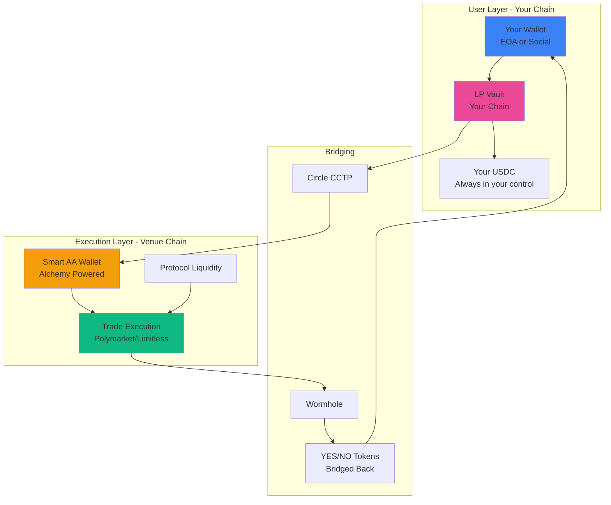
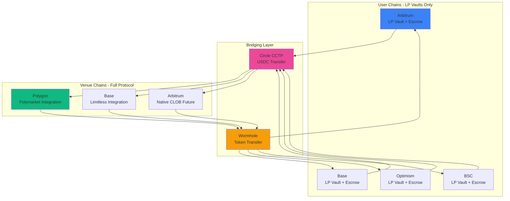
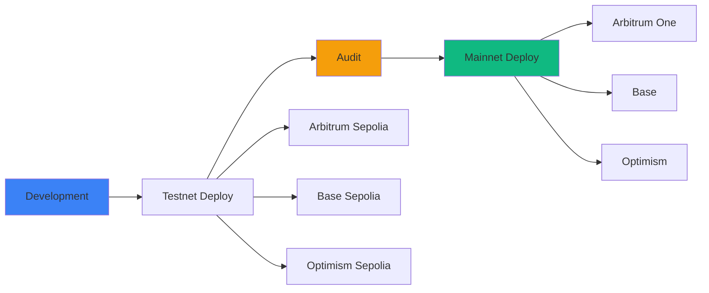

## True Chain-Agnostic Trading

Predifi's architecture separates **user funds** from **trade execution**. Your assets stay on your preferred chain in LP Vaults, while our Smart Account Abstraction layer executes trades on the most liquid venue chains—all seamlessly.

> 🌐 **Your Funds (Any Chain) → LP Vault → Smart AA Wallet → Trade Execution (Venue Chain) → Profits Back to You**

---

## How It Works

### Two-Layer Architecture



### User Flow Example

**Scenario**: User on Arbitrum wants to trade on Polymarket (Polygon)

<Steps>
  <Step title="Deposit to LP Vault">
    User deposits USDC to **Arbitrum LP Vault**
    - Funds remain on Arbitrum
    - User maintains full control
    - LP Vault contract holds in escrow
  </Step>
  
  <Step title="Request Trade">
    User requests to trade on Polymarket market
    - Frontend sends request to backend
    - Backend identifies target venue (Polygon)
  </Step>
  
  <Step title="Bridge & Execute">
    Protocol bridges liquidity and executes:
    - USDC bridged via **CCTP** (Arbitrum → Polygon)
    - **Smart AA Wallet** receives funds on Polygon
    - AA Wallet executes trade on Polymarket
    - Total time: ~2-3 minutes
  </Step>
  
  <Step title="Receive Tokens">
    YES/NO tokens bridged back:
    - Position tokens sent via **Wormhole**
    - Tokens arrive in user's wallet on Arbitrum
    - User owns tokens directly (non-custodial)
  </Step>
  
  <Step title="Settlement">
    When market resolves:
    - Winning tokens redeemed automatically
    - USDC profit returned to LP Vault
    - Withdrawable by user anytime
  </Step>
</Steps>

---

## Why This Architecture?

### 🏠 Stay on Your Chain

Users never need to leave their preferred chain:

### 💰 Protocol Optimizes Execution

Predifi's Smart AA Wallets execute on the most liquid venues:

**Venue Chains (Where Trades Execute):**
- **Polygon** - Polymarket's native chain
- **Base** - Limitless markets
- **Arbitrum** - Predifi native CLOB (future)

**User Chains (Where Funds Stay):**
- **Arbitrum** - Low fees, fast finality
- **Base** - Coinbase ecosystem
- **Optimism** - Ethereum-aligned
- **BSC** - Binance ecosystem
- More chains added based on demand

You hold funds on cheap chains, we execute on liquid chains.

### 🔐 Avoid Single Point of Failure

Chain-agnostic design means:

- **No dependency** on a single chain's success
- **Resilience** against network issues
- **Flexibility** to migrate if needed
- **Risk diversification** across ecosystems

### 🚀 Future-Proof

As new chains emerge:

- **Quick deployment** on new L2s and alt-L1s
- **Early adoption** of promising chains
- **Capture new users** entering crypto on new chains
- **Stay relevant** as the ecosystem evolves

---

## Technical Architecture

### Escrow Vault Model

**We DON'T deploy full protocol on every chain. We deploy lightweight LP Vaults:**



### LP Vault Contract (Deployed on User Chains)

**Lightweight escrow contract:**

```solidity
// Deployed on Arbitrum, Base, Optimism, BSC, etc.
contract PredifiLPVault {
    IERC20 public immutable usdc;
    
    // User deposits (stays on this chain)
    function deposit(uint256 amount) external {
        usdc.transferFrom(msg.sender, address(this), amount);
        // User gets vault shares
        _mint(msg.sender, calculateShares(amount));
    }
    
    // Withdraw anytime
    function withdraw(uint256 shares) external {
        uint256 amount = calculateWithdrawal(shares);
        _burn(msg.sender, shares);
        usdc.transfer(msg.sender, amount);
    }
    
    // Protocol can bridge funds to execute trades
    function bridgeForExecution(
        uint256 amount,
        uint16 targetChain,
        address recipient
    ) external onlyProtocol {
        // Bridge via CCTP
        cctp.burnAndMint(amount, targetChain, recipient);
    }
    
    // Receive profits back
    function receiveProfit(uint256 amount) external {
        // Distribute to vault (increases share value)
        totalAssets += amount;
    }
}
```

### Smart Account Abstraction (Alchemy)

**Protocol-controlled AA wallets execute trades:**

```typescript
// Smart AA Wallet on venue chain (e.g., Polygon for Polymarket)
interface SmartAccountConfig {
  provider: 'alchemy';
  chain: 'polygon' | 'base';  // Venue chains only
  purpose: 'trade_execution';
}

// Example: Execute trade on Polymarket via AA Wallet
async function executeTrade(
  user: string,
  market: string,
  amount: number
) {
  // 1. Bridge USDC from user's chain vault to venue chain
  await bridgeUSDC({
    from: userChain,           // e.g., Arbitrum
    to: venueChain,            // e.g., Polygon (Polymarket)
    amount: amount,
    recipient: smartAAWallet   // Protocol's AA wallet
  });
  
  // 2. AA Wallet executes trade on Polymarket
  const trade = await smartAAWallet.execute({
    target: polymarketCLOB,
    method: 'buyYes',
    params: [market, amount]
  });
  
  // 3. Bridge YES tokens back to user
  await bridgeTokens({
    from: venueChain,          // Polygon
    to: userChain,             // Arbitrum
    token: yesToken,
    amount: trade.tokensReceived,
    recipient: user            // User's wallet
  });
}
```

**Key Points:**
- AA Wallets created via **Alchemy Account Kit**
- Wallets are protocol-controlled (not user-controlled)
- Used exclusively for trade execution
- Users never send funds to AA wallet directly
- Tokens always delivered to user's actual wallet

---

## User Experience

### Seamless Cross-Chain Trading

**Users never think about chains:**

```tsx
// User connects wallet (any supported chain)
<ConnectWallet />

// Behind the scenes:
// 1. Detect user's chain (e.g., Arbitrum)
// 2. Load Arbitrum LP Vault contract
// 3. Show ALL markets (from all venues)
// 4. User picks market (e.g., Polymarket BTC market)
// 5. Protocol handles bridging automatically
```

### Trade Flow (User Perspective)

From user's perspective, it's simple:

<Steps>
  <Step title="Connect Wallet">
    Connect with MetaMask, Coinbase Wallet, or Social Login
    - Your wallet can be on ANY supported chain
  </Step>
  
  <Step title="Deposit to Vault">
    Deposit USDC to LP Vault on your chain
    - Funds stay on YOUR chain
    - Earn yield while deposited
  </Step>
  
  <Step title="Browse Markets">
    See markets from ALL venues:
    - Polymarket (Polygon)
    - Limitless (Base)
    - Future venues
  </Step>
  
  <Step title="Place Trade">
    Click "Buy YES" or "Buy NO"
    - Protocol handles everything
    - ~2-3 min for execution
  </Step>
  
  <Step title="Receive Tokens">
    YES/NO tokens appear in your wallet
    - On YOUR chain (where you started)
    - You own them (non-custodial)
  </Step>
  
  <Step title="Claim Winnings">
    When market resolves, claim USDC
    - Sent back to LP Vault
    - Withdraw anytime
  </Step>
</Steps>

### No Manual Bridging Required

**Traditional multi-chain DeFi:**
```
❌ User must manually bridge USDC to Polygon
❌ User must have MATIC for gas
❌ User must find Polymarket contracts
❌ User must manually bridge tokens back
❌ User manages assets on multiple chains
```

**Predifi:**
```
✅ User stays on one chain (e.g., Arbitrum)
✅ Protocol bridges automatically
✅ Protocol pays gas on venue chains
✅ Tokens delivered to user's home chain
✅ One wallet, one chain, all markets
```

### Portfolio Aggregation

**See positions across all chains:**

```
Your Portfolio:
├─ Arbitrum
│  ├─ Position A: $500
│  └─ Position B: $800
├─ Base
│  ├─ Position C: $300
│  └─ Position D: $1,200
└─ Optimism
   └─ Position E: $600

Total Value: $3,400 (across 3 chains)
```

[Learn more about Portfolio Tracker →](/products/portfolio-tracker)

---

## Smart Contract Design

### Chain-Agnostic Principles

Our contracts follow strict guidelines:

#### ✅ Do Use:
- Standard EVM opcodes
- Well-established libraries (OpenZeppelin)
- ERC-20/ERC-4626 standards
- Deterministic logic
- Chain ID for signature verification

#### ❌ Avoid:
- Chain-specific features (e.g., Arbitrum-only opcodes)
- Hardcoded gas limits
- Block number-based timing (use timestamps)
- Custom precompiles
- Non-standard token implementations

### Example: Chain-Agnostic Order Matching

```solidity
contract PredifiCLOB {
    // ✅ Works on any EVM chain
    function matchOrder(
        Order memory makerOrder,
        Order memory takerOrder
    ) public returns (uint256 fillAmount) {
        // Standard EVM operations
        require(makerOrder.isValid(), "Invalid maker order");
        require(takerOrder.isValid(), "Invalid taker order");
        
        // Use block.timestamp (not block.number)
        require(block.timestamp < makerOrder.expiry, "Order expired");
        
        // Standard ERC-20 transfers
        IERC20(usdc).transferFrom(taker, maker, amount);
        
        // Emit events (standard across EVMs)
        emit OrderMatched(makerOrder.id, takerOrder.id, fillAmount);
    }
    
    // Chain ID used only for signature verification
    function _domainSeparator() internal view returns (bytes32) {
        return keccak256(abi.encode(
            TYPE_HASH,
            block.chainid,  // Only place chain-specific
            address(this)
        ));
    }
}
```

### Testing Across Chains

**Comprehensive test suite:**

```bash
# Test on Arbitrum fork
forge test --fork-url https://arb1.arbitrum.io/rpc

# Test on Base fork
forge test --fork-url https://mainnet.base.org

# Test on Optimism fork
forge test --fork-url https://mainnet.optimism.io

# All tests pass → Contract is chain-agnostic ✅
```

---

## Backend Abstraction

### Chain Abstraction Layer

Our backend hides chain complexity:

```typescript
// Abstract class - works with any chain
abstract class VenueAdapter {
  abstract async getMarkets(): Promise<Market[]>;
  abstract async placeOrder(order: Order): Promise<string>;
  abstract async getPositions(user: string): Promise<Position[]>;
}

// Concrete implementations per chain
class ArbitrumCLOBAdapter extends VenueAdapter {
  private readonly provider: ethers.Provider;
  private readonly contractAddress: string;
  
  async getMarkets() {
    // Arbitrum-specific RPC calls
    const contract = new ethers.Contract(
      this.contractAddress,
      ABI,
      this.provider
    );
    return contract.getMarkets();
  }
  
  // ... other methods
}

class BaseCLOBAdapter extends VenueAdapter {
  // Same interface, different chain
}

// API layer doesn't care which chain
app.get('/api/markets', async (req, res) => {
  const chain = req.query.chain || 'arbitrum';
  const adapter = getAdapter(chain);  // Get chain-specific adapter
  const markets = await adapter.getMarkets();
  res.json(markets);
});
```

### Multi-Chain Indexing

**One indexer, all chains:**

```typescript
// Listen to events on multiple chains simultaneously
const chains = ['arbitrum', 'base', 'optimism'];

for (const chain of chains) {
  const provider = getProvider(chain);
  const contract = getContract(chain);
  
  // Listen to OrderMatched events
  contract.on('OrderMatched', async (event) => {
    await database.saveOrder({
      chain: chain,
      txHash: event.transactionHash,
      blockNumber: event.blockNumber,
      // ... event data
    });
  });
}

// Query orders across all chains
async function getUserOrders(userAddress: string) {
  return database.orders.find({
    user: userAddress
    // Returns orders from all chains
  });
}
```

---

## Deployment Process

### Multi-Chain Deployment



### Deployment Steps

<Steps>
  <Step title="Contract Preparation">
    - Finalize contract code
    - Run full test suite
    - Generate deployment scripts
  </Step>
  
  <Step title="Testnet Deployment">
    Deploy to testnets in parallel:
    ```bash
    forge script script/Deploy.s.sol --rpc-url arbitrum-sepolia --broadcast
    forge script script/Deploy.s.sol --rpc-url base-sepolia --broadcast
    forge script script/Deploy.s.sol --rpc-url optimism-sepolia --broadcast
    ```
  </Step>
  
  <Step title="Testnet Verification">
    - Verify contracts on block explorers
    - Test all functions on each chain
    - Ensure identical behavior
  </Step>
  
  <Step title="Security Audit">
    - External audit of contracts
    - Test audit recommendations
    - Fix any issues found
  </Step>
  
  <Step title="Mainnet Deployment">
    Deploy to mainnets sequentially:
    ```bash
    # Deploy with verification
    forge script script/Deploy.s.sol \
      --rpc-url arbitrum \
      --broadcast \
      --verify
    ```
  </Step>
  
  <Step title="Configuration Update">
    Update backend with new addresses:
    ```typescript
    const MAINNET_CONFIG = {
      arbitrum: {
        clob: '0x...',
        aggregator: '0x...',
        // ...
      },
      base: {
        clob: '0x...',
        aggregator: '0x...',
        // ...
      }
    };
    ```
  </Step>
  
  <Step title="Frontend Update">
    Deploy frontend with new chain configs
  </Step>
  
  <Step title="Monitoring">
    Monitor all chains for activity
  </Step>
</Steps>

---

## Supported Chains

### Current Deployment

<CardGroup cols={2}>
  <Card title="Arbitrum One" icon="ethereum">
    **Chain ID**: 42161
    **Block Time**: 0.25s
    **Finality**: Instant
    **USDC**: Native
  </Card>
  
  <Card title="Base" icon="b">
    **Chain ID**: 8453
    **Block Time**: 2s
    **Finality**: ~1 min
    **USDC**: Native
  </Card>
  
  <Card title="Optimism" icon="ethereum">
    **Chain ID**: 10
    **Block Time**: 2s
    **Finality**: ~1 min
    **USDC**: Bridged
  </Card>
  
  <Card title="Binance Smart Chain" icon="b">
    **Chain ID**: 56
    **Block Time**: 3s
    **Finality**: Instant
    **USDC**: Bridged
  </Card>
</CardGroup>

<Note>
  Final chain selection depends on grant approvals. All chains listed are technically supported.
</Note>

### Coming Soon

- **Polygon PoS** - High throughput, very low fees
- **Avalanche C-Chain** - Fast finality
- **Gnosis Chain** - Decentralized, stable fees
- **zkSync Era** - Zero-knowledge L2

### Request a Chain

Want Predifi on a specific chain?

<Card
  title="Submit Chain Request"
  icon="plus"
  href="https://forms.gle/predifi-chain-request"
>
  Tell us which chain you want us to support
</Card>

---

## Benefits for Users

### 🎯 Choose Your Chain

**Trade where you're comfortable:**

- Already on Arbitrum? Trade there.
- Prefer Base? Use Base.
- Want lowest fees? We'll recommend the best chain.

### 💸 Minimize Costs

**We optimize for fees:**

- Deploy on low-cost chains
- Use efficient contracts
- Batch operations when possible
- Pass savings to users

### 🔄 Easy Migration

**Move between chains seamlessly:**

1. Exit positions on Chain A
2. Bridge USDC to Chain B (via Circle CCTP)
3. Enter positions on Chain B
4. All tracked in one portfolio

[Learn about cross-chain bridging →](/technology/cross-chain-bridging)

### 🌐 Global Access

**Regional optimization:**

- **North America**: Arbitrum, Base (proximity to Coinbase)
- **Europe**: Optimism, Polygon (regulatory-friendly)
- **Asia**: Binance Smart Chain (exchange integration)
- **Emerging Markets**: Polygon (lowest fees)

---

## Developer Benefits

### 🛠️ Build Once, Deploy Everywhere

**Chain-agnostic smart contracts:**

```solidity
// Write once
contract MyPredictionMarket {
    // Standard Solidity
}

// Deploy everywhere
// forge script Deploy.s.sol --rpc-url <any-evm-chain>
```

### 📚 Unified SDK

**One SDK for all chains:**

```javascript
import { PredifiSDK } from '@predifi/sdk';

// Initialize with desired chain
const sdk = new PredifiSDK({ chain: 'arbitrum' });

// Same API regardless of chain
const markets = await sdk.getMarkets();
const order = await sdk.placeOrder({
  marketId: '0x123',
  outcome: 'YES',
  amount: 100
});

// Switch chain easily
await sdk.switchChain('base');
// Now trading on Base with same code
```

### 🧪 Consistent Testing

**Test on any chain:**

```typescript
describe('PredifiCLOB', () => {
  const chains = ['arbitrum', 'base', 'optimism'];
  
  for (const chain of chains) {
    it(`should work on ${chain}`, async () => {
      const sdk = new PredifiSDK({ chain });
      const markets = await sdk.getMarkets();
      expect(markets).to.be.an('array');
    });
  }
});

// All tests pass → Chain-agnostic ✅
```

---

## Technical Challenges & Solutions

### Challenge 1: Different Gas Costs

**Problem**: Gas varies 100x between chains

**Solution**: Dynamic gas pricing

```typescript
// Adjust order sizes based on gas costs
function calculateMinOrderSize(chain: string): number {
  const gasPrice = getGasPrice(chain);
  const txCost = gasPrice * 150000; // avg gas for order
  
  // Min order should be 100x gas cost
  return txCost * 100;
}

// Arbitrum: $0.20 gas → $20 min order
// Base: $0.10 gas → $10 min order
```

### Challenge 2: Different Block Times

**Problem**: Arbitrum (0.25s) vs Base (2s) vs BSC (3s)

**Solution**: Use timestamps, not block numbers

```solidity
// ❌ Don't use block numbers for timing
function isExpired(uint256 expiryBlock) public view returns (bool) {
    return block.number > expiryBlock;  // Varies by chain!
}

// ✅ Use timestamps (consistent)
function isExpired(uint256 expiryTimestamp) public view returns (bool) {
    return block.timestamp > expiryTimestamp;  // Same on all chains
}
```

### Challenge 3: Different Finality Times

**Problem**: Some chains confirm instantly, others take minutes

**Solution**: Chain-specific confirmation requirements

```typescript
const CONFIRMATIONS_REQUIRED = {
  'arbitrum': 1,   // Instant finality
  'base': 30,      // ~1 minute
  'optimism': 30,  // ~1 minute
  'polygon': 128,  // ~5 minutes
};

async function waitForConfirmation(txHash: string, chain: string) {
  const required = CONFIRMATIONS_REQUIRED[chain];
  let confirmations = 0;
  
  while (confirmations < required) {
    confirmations = await getConfirmations(txHash);
    await sleep(1000);
  }
}
```

### Challenge 4: USDC Variants

**Problem**: Native USDC vs bridged USDC

**Solution**: Normalize to native USDC

```solidity
// Support both native and bridged USDC
address public immutable usdc;

constructor(address _usdc) {
    // Deployment script passes correct address per chain
    usdc = _usdc;
    
    // Arbitrum: 0xaf88d065e77c8cC2239327C5EDb3A432268e5831 (native)
    // Base: 0x833589fCD6eDb6E08f4c7C32D4f71b54bdA02913 (native)
    // Optimism: 0x0b2C639c533813f4Aa9D7837CAf62653d097Ff85 (bridged)
}
```

---

## Migration Strategy

### Adding New Chains

**Process for supporting new chains:**

<Steps>
  <Step title="Technical Assessment">
    - Verify EVM compatibility
    - Check for exotic opcodes
    - Assess gas costs
    - Review USDC availability
  </Step>
  
  <Step title="Testnet Deployment">
    - Deploy contracts to testnet
    - Run full test suite
    - Verify identical behavior
  </Step>
  
  <Step title="Infrastructure Setup">
    - Configure RPC endpoints
    - Set up indexers
    - Deploy relayers (if needed)
    - Configure monitoring
  </Step>
  
  <Step title="Frontend Integration">
    - Add chain to dropdown
    - Update chain configs
    - Test wallet connections
  </Step>
  
  <Step title="Mainnet Launch">
    - Deploy to mainnet
    - Announce to community
    - Monitor initial activity
  </Step>
</Steps>

### Sunset Strategy

**If a chain fails or becomes unusable:**

1. **Announce Sunset** - 90 days notice
2. **Freeze New Orders** - Stop new positions
3. **Allow Exits** - Users can close positions
4. **Resolve Markets** - All markets resolved
5. **Emergency Withdrawals** - If needed, admin can trigger withdrawals
6. **Redirect Users** - Suggest alternative chains

---

## Governance & Chain Selection

### Community Input

**You decide which chains we support:**

- **Proposals** - Community suggests new chains
- **Voting** - Token holders vote on additions
- **Grants** - Chain foundations can sponsor deployment
- **Usage** - Deploy where users want to trade

### Grant-Dependent Deployment

We're pursuing grants from:

- **Arbitrum Foundation** - LTIP/STIP grants
- **Optimism Collective** - Retroactive funding
- **Base** - Builder grants
- **Binance Chain** - MVB program

Grant approval determines priority.

---

## Conclusion

Predifi's chain-agnostic architecture ensures:

✅ **Maximum reach** - Available where users are
✅ **Future-proof** - Easy to add new chains
✅ **Cost-efficient** - Deploy on cheapest chains
✅ **Resilient** - No single point of failure
✅ **Developer-friendly** - Write once, deploy everywhere

<CardGroup cols={2}>
  <Card
    title="Cross-Chain Bridging"
    icon="bridge"
    href="/technology/cross-chain-bridging"
  >
    Move assets between chains
  </Card>
  <Card
    title="Deploy on Predifi"
    icon="rocket"
    href="/developers/introduction"
  >
    Build on any chain
  </Card>
  <Card
    title="Start Trading"
    icon="chart-line"
    href="/getting-started/quickstart"
  >
    Trade on your preferred chain
  </Card>
  <Card
    title="View Portfolio"
    icon="wallet"
    href="/products/portfolio-tracker"
  >
    Track positions across all chains
  </Card>
</CardGroup>
