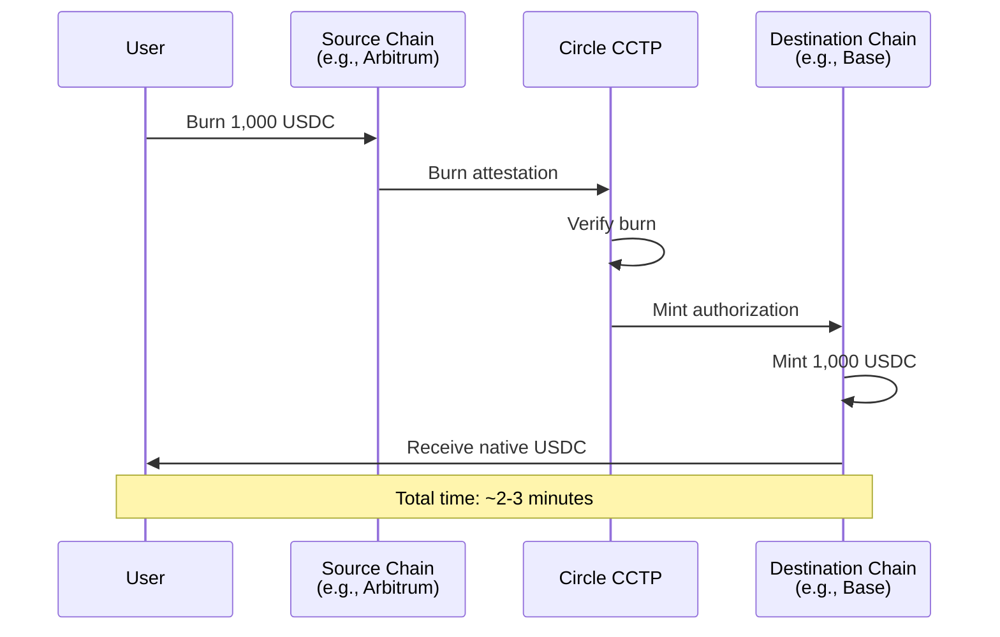
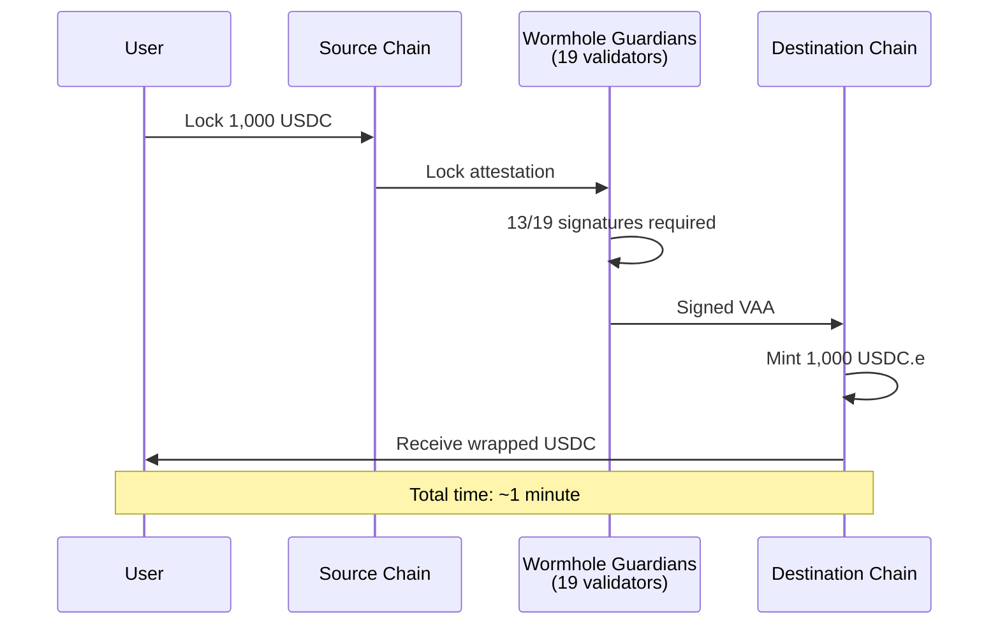
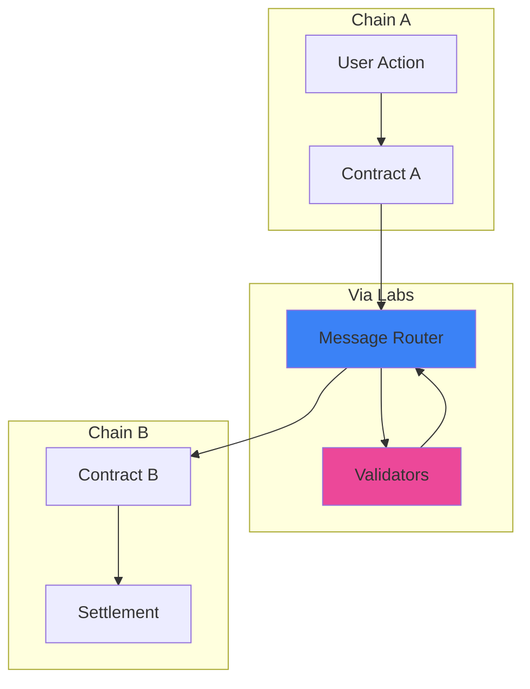
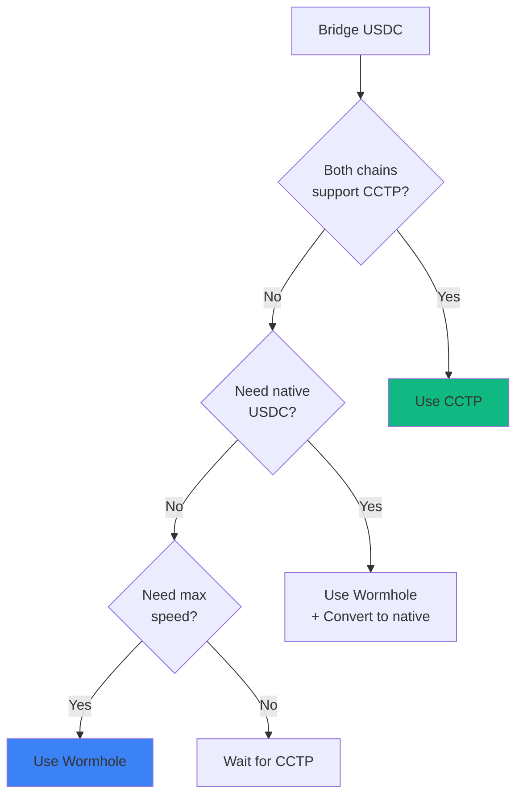

## Bridging Made Simple

Predifi integrates best-in-class bridging solutions to enable **frictionless movement** of assets across chains. Trade on any chain without worrying about moving your funds.

<Frame>
  <div style={{padding: '20px', background: '#f8fafc', borderRadius: '8px'}}>
    **USDC on Chain A → Circle CCTP / Wormhole → USDC on Chain B → Start Trading**
  </div>
</Frame>

---

## Why Cross-Chain Bridging?

### 🌐 Trade Anywhere

Markets exist across multiple chains. Bridging lets you:

- **Access opportunities** on any chain
- **Avoid fragmentation** - your USDC works everywhere
- **Optimize for fees** - trade where gas is cheapest
- **Follow liquidity** - go where the volume is

### 💰 Capital Efficiency

Without bridging:
```
You have:  $1,000 USDC on Arbitrum
You want:  Trade on Base
Problem:   Need to buy USDC on Base separately 😞
Result:    Capital split across chains
```

With bridging:
```
You have:  $1,000 USDC on Arbitrum
You want:  Trade on Base
Solution:  Bridge $1,000 to Base in ~2 minutes ✅
Result:    Full capital available where needed
```

### 🔒 Security First

Predifi only uses **battle-tested** bridging solutions:

- **Circle CCTP** - Native USDC bridging (preferred)
- **Wormhole** - Trusted by $30B+ TVL
- **No generic bridges** - Avoid vulnerability risks

---

## Circle CCTP (Cross-Chain Transfer Protocol)

### What is CCTP?

Circle's **official protocol** for moving USDC between chains. Instead of locking and minting (which creates wrapped USDC), CCTP **burns** on the source chain and **mints** native USDC on the destination.

### How It Works



### CCTP Advantages

<CardGroup cols={2}>
  <Card title="Native USDC" icon="circle-dollar">
    Always receive **native USDC**, never wrapped tokens
  </Card>
  <Card title="Capital Efficient" icon="coins">
    Burn & mint model—no liquidity pools needed
  </Card>
  <Card title="Secure" icon="shield-check">
    Backed by Circle, issuer of USDC
  </Card>
  <Card title="Fast" icon="bolt">
    Transfers complete in 2-3 minutes
  </Card>
  <Card title="Low Cost" icon="piggy-bank">
    Minimal fees (~$0.10-0.50)
  </Card>
  <Card title="No Slippage" icon="equals">
    1 USDC in = 1 USDC out, always
  </Card>
</CardGroup>

### Supported Routes

CCTP currently supports:

| Source Chain | Destination Chains |
|--------------|-------------------|
| **Arbitrum** | Base, Optimism, Ethereum, Polygon, Avalanche |
| **Base** | Arbitrum, Optimism, Ethereum, Polygon, Avalanche |
| **Optimism** | Arbitrum, Base, Ethereum, Polygon, Avalanche |
| **Ethereum** | All CCTP chains |
| **Polygon** | All CCTP chains |
| **Avalanche** | All CCTP chains |

<Note>
  CCTP is our **preferred** bridging method for all supported routes.
</Note>

### Using CCTP in Predifi

**Automatic integration:**

```javascript
// User initiates bridge from UI
await predifi.bridge({
  from: 'arbitrum',
  to: 'base',
  amount: 1000, // USDC
  method: 'cctp' // Auto-selected for CCTP routes
});

// Behind the scenes:
// 1. Approve USDC on source chain
// 2. Call CCTP burn function
// 3. Wait for attestation (~2 min)
// 4. Call CCTP mint on destination
// 5. User receives native USDC
```

---

## Wormhole Bridge

### What is Wormhole?

Wormhole is a **generic message-passing protocol** connecting 30+ blockchains. For USDC transfers, Wormhole uses a lock-and-mint model with **Wormhole-wrapped USDC** (USDC.e).

### When to Use Wormhole

We use Wormhole for:

- **Non-CCTP chains** - Chains not supported by CCTP
- **Faster transfers** - When speed is critical (~1 minute vs 2-3)
- **Non-USDC assets** - If we need to bridge other tokens
- **Message passing** - Sending data along with tokens

### How Wormhole Works



### Wormhole Features

<CardGroup cols={2}>
  <Card title="Multi-Chain" icon="globe">
    Supports 30+ chains (more than CCTP)
  </Card>
  <Card title="Fast" icon="rocket">
    Transfers in ~1 minute
  </Card>
  <Card title="Proven" icon="badge-check">
    $30B+ in cumulative volume
  </Card>
  <Card title="Generic Messaging" icon="message">
    Can pass data, not just tokens
  </Card>
</CardGroup>

### Wormhole Considerations

<Warning>
  Wormhole delivers **wrapped USDC** (USDC.e), not native USDC. Predifi automatically handles conversion where needed.
</Warning>

**Wrapped vs Native:**

| Type | Symbol | Description |
|------|--------|-------------|
| **Native USDC** | USDC | Issued by Circle |
| **Wormhole USDC** | USDC.e | Wrapped via Wormhole |

Most DeFi protocols accept both, but native USDC is preferred.

---

## Via Labs Integration

### What is Via Labs?

**Via Labs** provides **cross-chain messaging infrastructure** that we use to coordinate complex multi-chain operations.

### Use Cases in Predifi

<AccordionGroup>
  <Accordion title="Cross-Chain Order Matching" icon="shuffle">
    Match orders across chains:
    - User A creates order on Chain A
    - User B fills order on Chain B
    - Via Labs coordinates settlement
  </Accordion>

  <Accordion title="Unified Liquidity" icon="droplet">
    Access liquidity across all chains:
    - LP deposits on Chain A
    - Liquidity available on Chain B, C, D
    - Via Labs routes requests
  </Accordion>

  <Accordion title="Cross-Chain Claims" icon="hand-holding-dollar">
    Claim winnings on any chain:
    - Position wins on Chain A
    - User claims payout on Chain B
    - Via Labs bridges winnings
  </Accordion>

  <Accordion title="Portfolio Aggregation" icon="layer-group">
    Real-time multi-chain portfolio:
    - Positions on multiple chains
    - Via Labs aggregates data
    - Single unified view
  </Accordion>
</AccordionGroup>

### How Via Labs Works



---

## Bridge Comparison

### CCTP vs Wormhole

| Feature | Circle CCTP | Wormhole |
|---------|-------------|----------|
| **Token Type** | Native USDC | Wrapped USDC.e |
| **Speed** | 2-3 minutes | ~1 minute |
| **Security** | Circle-backed | Guardian network |
| **Chains Supported** | 6 major chains | 30+ chains |
| **Fees** | Very low ($0.10-0.50) | Low ($0.50-2.00) |
| **Slippage** | None | None |
| **Use Case** | USDC transfers | Any token + messages |

### When We Use Each

**Decision tree:**



---

## User Experience

### Bridging Flow

<Steps>
  <Step title="Select Destination">
    Choose which chain you want to trade on
  </Step>
  
  <Step title="Predifi Checks Balance">
    - See available USDC on current chain
    - See required USDC on destination chain
  </Step>
  
  <Step title="Initiate Bridge">
    Click "Bridge to [Chain]" button
  </Step>
  
  <Step title="Approve Transaction">
    - **Tx 1**: Approve USDC (if first time)
    - **Tx 2**: Execute bridge
  </Step>
  
  <Step title="Wait for Transfer">
    Track progress in real-time:
    ```
    ⏳ Burning USDC on Arbitrum...
    ⏳ Waiting for attestation...
    ⏳ Minting USDC on Base...
    ✅ Bridge complete! (2m 15s)
    ```
  </Step>
  
  <Step title="Start Trading">
    USDC now available on destination chain
  </Step>
</Steps>

### Smart Routing

Predifi **automatically selects** the best bridge:

```typescript
// User wants to bridge Arbitrum → Base
const route = await predifi.findBestRoute({
  from: 'arbitrum',
  to: 'base',
  amount: 1000,
  priority: 'cost' // or 'speed'
});

// Result:
{
  bridge: 'cctp',
  estimatedTime: '2-3 minutes',
  fee: '$0.15',
  willReceive: 1000, // Native USDC
  steps: [
    'Approve USDC on Arbitrum',
    'Burn via CCTP',
    'Wait for attestation',
    'Mint on Base'
  ]
}
```

### In-App Bridging

**No need to leave Predifi:**

- **Integrated UI** - Bridge directly from trading interface
- **Gas Estimation** - See total cost before bridging
- **Transaction Tracking** - Real-time status updates
- **Failure Handling** - Auto-retry on failures
- **History** - View all bridge transactions

---

## Technical Implementation

### CCTP Integration

```solidity
// Predifi's CCTP adapter
contract CCTPBridgeAdapter {
    ITokenMessenger public immutable tokenMessenger;
    
    function bridgeUSDC(
        uint32 destinationDomain,
        address recipient,
        uint256 amount
    ) external returns (bytes32 messageHash) {
        // 1. Transfer USDC from user
        IERC20(usdc).transferFrom(msg.sender, address(this), amount);
        
        // 2. Approve CCTP contract
        IERC20(usdc).approve(address(tokenMessenger), amount);
        
        // 3. Burn and send via CCTP
        messageHash = tokenMessenger.depositForBurn(
            amount,
            destinationDomain,
            bytes32(uint256(uint160(recipient))),
            usdc
        );
        
        emit BridgeInitiated(msg.sender, destinationDomain, amount, messageHash);
    }
}
```

### Wormhole Integration

```solidity
// Predifi's Wormhole adapter
contract WormholeBridgeAdapter {
    IWormholeTokenBridge public immutable bridge;
    
    function bridgeUSDC(
        uint16 targetChain,
        address recipient,
        uint256 amount
    ) external payable returns (uint64 sequence) {
        // 1. Transfer USDC from user
        IERC20(usdc).transferFrom(msg.sender, address(this), amount);
        
        // 2. Approve Wormhole bridge
        IERC20(usdc).approve(address(bridge), amount);
        
        // 3. Transfer via Wormhole
        sequence = bridge.transferTokens{value: msg.value}(
            usdc,
            amount,
            targetChain,
            bytes32(uint256(uint160(recipient))),
            0, // No arbiter fee
            0  // No nonce
        );
        
        emit BridgeInitiated(msg.sender, targetChain, amount, sequence);
    }
}
```

### Via Labs Messaging

```typescript
// Cross-chain order coordination
async function crossChainOrderMatch(
  makerChain: string,
  takerChain: string,
  orderId: string
) {
  // 1. Validate order on maker chain
  const order = await getOrder(makerChain, orderId);
  
  // 2. Send message via Via Labs
  const message = {
    type: 'ORDER_MATCH',
    makerChain,
    takerChain,
    orderId,
    amount: order.amount,
    price: order.price
  };
  
  await viaLabs.sendMessage({
    from: makerChain,
    to: takerChain,
    payload: message
  });
  
  // 3. Via Labs delivers message to taker chain
  // 4. Settlement happens on taker chain
  // 5. Confirmation sent back to maker chain
}
```

---

## Fees & Timing

### Bridge Costs

| Bridge | Gas Fee | Protocol Fee | Total |
|--------|---------|--------------|-------|
| **CCTP** (Arbitrum → Base) | $0.10 | $0 | **$0.10** |
| **CCTP** (Base → Arbitrum) | $0.05 | $0 | **$0.05** |
| **Wormhole** (any route) | $0.50-1.00 | $0.50 | **$1.00-1.50** |

<Tip>
  CCTP is typically 10x cheaper than Wormhole for USDC transfers.
</Tip>

### Transfer Times

| Bridge | Typical Time | Max Time |
|--------|--------------|----------|
| **CCTP** | 2-3 minutes | 5 minutes |
| **Wormhole** | 1 minute | 2 minutes |
| **Via Labs Messaging** | 1-2 minutes | 3 minutes |

### Amount Limits

| Bridge | Min Amount | Max Amount |
|--------|------------|------------|
| **CCTP** | $1 | Unlimited |
| **Wormhole** | $1 | Unlimited (but large amounts may need manual review) |

---

## Security & Reliability

### CCTP Security

<CardGroup cols={2}>
  <Card title="Circle-Backed" icon="building-columns">
    Official protocol from USDC issuer
  </Card>
  <Card title="No 3rd Party Risk" icon="shield-check">
    Direct burn/mint, no intermediaries
  </Card>
  <Card title="Audited" icon="file-certificate">
    Multiple security audits
  </Card>
  <Card title="Battle-Tested" icon="helmet-battle">
    Billions bridged successfully
  </Card>
</CardGroup>

### Wormhole Security

- **Guardian Network**: 19 validators including Jump, Coinbase, and others
- **Threshold Signatures**: Requires 13/19 signatures to process
- **Insurance**: $10M bug bounty program
- **Audits**: Regular audits by top firms
- **Track Record**: Despite 2022 exploit (fixed), now has strong security

### Via Labs Security

- **Distributed Validators**: Decentralized validator set
- **Message Verification**: Cryptographic proof of message authenticity
- **Timeout Handling**: Automatic reversal if delivery fails
- **Monitoring**: 24/7 system monitoring

### Failure Handling

**What if bridge fails?**

<Steps>
  <Step title="Detection">
    System detects failed bridge attempt
  </Step>
  
  <Step title="User Notification">
    Alert sent via email/push notification
  </Step>
  
  <Step title="Automatic Retry">
    System retries transaction (for transient failures)
  </Step>
  
  <Step title="Manual Intervention">
    If retry fails, support team investigates
  </Step>
  
  <Step title="Refund">
    Funds returned to original chain if necessary
  </Step>
</Steps>

<Warning>
  Always verify destination address before bridging. Bridge transactions are **irreversible**.
</Warning>

---

## Bridge Monitoring

### Real-Time Status

Track your bridge transfers:

```
Bridge Transaction #12345
├─ Status: In Progress
├─ From: Arbitrum
├─ To: Base
├─ Amount: 1,000 USDC
├─ Bridge: CCTP
├─ Started: 2:34 PM
├─ Progress:
│  ✅ USDC burned on Arbitrum (Block 156,234,567)
│  ⏳ Waiting for Circle attestation (estimated 2 min)
│  ⏸️ Pending mint on Base
└─ Est. Completion: 2:37 PM (3 min total)
```

### Bridge Analytics

**Dashboard metrics:**

- **Total Volume Bridged**: Track your bridge history
- **Most Used Route**: Which chain pairs you bridge most
- **Avg Bridge Time**: How long your bridges take
- **Total Fees Paid**: Fees across all bridges
- **Success Rate**: Percentage of successful bridges

---

## Advanced Features

### Automatic Bridging

**Set up auto-bridge rules:**

```typescript
// Auto-bridge to wherever best opportunities exist
await predifi.setAutoBridgeRule({
  enabled: true,
  minOpportunity: 5, // 5% better odds
  maxBridgeCost: 10, // Max $10 in fees
  chains: ['arbitrum', 'base', 'optimism']
});

// When opportunity detected:
// 1. Calculate net profit (opportunity - bridge cost)
// 2. If profitable, auto-bridge funds
// 3. Execute trade on destination chain
```

### Bridge Aggregation

**Compare all options:**

```typescript
const routes = await predifi.getAllRoutes({
  from: 'arbitrum',
  to: 'base',
  amount: 1000
});

// Returns:
[
  {
    bridge: 'cctp',
    time: '2-3 min',
    cost: '$0.10',
    result: '1000 USDC (native)'
  },
  {
    bridge: 'wormhole',
    time: '1 min',
    cost: '$1.50',
    result: '1000 USDC.e (wrapped)'
  }
]

// User chooses based on preference
```

### Bridging + Trading (Combo)

**Bridge and trade in one flow:**

1. User wants to trade on Base but has USDC on Arbitrum
2. Click "Bridge & Trade" button
3. Single confirmation bridges and opens position
4. Predifi handles bridge → wait → trade automatically

---

## Best Practices

### For Users

<AccordionGroup>
  <Accordion title="Plan Ahead" icon="calendar">
    Bridge before you need to trade to avoid waiting during volatile markets
  </Accordion>

  <Accordion title="Use CCTP When Possible" icon="circle-dollar">
    Cheaper and delivers native USDC
  </Accordion>

  <Accordion title="Bridge Larger Amounts" icon="sack-dollar">
    Fixed fees mean bridging $1,000 is nearly same cost as $100
  </Accordion>

  <Accordion title="Keep Some USDC on Each Chain" icon="coins">
    Have balance ready for opportunities
  </Accordion>

  <Accordion title="Monitor Gas Prices" icon="gas-pump">
    Bridge when gas is low to save on fees
  </Accordion>
</AccordionGroup>

### For Developers

<AccordionGroup>
  <Accordion title="Prefer CCTP" icon="thumbs-up">
    Use CCTP for all supported routes
  </Accordion>

  <Accordion title="Handle Failures Gracefully" icon="circle-exclamation">
    Implement retry logic and user notifications
  </Accordion>

  <Accordion title="Verify Receipts" icon="receipt">
    Always verify bridge completion before allowing trades
  </Accordion>

  <Accordion title="Cache Route Calculations" icon="database">
    Pre-calculate common routes to speed up UX
  </Accordion>

  <Accordion title="Monitor Bridge Health" icon="heart-pulse">
    Track success rates and alert on issues
  </Accordion>
</AccordionGroup>

---

## Roadmap

### ✅ Live Now
- Circle CCTP integration
- Wormhole integration (backup)
- Via Labs messaging
- In-app bridge UI
- Transaction tracking

### 🔄 Coming Soon
- **Instant Bridging** - Liquidity pools for 0-wait bridges
- **Gas Abstraction** - Pay bridge fees in USDC
- **Bridge Aggregator** - Compare 10+ bridge options
- **Cross-Chain Limit Orders** - Place orders that bridge automatically

### 🔮 Future
- **Native Cross-Chain Trading** - Trade on Chain A while settlement happens on Chain B
- **Unified Liquidity Pools** - LP on one chain, liquidity on all chains
- **Cross-Chain Margin** - Collateral on any chain

---

## Learn More

<CardGroup cols={2}>
  <Card
    title="Circle CCTP Docs"
    icon="circle"
    href="https://developers.circle.com/stablecoins/cctp"
  >
    Official CCTP documentation
  </Card>
  <Card
    title="Wormhole Docs"
    icon="worm"
    href="https://docs.wormhole.com"
  >
    Learn about Wormhole
  </Card>
  <Card
    title="Via Labs"
    icon="v"
    href="https://via.exchange"
  >
    Cross-chain messaging
  </Card>
  <Card
    title="Start Trading"
    icon="chart-line"
    href="/getting-started/quickstart"
  >
    Trade on any chain
  </Card>
</CardGroup>
