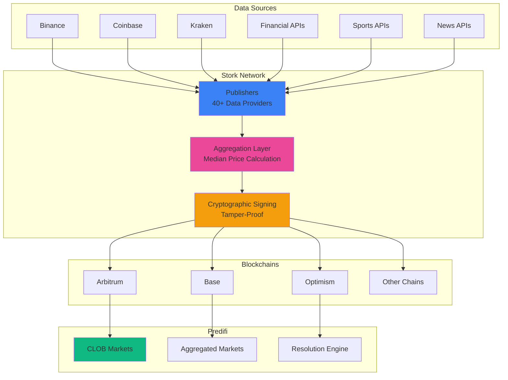
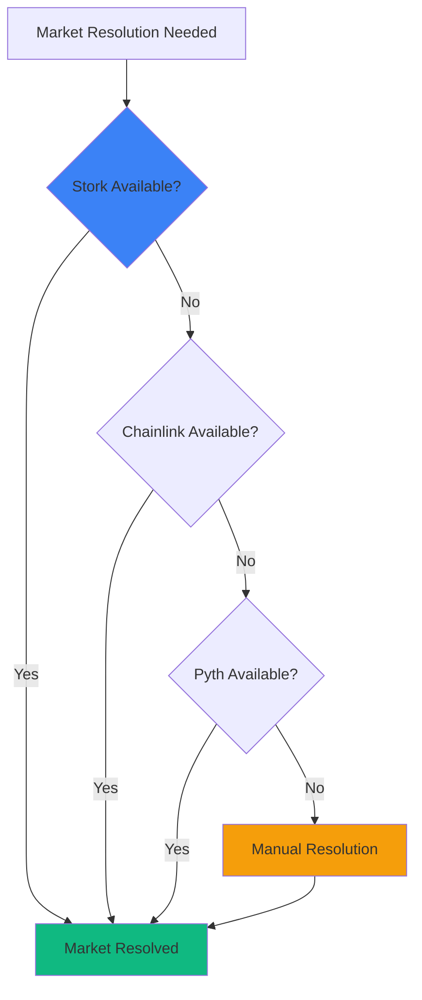

## Price Feeds That Power Predictions

Prediction markets live or die by **data accuracy**. Predifi uses **Stork Network** to deliver ultra-low-latency, manipulation-resistant price feeds that ensure fair market resolution.

<Frame>
  <div style={{padding: '20px', background: '#f8fafc', borderRadius: '8px'}}>
    **Real-World Events → Stork Oracles → On-Chain Data → Market Resolution → Fair Payouts**
  </div>
</Frame>

---

## Why Oracles Matter

### The Oracle Problem

Prediction markets need answers to questions like:

- "Will Bitcoin reach $100,000 by year-end?" → **Need BTC price data**
- "Who wins the election?" → **Need election results**
- "Will the S&P 500 hit new high?" → **Need S&P 500 price**
- "Will Ethereum upgrade succeed?" → **Need upgrade status**

Blockchains can't access external data directly. **Oracles bridge this gap.**

### Consequences of Bad Oracles

<Warning>
  **Poor oracle design can destroy a prediction market:**
  - 📉 **Manipulation** - Attackers can manipulate prices to win bets
  - ⏱️ **Latency** - Stale prices lead to unfair advantages
  - 🔧 **Failure** - Oracle downtime freezes markets
  - 💰 **Expense** - High costs make small markets unviable
</Warning>

### Predifi's Solution: Stork Network

We chose **Stork Network** because they excel at:

- ⚡ **Ultra-low latency** - Sub-second price updates
- 🔒 **Manipulation resistance** - Multiple data sources + validation
- 💪 **High reliability** - 99.99% uptime
- 💸 **Cost-effective** - Affordable for all market sizes
- 🌐 **Multi-chain** - Works on all our supported chains

---

## What is Stork Network?

### Overview

**Stork Network** is a next-generation oracle protocol designed for **high-frequency, low-latency price feeds** needed by DeFi applications.

<CardGroup cols={2}>
  <Card title="Speed" icon="bolt">
    **400ms** average latency from source to chain
  </Card>
  <Card title="Coverage" icon="globe">
    **10,000+** price feeds across crypto, stocks, forex, commodities
  </Card>
  <Card title="Reliability" icon="shield-check">
    **99.99%** uptime with redundant infrastructure
  </Card>
  <Card title="Security" icon="lock">
    **Publisher staking** + cryptographic verification
  </Card>
</CardGroup>

### How Stork Works



### Key Features

<AccordionGroup>
  <Accordion title="Publisher Network" icon="network-wired">
    40+ independent data publishers fetch prices from multiple sources:
    - Centralized exchanges (Binance, Coinbase, Kraken, etc.)
    - DEXs (Uniswap, Curve, etc.)
    - Financial data providers (Bloomberg, Reuters)
    - Custom data sources (sports, elections, weather)
    
    Each publisher stakes collateral to ensure honest reporting.
  </Accordion>

  <Accordion title="Aggregation & Consensus" icon="calculator">
    Stork aggregates publisher submissions:
    - **Median price calculation** - Resistant to outliers
    - **Outlier detection** - Flag suspicious submissions
    - **Weighted averaging** - Higher-stake publishers have more weight
    - **Consensus threshold** - Require minimum publisher participation
  </Accordion>

  <Accordion title="Cryptographic Proofs" icon="key">
    Every price update includes:
    - **Publisher signatures** - Proof of data origin
    - **Merkle proofs** - Efficient verification
    - **Timestamp** - Exact time of price
    - **ECDSA verification** - On-chain proof validation
  </Accordion>

  <Accordion title="Pull-Based Model" icon="download">
    Unlike traditional push oracles:
    - **On-demand updates** - Only pay when you need data
    - **Lower costs** - No constant gas for updates
    - **Fresher data** - Get latest price when needed
    - **Flexible frequency** - Update as often or rarely as needed
  </Accordion>

  <Accordion title="Low Latency" icon="gauge-high">
    Speed metrics:
    - **Publisher to Stork**: <100ms
    - **Stork aggregation**: <200ms
    - **Stork to chain**: <100ms
    - **Total latency**: ~400ms average
    
    Critical for fast-moving markets!
  </Accordion>
</AccordionGroup>

---

## Stork in Predifi

### Price Feed Integration

**Crypto Markets:**

```solidity
// Predifi contract using Stork for BTC/USD price
contract BTCMarket {
    IStorkOracle public immutable stork;
    
    function resolveMarket() external {
        // Fetch latest BTC price from Stork
        (uint256 price, uint256 timestamp) = stork.getPrice("BTC/USD");
        
        require(timestamp >= resolutionTime, "Price too old");
        require(block.timestamp - timestamp < 60, "Price stale");
        
        // Resolve market based on price
        if (price >= 100_000e8) { // $100k target
            _resolveYes();
        } else {
            _resolveNo();
        }
    }
}
```

**Sports Markets:**

```solidity
// Sports outcome from Stork
contract SuperBowlMarket {
    IStorkOracle public immutable stork;
    
    function resolveMarket() external {
        // Fetch game result from Stork
        bytes32 winner = stork.getResult("SUPERBOWL_2025_WINNER");
        
        // winner = keccak256("KC_CHIEFS") or keccak256("SF_49ERS")
        if (winner == expectedOutcome) {
            _resolveYes();
        } else {
            _resolveNo();
        }
    }
}
```

### Market Types Using Stork

<Tabs>
  <Tab title="Crypto Prices">
    **Examples:**
    - Will BTC hit $100k by Dec 31?
    - ETH above $5,000 this quarter?
    - SOL to reach new ATH?
    
    **Stork Feeds:**
    - BTC/USD, ETH/USD, SOL/USD
    - 400ms latency
    - Updated every block
  </Tab>
  
  <Tab title="Stock Indices">
    **Examples:**
    - S&P 500 to hit 6,000?
    - Nasdaq new record by Q2?
    - Dow Jones above 45,000?
    
    **Stork Feeds:**
    - SPX, NDX, DJI indices
    - Updated during market hours
    - 1-second latency
  </Tab>
  
  <Tab title="Forex & Commodities">
    **Examples:**
    - EUR/USD to reach 1.20?
    - Gold above $2,500/oz?
    - Oil below $60/barrel?
    
    **Stork Feeds:**
    - Major forex pairs
    - Precious metals
    - Commodity prices
  </Tab>
  
  <Tab title="Sports & Events">
    **Examples:**
    - Who wins Super Bowl?
    - NBA Finals champion?
    - World Cup winner?
    
    **Stork Feeds:**
    - Game scores
    - Winner determination
    - Tournament results
  </Tab>
</Tabs>

---

## Security & Manipulation Resistance

### Multiple Layers of Security

<Steps>
  <Step title="Data Source Diversity">
    Publishers aggregate from 5+ exchanges/sources each
    - Single exchange manipulation won't affect outcome
    - Median calculation removes outliers
  </Step>
  
  <Step title="Publisher Staking">
    Every publisher stakes significant collateral
    - Dishonest reporting = stake slashed
    - Economic incentive for accuracy
    - 40+ independent publishers
  </Step>
  
  <Step title="Consensus Mechanism">
    Require agreement from majority of publishers
    - Minimum 21 publishers must submit
    - Outliers automatically removed
    - No single point of failure
  </Step>
  
  <Step title="Cryptographic Verification">
    All data cryptographically signed
    - On-chain verification of signatures
    - Tamper-proof data
    - Merkle proofs for efficiency
  </Step>
  
  <Step title="Time Validation">
    Timestamps prevent replay attacks
    - Price must be recent (< 60s old)
    - Monotonically increasing timestamps
    - Grace period for chain reorgs
  </Step>
  
  <Step title="Circuit Breakers">
    Extreme price moves trigger delays
    - Sudden 50%+ move → 1-hour delay
    - Allows investigation of potential manipulation
    - Manual override by governance
  </Step>
</Steps>

### Attack Scenarios & Defenses

<AccordionGroup>
  <Accordion title="Exchange Price Manipulation" icon="chart-line-up">
    **Attack**: Manipulate price on one exchange
    
    **Defense**:
    - Publishers aggregate from 5+ exchanges
    - Median calculation ignores outliers
    - Stork's aggregation removes manipulated data
    
    **Result**: Attack fails ✅
  </Accordion>

  <Accordion title="Publisher Bribery" icon="sack-dollar">
    **Attack**: Bribe publishers to report false prices
    
    **Defense**:
    - Need 21+ publishers (>50%) to affect outcome
    - Bribing 21+ publishers extremely expensive
    - Slashing penalties exceed potential gains
    
    **Result**: Economically infeasible ✅
  </Accordion>

  <Accordion title="Network Attacks" icon="wifi-slash">
    **Attack**: DDoS Stork infrastructure
    
    **Defense**:
    - Distributed publisher network
    - Redundant servers across regions
    - Fallback oracles (Chainlink, Pyth)
    
    **Result**: Market continues functioning ✅
  </Accordion>

  <Accordion title="Flash Loan Manipulation" icon="bolt">
    **Attack**: Use flash loan to manipulate DEX price
    
    **Defense**:
    - Stork uses CEX prices (not DEXs) for major assets
    - TWAP (time-weighted average) for DEX feeds
    - Aggregation across multiple DEXs
    
    **Result**: Flash loans don't affect outcome ✅
  </Accordion>

  <Accordion title="Timestamp Manipulation" icon="clock">
    **Attack**: Submit stale prices with fake timestamps
    
    **Defense**:
    - Cryptographic signatures include timestamp
    - Signature verification ensures timestamp authenticity
    - Smart contracts check freshness
    
    **Result**: Stale prices rejected ✅
  </Accordion>
</AccordionGroup>

---

## Oracle Economics

### Cost Structure

Stork's pull-based model keeps costs low:

| Update Frequency | Cost per Update | Monthly Cost |
|-----------------|-----------------|--------------|
| **Every block** (Arbitrum) | $0.05 | $54,000 |
| **Every 10 blocks** | $0.05 | $5,400 |
| **Hourly** | $0.05 | $36 |
| **On-demand** (market resolution) | $0.05 | ~$1-10 |

<Tip>
  Predifi uses **on-demand pricing** - we only fetch prices when markets resolve, saving 99%+ on oracle costs!
</Tip>

### Cost Comparison

| Oracle | Model | Cost per Update | Monthly (hourly) |
|--------|-------|----------------|------------------|
| **Stork** | Pull | $0.05 | $36 |
| **Chainlink** | Push | $0.50 | $360 |
| **Pyth** | Pull | $0.10 | $72 |
| **Band** | Push | $0.40 | $288 |

### Who Pays?

**Resolution-time model:**

- **Market creation**: No oracle fee
- **Trading**: No oracle fee
- **Resolution**: $0.05-0.20 per market (paid from market fees)
- **Users**: Never pay oracle fees directly

---

## Data Feeds Catalog

### Available Feeds

Stork provides 10,000+ feeds across:

<Tabs>
  <Tab title="Cryptocurrencies">
    **Major Assets** (400ms latency):
    - BTC/USD, ETH/USD, BNB/USD, SOL/USD
    - XRP/USD, ADA/USD, DOGE/USD, DOT/USD
    - 200+ more crypto pairs
    
    **DeFi Tokens**:
    - UNI, AAVE, LINK, MKR, CRV
    - Stablecoin pegs (USDT, USDC, DAI)
  </Tab>
  
  <Tab title="Stock Indices">
    **Major Indices**:
    - S&P 500 (SPX)
    - Nasdaq 100 (NDX)
    - Dow Jones (DJI)
    - Russell 2000 (RUT)
    
    **International**:
    - FTSE 100, DAX, Nikkei 225
    - Hang Seng, CAC 40
  </Tab>
  
  <Tab title="Forex">
    **Major Pairs**:
    - EUR/USD, GBP/USD, USD/JPY
    - USD/CHF, AUD/USD, NZD/USD
    - USD/CAD
    
    **Emerging Markets**:
    - USD/MXN, USD/BRL, USD/INR
    - USD/CNY, USD/ZAR
  </Tab>
  
  <Tab title="Commodities">
    **Precious Metals**:
    - Gold (XAU/USD)
    - Silver (XAG/USD)
    - Platinum, Palladium
    
    **Energy**:
    - WTI Crude Oil
    - Brent Crude
    - Natural Gas
    
    **Agriculture**:
    - Wheat, Corn, Soybeans
  </Tab>
  
  <Tab title="Sports & Events">
    **Sports**:
    - NFL, NBA, MLB scores
    - Soccer matches (Premier League, La Liga, etc.)
    - Tennis, F1, MMA results
    
    **Political**:
    - Election results (when available)
    - Referendum outcomes
    
    **Custom Events**:
    - Award shows (Oscars, Grammys)
    - Box office results
    - Streaming metrics
  </Tab>
</Tabs>

---

## Fallback & Redundancy

### Multi-Oracle Strategy

Predifi doesn't rely solely on Stork:



### Oracle Priority

1. **Stork Network** (Primary)
   - Fastest, cheapest, most comprehensive
   - 99.99% uptime target
   
2. **Chainlink** (Secondary)
   - Industry standard, highly secure
   - Available for major assets
   
3. **Pyth Network** (Tertiary)
   - High-frequency feeds
   - Good coverage of crypto assets
   
4. **Manual Resolution** (Last Resort)
   - Governance vote
   - Used only if all oracles fail
   - Requires 7-day dispute period

### Dispute Resolution

If users disagree with oracle result:

<Steps>
  <Step title="Dispute Period">
    7 days to challenge resolution
  </Step>
  
  <Step title="Submit Evidence">
    Provide proof of incorrect price (screenshots, API data, etc.)
  </Step>
  
  <Step title="Governance Review">
    Token holders vote on dispute
  </Step>
  
  <Step title="Re-Resolution">
    If dispute succeeds, market re-resolved with correct data
  </Step>
  
  <Step title="Compensation">
    Affected users compensated for incorrect resolution
  </Step>
</Steps>

---

## Developer Integration

### Using Stork in Your Markets

```solidity
// Example: Create market with Stork price feed
import "@stork-oracle/contracts/IStorkOracle.sol";

contract CustomPredictionMarket {
    IStorkOracle public stork;
    bytes32 public priceId; // e.g., "BTC/USD"
    uint256 public targetPrice;
    uint256 public resolutionTime;
    
    constructor(
        address _stork,
        bytes32 _priceId,
        uint256 _targetPrice,
        uint256 _resolutionTime
    ) {
        stork = IStorkOracle(_stork);
        priceId = _priceId;
        targetPrice = _targetPrice;
        resolutionTime = _resolutionTime;
    }
    
    function resolve() external {
        require(block.timestamp >= resolutionTime, "Not time yet");
        
        // Fetch price from Stork
        IStorkOracle.Price memory priceData = stork.getPrice(priceId);
        
        // Validate freshness (within 60 seconds)
        require(
            block.timestamp - priceData.timestamp < 60,
            "Price too stale"
        );
        
        // Resolve based on price
        bool outcomeYes = priceData.price >= targetPrice;
        _settleMarket(outcomeYes);
    }
}
```

### Price Feed Discovery

```typescript
// Find available price feeds
const feeds = await stork.listFeeds({
  category: 'crypto',
  search: 'BTC'
});

// Returns:
[
  { id: 'BTC/USD', name: 'Bitcoin / US Dollar', latency: '400ms' },
  { id: 'BTC/EUR', name: 'Bitcoin / Euro', latency: '500ms' },
  { id: 'WBTC/USD', name: 'Wrapped Bitcoin / USD', latency: '1s' }
]
```

### Historical Data

```typescript
// Get historical prices for backtesting
const history = await stork.getHistoricalPrices({
  priceId: 'BTC/USD',
  from: '2024-01-01',
  to: '2024-12-31',
  interval: '1h'
});

// Use for market analysis, strategy testing, etc.
```

---

## Monitoring & Alerts

### Oracle Health Dashboard

Predifi monitors Stork 24/7:

```
Stork Network Status: ✅ Operational

Metrics:
├─ Uptime (30d): 99.98%
├─ Avg Latency: 412ms
├─ Publisher Participation: 42/40 (105%)
├─ Median Deviation: 0.02% (excellent consensus)
├─ Failed Updates: 0
└─ Circuit Breakers Triggered: 0

Recent Updates:
├─ BTC/USD: $98,450.23 (2 seconds ago)
├─ ETH/USD: $4,123.45 (2 seconds ago)
├─ SPX: 5,890.12 (5 seconds ago)
└─ EURUSD: 1.0850 (3 seconds ago)
```

### Alerts

**We monitor for:**

- ⚠️ **High Latency** - If updates take >2 seconds
- ⚠️ **Low Participation** - If <30 publishers submitting
- ⚠️ **High Deviation** - If price varies >5% between publishers
- ⚠️ **Stale Data** - If price not updated in 60+ seconds
- 🚨 **Oracle Failure** - If Stork unavailable

When issues detected:
1. Automatic fallback to Chainlink/Pyth
2. Alert sent to operations team
3. Investigation begins immediately
4. Users notified of any market delays

---

## Roadmap

### ✅ Implemented
- Stork integration for crypto prices
- On-demand price fetching
- Multi-oracle fallback system
- Real-time monitoring

### 🔄 In Progress
- Sports data feeds
- Stock market data (traditional hours)
- Custom event data (elections, awards, etc.)

### 🔮 Future
- **Decentralized News Oracle** - AI-verified news for event markets
- **Satellite Data Feeds** - Weather, shipping, agriculture
- **On-Chain Voting Oracle** - DAO proposals, governance outcomes
- **Social Media Sentiment** - Twitter, Reddit sentiment scores

---

## Why Stork Over Alternatives?

### Stork vs Chainlink

| Feature | Stork | Chainlink |
|---------|-------|-----------|
| **Latency** | 400ms | 30-60s |
| **Cost** | $0.05/update | $0.50/update |
| **Feeds** | 10,000+ | 1,000+ |
| **Model** | Pull (on-demand) | Push (constant updates) |
| **Best For** | High-frequency, cost-sensitive | Maximum decentralization |

**Our Take**: Stork's low latency and cost make it ideal for prediction markets. We use Chainlink as fallback.

### Stork vs Pyth

| Feature | Stork | Pyth |
|---------|-------|------|
| **Latency** | 400ms | 300ms |
| **Cost** | $0.05/update | $0.10/update |
| **Feeds** | 10,000+ | 500+ |
| **Coverage** | Crypto, stocks, sports | Primarily crypto |
| **Best For** | Diverse markets | Crypto-only markets |

**Our Take**: Stork offers better coverage for non-crypto markets. Pyth is excellent for crypto-native use cases.

---

## FAQs

<AccordionGroup>
  <Accordion title="Can Stork be manipulated?" icon="shield-halved">
    Extremely difficult. With 40+ independent publishers, you'd need to control 21+ simultaneously. The economic cost of bribing 21+ staked publishers exceeds any potential profit from manipulation.
  </Accordion>

  <Accordion title="What if Stork goes down?" icon="power-off">
    Automatic fallback to Chainlink or Pyth. In extreme cases (all oracles down), governance can manually resolve markets with a 7-day dispute period.
  </Accordion>

  <Accordion title="How fresh is the data?" icon="clock">
    Crypto prices update every 400ms. Traditional assets update during market hours. Sports scores update in real-time during games.
  </Accordion>

  <Accordion title="Can I request a new price feed?" icon="plus">
    Yes! Contact us with your market idea. If there's demand, we'll work with Stork to add the feed.
  </Accordion>

  <Accordion title="Do users pay oracle fees?" icon="dollar-sign">
    No. Oracle costs are covered by market fees. Users never pay oracle fees directly.
  </Accordion>

  <Accordion title="How accurate are the prices?" icon="bullseye">
    Stork aggregates from 5+ sources per feed and uses median calculation. Typical deviation is <0.05% from true price.
  </Accordion>
</AccordionGroup>

---

## Learn More

<CardGroup cols={2}>
  <Card
    title="Stork Network Docs"
    icon="book"
    href="https://docs.stork.network"
  >
    Official Stork documentation
  </Card>
  <Card
    title="Create Market with Oracle"
    icon="code"
    href="/developers/market-data"
  >
    Developer guide to using Stork
  </Card>
  <Card
    title="View Live Oracle Data"
    icon="chart-line"
    href="https://app.stork.network"
  >
    See real-time price feeds
  </Card>
  <Card
    title="Partner with Us"
    icon="handshake"
    href="/technology/partners"
  >
    Learn about all our partners
  </Card>
</CardGroup>
