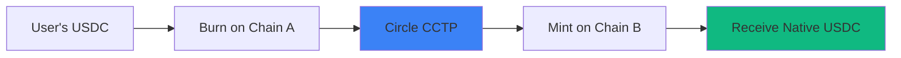
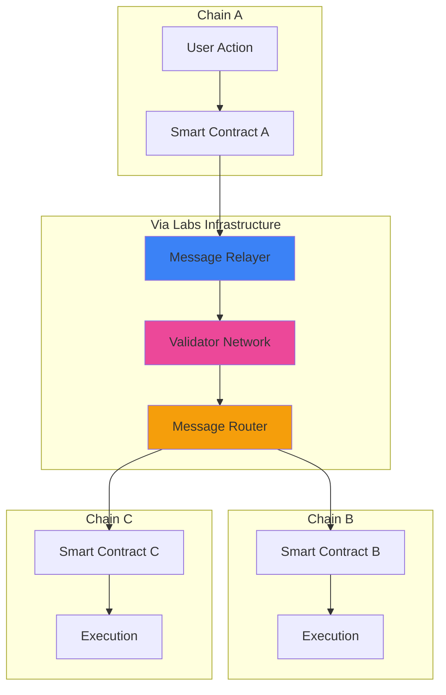
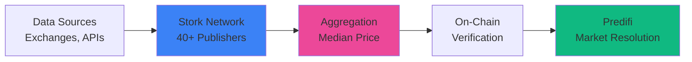
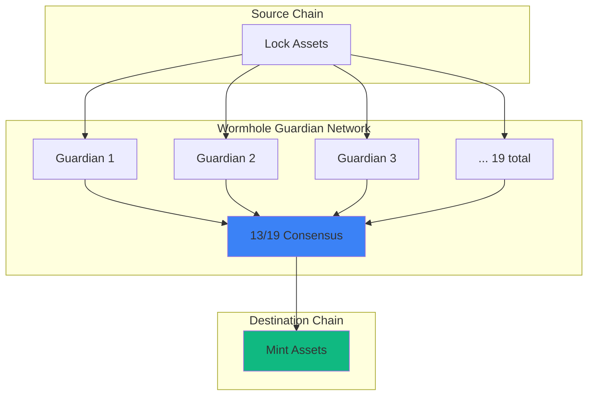

## Best-in-Class Infrastructure

Predifi partners with top-tier protocols to deliver a **secure, fast, and reliable** prediction market platform. We don't reinvent the wheel—we integrate with proven solutions.

<Note>
**Circle CCTP + Via Labs + Stork Network + Wormhole = Production-Ready Infrastructure**
</Note>

---

## Our Partners

<CardGroup cols={2}>
  <Card title="Circle" icon="circle">
    **Cross-Chain Transfer Protocol**
    
    Native USDC bridging between chains
  </Card>
  
  <Card title="Via Labs" icon="v">
    **Cross-Chain Messaging**
    
    Multi-chain communication infrastructure
  </Card>
  
  <Card title="Stork Network" icon="bird">
    **Oracle Infrastructure**
    
    Low-latency, manipulation-resistant price feeds
  </Card>
  <Card title="Wormhole" icon="worm">
    **Generic Bridging**
    
    Backup bridge for non-CCTP routes
  </Card>
</CardGroup>

---

## Circle - USDC & CCTP

### About Circle

**Circle** is the issuer of **USDC**, the world's second-largest stablecoin ($35B+ market cap). Their Cross-Chain Transfer Protocol (CCTP) enables native USDC transfers between chains.

<Info>
  **Why USDC?** 
  - **1:1 USD backing** - Fully reserved with transparency
  - **Regulatory compliance** - Licensed and audited
  - **Wide adoption** - Accepted everywhere in DeFi
  - **Native on many chains** - Not wrapped or bridged
</Info>

### What We Use

**CCTP for USDC Bridging:**

- **Burn & Mint** - Burn USDC on source, mint on destination
- **Always Native** - Receive real USDC, not wrapped tokens
- **Capital Efficient** - No liquidity pools required
- **Fast** - 2-3 minute transfers
- **Cheap** - ~$0.10-0.50 per bridge



### Why Circle?

<AccordionGroup>
  <Accordion title="Security & Trust" icon="shield-check">
    - **Regulated issuer** - Licensed as money transmitter
    - **Monthly attestations** - Third-party audits of reserves
    - **Full backing** - Every USDC backed 1:1 by USD
    - **Transparent** - Public reserve reports
  </Accordion>

  <Accordion title="Native USDC Everywhere" icon="globe">
    Circle supports native USDC on:
    - Ethereum, Arbitrum, Optimism, Base
    - Polygon, Avalanche, Solana
    - Binance Smart Chain (via partner)
    
    No wrapped tokens, no liquidity fragmentation.
  </Accordion>

  <Accordion title="CCTP Innovation" icon="bolt">
    First protocol to enable:
    - **Burn/mint bridging** - No liquidity lock-up
    - **Permissionless** - Anyone can integrate
    - **Composable** - Build on top of CCTP
    - **No slippage** - 1 USDC = 1 USDC always
  </Accordion>

  <Accordion title="Ecosystem Support" icon="handshake">
    Circle actively supports developers:
    - **Grants** - Funding for integrators
    - **Technical support** - Direct engineering help
    - **Marketing** - Co-marketing opportunities
    - **Network effects** - Benefit from USDC adoption
  </Accordion>
</AccordionGroup>

### Integration Details

**CCTP Supported Chains:**

| Chain | Native USDC | CCTP Support | Bridge Time |
|-------|-------------|--------------|-------------|
| **Arbitrum** | ✅ Yes | ✅ Yes | 2-3 min |
| **Base** | ✅ Yes | ✅ Yes | 2-3 min |
| **Optimism** | ✅ Yes | ✅ Yes | 2-3 min |
| **Ethereum** | ✅ Yes | ✅ Yes | 2-3 min |
| **Polygon** | ✅ Yes | ✅ Yes | 2-3 min |
| **Avalanche** | ✅ Yes | ✅ Yes | 2-3 min |

[Learn more about CCTP →](/technology/cross-chain-bridging)

---

## Via Labs - Cross-Chain Messaging

### About Via Labs

**Via Labs** provides **omnichain communication infrastructure** that enables smart contracts on different chains to interact seamlessly.

<Info>
  **Why Via Labs?**
  - **Sub-second messaging** - Faster than alternatives
  - **Multi-chain native** - Built for cross-chain from day one
  - **Developer-friendly** - Simple SDK and APIs
  - **Reliable** - 99.9% uptime
</Info>

### What We Use

**Cross-Chain Coordination:**

<Tabs>
  <Tab title="Order Matching">
    **Cross-Chain CLOB:**
    - Order placed on Chain A
    - Matched with liquidity on Chain B
    - Via Labs coordinates settlement
    - Both users receive assets on their chain
  </Tab>
  
  <Tab title="Liquidity Routing">
    **Unified Liquidity Pools:**
    - LP deposits on Chain A
    - Liquidity available on Chains B, C, D
    - Via Labs routes requests
    - Automatic rebalancing
  </Tab>
  
  <Tab title="Position Tracking">
    **Multi-Chain Portfolio:**
    - Positions on multiple chains
    - Via Labs aggregates data
    - Real-time unified view
    - Single-click actions across chains
  </Tab>
  
  <Tab title="Market Resolution">
    **Synchronized Resolution:**
    - Markets on multiple chains
    - Via Labs broadcasts resolution
    - All chains settle simultaneously
    - Consistent outcomes everywhere
  </Tab>
</Tabs>

### Architecture



### Why Via Labs?

<AccordionGroup>
  <Accordion title="Speed" icon="gauge-high">
    Via Labs delivers messages in **<1 second**:
    - **Fast relayers** - Optimized infrastructure
    - **Parallel processing** - Multiple messages simultaneously
    - **Minimal hops** - Direct chain-to-chain communication
    - **Low latency** - Sub-second across all supported chains
  </Accordion>

  <Accordion title="Reliability" icon="shield-check">
    Built for production:
    - **99.9% uptime** - Redundant infrastructure
    - **Automatic retries** - Failed messages retried automatically
    - **Monitoring** - 24/7 system monitoring
    - **Incident response** - Quick issue resolution
  </Accordion>

  <Accordion title="Developer Experience" icon="code">
    Easy to integrate:
    ```typescript
    // Send cross-chain message with Via Labs
    await viaLabs.send({
      from: 'arbitrum',
      to: 'base',
      message: {
        action: 'MATCH_ORDER',
        orderId: '0x123...',
        amount: 1000
      }
    });
    
    // That's it! Via Labs handles the rest.
    ```
  </Accordion>

  <Accordion title="Cost-Effective" icon="piggy-bank">
    Competitive pricing:
    - **Per-message fee**: $0.05-0.20
    - **No minimum balance** - Pay as you go
    - **Volume discounts** - Lower costs at scale
    - **Predictable costs** - No gas spikes
  </Accordion>
</AccordionGroup>

### Use Cases

**1. Cross-Chain Order Books:**

```typescript
// User creates order on Arbitrum
const order = await predifi.createOrder({
  chain: 'arbitrum',
  market: 'BTC-100K',
  side: 'BUY',
  amount: 1000
});

// Via Labs broadcasts to all chains
await viaLabs.broadcast({
  chains: ['base', 'optimism'],
  message: {
    type: 'NEW_ORDER',
    order: order
  }
});

// Order visible and matchable on all chains
```

**2. Unified Liquidity:**

```typescript
// LP deposits on Base
await vault.deposit({ chain: 'base', amount: 10000 });

// Via Labs distributes liquidity
await viaLabs.distributeequidity({
  from: 'base',
  to: ['arbitrum', 'optimism'],
  allocation: { arbitrum: 5000, optimism: 5000 }
});

// Liquidity now available on all chains
```

[Learn more about cross-chain features →](/technology/chain-agnostic)

---

## Stork Network - Oracle Infrastructure

### About Stork

**Stork Network** provides **ultra-low-latency price feeds** with sub-second updates, purpose-built for high-frequency DeFi applications like prediction markets.

<Info>
  **Why Stork?**
  - **400ms latency** - Faster than any alternative
  - **10,000+ feeds** - Crypto, stocks, sports, events
  - **Pull-based pricing** - Pay only when you need data
  - **Manipulation-resistant** - 40+ independent publishers
</Info>

### What We Use

**Price Feeds for Market Resolution:**

- **Crypto Prices** - BTC, ETH, SOL, etc. (400ms latency)
- **Stock Indices** - S&P 500, Nasdaq, etc. (1s latency)
- **Forex & Commodities** - Major pairs and commodities
- **Sports Scores** - Real-time game results
- **Event Outcomes** - Elections, awards, custom events



### Why Stork?

<AccordionGroup>
  <Accordion title="Ultra-Low Latency" icon="bolt">
    **400ms average** from data source to on-chain:
    - Publishers fetch data: &lt;100ms
    - Stork aggregation: &lt;200ms
    - Blockchain delivery: &lt;100ms
    
    Critical for fast-moving crypto markets!
  </Accordion>

  <Accordion title="Pull-Based Model" icon="download">
    Pay only for data you use:
    - Traditional oracles: **Constant updates** (expensive)
    - Stork: **On-demand updates** (cheap)
    
    Savings: **99%+ on oracle costs**
    
    We fetch prices only when markets resolve, not constantly.
  </Accordion>

  <Accordion title="Comprehensive Coverage" icon="globe">
    10,000+ price feeds:
    - **Crypto**: All major coins and tokens
    - **TradFi**: Stocks, indices, forex, commodities
    - **Sports**: NFL, NBA, MLB, soccer, etc.
    - **Custom**: Elections, awards, weather, shipping
    
    One oracle for all market types.
  </Accordion>

  <Accordion title="Manipulation Resistance" icon="shield-halved">
    Multiple layers of security:
    - **40+ publishers** - Need 21+ to manipulate (infeasible)
    - **Staked collateral** - Publishers lose stake if dishonest
    - **Median aggregation** - Outliers removed automatically
    - **Multiple sources** - Each publisher uses 5+ data sources
    
    Virtually impossible to manipulate.
  </Accordion>
</AccordionGroup>

### Integration Example

```solidity
// Resolve market using Stork oracle
contract BTCMarket {
    IStorkOracle public immutable stork;
    
    function resolve() external {
        // Fetch BTC price from Stork
        (uint256 price, uint256 timestamp) = stork.getPrice("BTC/USD");
        
        // Validate freshness
        require(block.timestamp - timestamp < 60, "Price stale");
        
        // Resolve market
        if (price >= 100_000e8) {
            _resolveYes(); // BTC hit $100k!
        } else {
            _resolveNo();
        }
    }
}
```

### Cost Savings

**Oracle cost comparison:**

| Oracle | Model | Cost per Market Resolution |
|--------|-------|---------------------------|
| **Stork** (on-demand) | Pull | $0.05 |
| **Chainlink** (hourly updates) | Push | $360/month → $0.50 per use |
| **Pyth** (on-demand) | Pull | $0.10 |

By using Stork's pull model, we save **90%+** on oracle costs compared to traditional push oracles.

[Learn more about oracles →](/technology/oracles)

---

## Wormhole - Generic Bridging

### About Wormhole

**Wormhole** is a **generic message-passing protocol** connecting 30+ blockchains, enabling asset transfers and cross-chain communication.

<Info>
  **Why Wormhole?**
  - **30+ chains** - Most chains of any bridge
  - **Generic messaging** - Send data + tokens
  - **Battle-tested** - $30B+ cumulative volume
  - **Fast** - ~1 minute transfers
</Info>

### What We Use

**Backup Bridging:**

Wormhole serves as our **fallback** when CCTP isn't available:

| Scenario | Bridge Used |
|----------|-------------|
| USDC: Arbitrum ↔ Base | ✅ **CCTP** (preferred) |
| USDC: Arbitrum ↔ BSC | ⚠️ **Wormhole** (CCTP not available) |
| USDC: Base ↔ Solana | ⚠️ **Wormhole** (non-EVM chain) |
| Non-USDC tokens | ⚠️ **Wormhole** |

### Architecture



### Why Wormhole?

<AccordionGroup>
  <Accordion title="Broadest Chain Support" icon="globe">
    Connects 30+ chains:
    - **EVM chains**: Ethereum, Arbitrum, Base, BSC, Polygon, Avalanche, etc.
    - **Non-EVM**: Solana, Aptos, Sui, Near, etc.
    - **L2s**: zkSync, Scroll, Linea, Mantle
    
    Go where CCTP can't.
  </Accordion>

  <Accordion title="Generic Messaging" icon="message">
    Not just tokens:
    - Send messages between chains
    - Execute cross-chain function calls
    - Bridge NFTs
    - Synchronize state
    
    More flexible than CCTP.
  </Accordion>

  <Accordion title="Proven Security" icon="shield-check">
    Guardian network includes:
    - Jump Crypto
    - Coinbase Cloud
    - P2P
    - Chorus One
    - + 15 more reputable validators
    
    13/19 signatures required (67% threshold).
  </Accordion>

  <Accordion title="Speed" icon="rocket">
    **~1 minute** typical transfer time:
    - Faster than CCTP (2-3 min)
    - But delivers wrapped tokens (not native)
    
    Trade-off: Speed vs native USDC.
  </Accordion>
</AccordionGroup>

### When We Use Wormhole

**Decision tree:**

```
Need to bridge USDC?
├─ Both chains support CCTP?
│  └─ Use CCTP ✅
└─ One or both chains don't support CCTP?
   ├─ Need native USDC?
   │  └─ Use Wormhole + Convert to native
   └─ Wrapped USDC acceptable?
      └─ Use Wormhole ✅
```

### Integration

```typescript
// Bridge with Wormhole when CCTP unavailable
async function bridgeUSDC(from: string, to: string, amount: number) {
  // Check CCTP availability
  if (await cctp.isSupported(from, to)) {
    return await cctp.bridge(from, to, amount);
  }
  
  // Fallback to Wormhole
  return await wormhole.bridge({
    from,
    to,
    token: 'USDC',
    amount,
    recipient: userAddress
  });
}
```

[Learn more about bridging →](/technology/cross-chain-bridging)

---

## Partner Comparison

### At a Glance

| Partner | Purpose | Why We Use Them | Alternatives |
|---------|---------|-----------------|--------------|
| **Circle** | USDC + CCTP | Native USDC bridging, regulatory compliance | Tether (USDT), MakerDAO (DAI) |
| **Via Labs** | Cross-chain messaging | Fast, reliable message passing | LayerZero, Axelar |
| **Stork** | Oracles | Ultra-low latency, pull-based pricing | Chainlink, Pyth |
| **Wormhole** | Generic bridging | Broadest chain support | LayerZero, Axelar |

### Why These Partners?

<AccordionGroup>
  <Accordion title="Best-in-Class" icon="star">
    Each partner is **#1 or #2** in their category:
    - Circle: #1 regulated stablecoin issuer
    - Via Labs: Top-tier messaging infrastructure
    - Stork: Fastest oracle for DeFi
    - Wormhole: Most chains of any bridge
  </Accordion>

  <Accordion title="Proven Track Record" icon="badge-check">
    All partners have:
    - **Years of operation** - Not experimental
    - **Billions in volume** - Battle-tested at scale
    - **Major backers** - Well-funded and supported
    - **Strong teams** - Experienced founders and engineers
  </Accordion>

  <Accordion title="Developer-Friendly" icon="code">
    Easy to integrate:
    - Comprehensive documentation
    - Active developer support
    - Open-source SDKs
    - Example code and tutorials
  </Accordion>

  <Accordion title="Aligned Incentives" icon="handshake">
    Partners support our growth:
    - Circle offers grants for CCTP integrators
    - Via Labs provides technical support
    - Stork offers volume discounts
    - Wormhole has co-marketing opportunities
  </Accordion>
</AccordionGroup>

---

## Partnership Benefits for Users

### 🔒 Security

Using industry leaders means:
- **Audited code** - Multiple security audits
- **Bug bounties** - $10M+ in bug bounty programs
- **Insurance** - Some partners offer insurance
- **Track record** - Proven security over years

### ⚡ Performance

Best-of-breed solutions deliver:
- **Low latency** - Sub-second to few minutes
- **High throughput** - Handle millions of transactions
- **99.9% uptime** - Reliable infrastructure
- **Scalability** - Grows with our user base

### 💰 Cost Efficiency

Partners enable low costs:
- **CCTP**: $0.10 bridges (vs $5+ on generic bridges)
- **Stork**: $0.05 oracle updates (vs $0.50+)
- **Via Labs**: $0.05-0.20 messages
- **Total savings**: **90%+ vs alternatives**

### 🌐 Multi-Chain Support

Together, our partners support:
- **50+ blockchains** (Wormhole)
- **Native USDC on 6+ major chains** (Circle)
- **10,000+ price feeds** (Stork)
- **Cross-chain messaging on all EVM chains** (Via Labs)

---

## Future Partnerships

### Actively Exploring

<CardGroup cols={2}>
  <Card title="LayerZero" icon="layer-group">
    Alternative messaging protocol
  </Card>
  <Card title="Pyth Network" icon="p">
    Additional oracle for crypto feeds
  </Card>
  <Card title="The Graph" icon="chart-network">
    Indexing and querying on-chain data
  </Card>
  <Card title="Gelato" icon="snowflake">
    Automated task execution (auto-claims)
  </Card>
</CardGroup>

### Grant Applications

We're applying for grants from:
- **Arbitrum Foundation** - LTIP/STIP programs
- **Optimism Collective** - Retroactive public goods funding
- **Base** - Builder grants
- **Binance Chain** - MVB (Most Valuable Builder) program

Success determines our **chain deployment priority**.

---

## Become a Partner

### Integration Opportunities

We're open to partnering with:

<AccordionGroup>
  <Accordion title="Infrastructure Providers" icon="server">
    - RPC providers (Alchemy, Infura)
    - Indexing solutions (The Graph, Goldsky)
    - Wallet connect providers (WalletConnect, Privy)
    - Account abstraction (Biconomy, ZeroDev)
  </Accordion>

  <Accordion title="Data Providers" icon="database">
    - Sports data (ESPN, The Odds API)
    - Political data (FiveThirtyEight, PredictIt)
    - Financial data (Bloomberg, Reuters)
    - Custom event data
  </Accordion>

  <Accordion title="Liquidity Partners" icon="droplet">
    - Market makers
    - Liquidity providers
    - Treasury management
    - Cross-protocol liquidity
  </Accordion>

  <Accordion title="Distribution Partners" icon="share-nodes">
    - Wallets (MetaMask, Coinbase Wallet)
    - Exchanges (Binance, Coinbase)
    - Aggregators (1inch, Matcha)
    - Social platforms (Lens, Farcaster)
  </Accordion>
</AccordionGroup>

### Partner Benefits

**What we offer partners:**

- 📣 **Co-marketing** - Joint announcements, blog posts
- 🎯 **User access** - Exposure to our user base
- 💡 **Feedback loop** - Direct input on your product
- 🤝 **Revenue share** - For certain partnership types
- 🏆 **Case studies** - Feature your tech in our docs

### Contact Us

Interested in partnering?

<Card
  title="Partnership Inquiry"
  icon="handshake"
  href="mailto:partnerships@predifi.com"
>
  Email partnerships@predifi.com with your proposal
</Card>

---

## Acknowledgments

We're grateful to our partners for:

- **Circle**: Enabling native USDC across chains with CCTP
- **Via Labs**: Providing lightning-fast cross-chain messaging
- **Stork Network**: Delivering ultra-low-latency oracle feeds
- **Wormhole**: Connecting 30+ chains with reliable bridging

Together, we're building the **most advanced prediction market infrastructure** in crypto.

---

## Learn More

<CardGroup cols={2}>
  <Card
    title="Circle CCTP"
    icon="circle"
    href="https://www.circle.com/cross-chain-transfer-protocol"
  >
    Official CCTP website
  </Card>
  <Card
    title="Via Labs"
    icon="v"
    href="https://via.exchange"
  >
    Cross-chain infrastructure
  </Card>
  <Card
    title="Stork Network"
    icon="bird"
    href="https://www.stork.network"
  >
    Oracle documentation
  </Card>
  <Card
    title="Wormhole"
    icon="worm"
    href="https://wormhole.com"
  >
    Bridge and messaging
  </Card>
  <Card
    title="Technology Overview"
    icon="microchip"
    href="/technology/chain-agnostic"
  >
    Our tech stack
  </Card>
  <Card
    title="Build on Predifi"
    icon="code"
    href="/developers/introduction"
  >
    Developer docs
  </Card>
</CardGroup>
